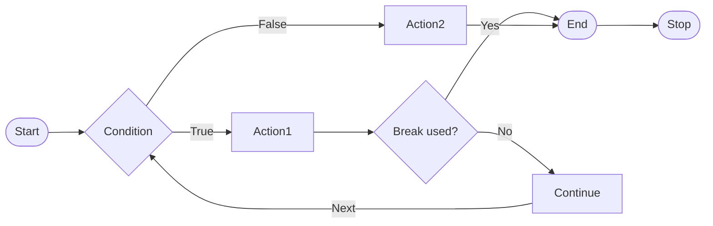

In JavaScript, the `break` statement is used to exit a loop prematurely. It is often used when you want to terminate the loop based on a certain condition.

## Syntax

The syntax of the `break` statement is as follows:

```js title="app.js"
for (let i = 1; i <= 5; i++) {
  if (i === 3) {
    break;
  }
  console.log(i);
}
```

- The `break` statement is used to exit the loop prematurely.
- It can be used inside a `for`, `while`, or `do...while` loop.
- When the `break` statement is encountered, the loop is terminated, and the program continues with the next statement after the loop.
- If the loop is inside a function, the `break` statement will terminate the loop and the function.
- The `break` statement should be used only within a loop, otherwise, it will produce a syntax error.
- The `break` statement can be used to exit a loop based on a certain condition, such as a specific value or a user input.
- The `break` statement can be used to avoid an infinite loop by providing a way to exit the loop when a certain condition is met.
- The `break` statement can be used to optimize the performance of a loop by avoiding unnecessary iterations.
- The `break` statement can be used to exit a loop based on a certain condition, such as a specific value or a user input.
- The `break` statement can be used to avoid an infinite loop by providing a way to exit the loop when a certain condition is met.

## Flow Chart of the `break` Statement



## Example

The following example demonstrates how to use the `break` statement to exit a loop based on a certain condition:

```js title="app.js"
for (let i = 1; i <= 5; i++) {
  if (i === 3) {
    break;
  }
  console.log(i);
}
```

In this example, the `for` loop initializes the loop variable `i` to `1`. It then checks if `i` is less than or equal to `5`. If the condition is `true`, it executes the code inside the loop and increments `i` by `1`. However, when `i` is equal to `3`, the `break` statement is encountered, and the loop is terminated. The program then continues with the next statement after the loop.

The output of the above example will be:

```plaintext title="Output"
1
2
```

In this example, the loop is terminated when `i` is equal to `3`, and the program continues with the next statement after the loop. The numbers `1` and `2` are printed to the console before the loop is terminated.

The `break` statement can be used to exit a loop based on a certain condition, such as a specific value or a user input. It is often used to optimize the performance of a loop by avoiding unnecessary iterations. The `break` statement should be used with caution, as it can make the code harder to read and understand. It is recommended to use the `break` statement sparingly and only when necessary.

## Example

The following example demonstrates how to use the `break` statement to exit a loop based on a certain condition:

```js title="app.js"
let numbers = [1, 2, 3, 4, 5];
for (let i = 0; i < numbers.length; i++) {
  if (numbers[i] === 3) {
    break;
  }
  console.log(numbers[i]);
}
```

In this example, the `for` loop iterates over the elements of the `numbers` array. It checks if the current element is equal to `3`. If the condition is `true`, the `break` statement is encountered, and the loop is terminated. The program then continues with the next statement after the loop.

The output of the above example will be:

```plaintext title="Output"
1
2
```

In this example, the loop is terminated when the current element is equal to `3`, and the program continues with the next statement after the loop. The numbers `1` and `2` are printed to the console before the loop is terminated.

The `break` statement can be used to exit a loop based on a certain condition, such as a specific value or a user input. It is often used to optimize the performance of a loop by avoiding unnecessary iterations. The `break` statement should be used with caution, as it can make the code harder to read and understand. It is recommended to use the `break` statement sparingly and only when necessary.

:::tip 🤔 Remember

- The `break` statement is used to exit a loop prematurely.
- It can be used inside a `for`, `while`, or `do...while` loop.
- When the `break` statement is encountered, the loop is terminated, and the program continues with the next statement after the loop.
- The `break` statement should be used only within a loop, otherwise, it will produce a syntax error.
- The `break` statement can be used to exit a loop based on a certain condition, such as a specific value or a user input.
- The `break` statement can be used to avoid an infinite loop by providing a way to exit the loop when a certain condition is met.
- The `break` statement can be used to optimize the performance of a loop by avoiding unnecessary iterations.

:::

## Summary

In this tutorial, we learned about the `break` statement in JavaScript. We learned how to use the `break` statement to exit a loop prematurely based on a certain condition. We also learned about the syntax of the `break` statement and how to use it to optimize the performance of a loop. We also learned about the best practices for using the `break` statement and when to use it sparingly.
