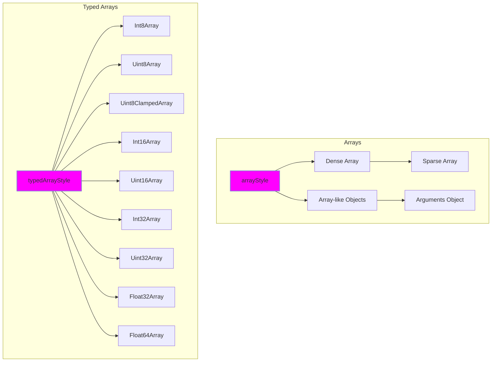

An `Array` is a non-primitive data type in JavaScript. It represents a collection of elements, where each element can be of any data type, including other arrays.



## What is an Array in JavaScript?

In JavaScript, an `Array` is a special type of object that represents a collection of elements. The elements can be of any data type, including other arrays. Arrays are used to store multiple values in a single variable. Each element in an array has a unique index, which is used to access the element. The index starts from `0` and goes up to `length - 1`, where `length` is the number of elements in the array. 


## Creating Arrays in JavaScript

You can create an array in JavaScript using the following syntax:

```js title="Creating Arrays in JavaScript"
let numbers = [1, 2, 3, 4, 5];
let names = ['John', 'Doe', 'Jane', 'Smith'];
let mixed = [1, 'John', true, null, undefined];
```

In the above examples, we have created arrays of numbers, strings, and mixed data types.

## Accessing Array Elements

You can access elements of an array using their index. The index starts from `0` for the first element and goes up to `length - 1` for the last element.

```js title="Accessing Array Elements"
let numbers = [1, 2, 3, 4, 5];

console.log(numbers[0]); // Output: 1
console.log(numbers[2]); // Output: 3
console.log(numbers[4]); // Output: 5
```

In the above example, we have accessed the first, third, and fifth elements of the `numbers` array using their indices.

## Modifying Array Elements

You can modify elements of an array using their index.

```js title="Modifying Array Elements"
let numbers = [1, 2, 3, 4, 5];

numbers[0] = 10;

console.log(numbers); // Output: [10, 2, 3, 4, 5]
```

In the above example, we have modified the first element of the `numbers` array and changed its value to `10`.

## Adding Array Elements

You can add elements to the end of an array using the `push` method.

```js title="Adding Array Elements"
let numbers = [1, 2, 3, 4, 5];

numbers.push(6);

console.log(numbers); // Output: [1, 2, 3, 4, 5, 6]
```

In the above example, we have added the number `6` to the end of the `numbers` array using the `push` method.

## Deleting Array Elements

You can delete elements from an array using the `delete` operator or the `splice` method.

```js title="Deleting Array Elements"
let numbers = [1, 2, 3, 4, 5];

delete numbers[2];

console.log(numbers); // Output: [1, 2, empty, 4, 5]
```

In the above example, we have deleted the third element of the `numbers` array using the `delete` operator. The element is replaced with `empty`, which is a placeholder for the deleted element.

## Deleting Array Elements using `pop` Method

You can also delete elements from the end of an array using the `pop` method.

```js title="Deleting Array Elements using pop Method"
let numbers = [1, 2, 3, 4, 5];

numbers.pop();

console.log(numbers); // Output: [1, 2, 3, 4]
```

In the above example, we have deleted the last element of the `numbers` array using the `pop` method.

:::info 📝 Note

## Arrays Style in JavaScript

There are different styles of arrays in JavaScript:

### 1. Dense Array

A dense array is an array in which the elements are stored in contiguous memory locations. It is the most common type of array in JavaScript.

for example:

```js title="Dense Array"
let numbers = [1, 2, 3, 4, 5];
```

### 2. Sparse Array

A sparse array is an array in which the elements are not stored in contiguous memory locations. It contains empty slots, which are placeholders for the missing elements.

for example:

```js title="Sparse Array"
let numbers = [1, , 3, , 5];
```

### 3. Array-like Objects

Array-like objects are objects that have a `length` property and indexed elements, but they are not instances of the `Array` constructor.

for example:

```js title="Array-like Objects"
let arrayLike = {
  0: 'a',
  1: 'b',
  2: 'c',
  length: 3
};
```

### 4. Typed Arrays

Typed arrays are a set of array-like objects that provide a way to work with binary data in JavaScript. They are used to represent raw binary data in memory and are used in various scenarios, such as working with WebGL, file I/O, and networking.

for example:

```js title="Typed Arrays"
let buffer = new ArrayBuffer(16);
let int32Array = new Int32Array(buffer);
```

## Typed Arrays in JavaScript

Typed arrays are a set of array-like objects that provide a way to work with binary data in JavaScript. They are used to represent raw binary data in memory and are used in various scenarios, such as working with WebGL, file I/O, and networking.

The following are the different types of typed arrays available in JavaScript:

### 1. `Int8Array`

The `Int8Array` represents an array of 8-bit signed integers.

for example:

```js title="Int8Array"
let buffer = new ArrayBuffer(16);
let int8Array = new Int8Array(buffer);
```

### 2. `Uint8Array`

The `Uint8Array` represents an array of 8-bit unsigned integers.

for example:

```js title="Uint8Array"
let buffer = new ArrayBuffer(16);
let uint8Array = new Uint8Array(buffer);
```

### 3. `Uint8ClampedArray`

The `Uint8ClampedArray` represents an array of 8-bit unsigned integers clamped to 0-255.

for example:

```js title="Uint8ClampedArray"
let buffer = new ArrayBuffer(16);
let uint8ClampedArray = new Uint8ClampedArray(buffer);
```

### 4. `Int16Array`

The `Int16Array` represents an array of 16-bit signed integers.

for example:

```js title="Int16Array"
let buffer = new ArrayBuffer(16);
let int16Array = new Int16Array(buffer);
```

### 5. `Uint16Array`

The `Uint16Array` represents an array of 16-bit unsigned integers.

for example:

```js title="Uint16Array"
let buffer = new ArrayBuffer(16);
let uint16Array = new Uint16Array(buffer);
```

### 6. `Int32Array`

The `Int32Array` represents an array of 32-bit signed integers.

for example:

```js title="Int32Array"
let buffer = new ArrayBuffer(16);
let int32Array = new Int32Array(buffer);
```

### 7. `Uint32Array`

The `Uint32Array` represents an array of 32-bit unsigned integers.

for example:

```js title="Uint32Array"
let buffer = new ArrayBuffer(16);
let uint32Array = new Uint32Array(buffer);
```

### 8. `Float32Array`

The `Float32Array` represents an array of 32-bit floating-point numbers.

for example:

```js title="Float32Array"
let buffer = new ArrayBuffer(16);
let float32Array = new Float32Array(buffer);
```

### 9. `Float64Array`

The `Float64Array` represents an array of 64-bit floating-point numbers.

for example:

```js title="Float64Array"
let buffer = new ArrayBuffer(16);
let float64Array = new Float64Array(buffer);
```
:::

---

:::tip Tips and Tricks

1. **Array Literals**: The array literal syntax `[]` is the most common way to create arrays in JavaScript.
2. **Array Elements**: Arrays can contain elements of any data type, including other arrays.
3. **Accessing Array Elements**: You can access array elements using their index, which starts from `0`.
4. **Modifying Array Elements**: You can modify array elements using their index.
5. **Adding Array Elements**: You can add elements to the end of an array using the `push` method.
6. **Deleting Array Elements**: You can delete elements from an array using the `delete` operator or the `splice` method.
7. **Deleting Array Elements using `pop` Method**: You can delete elements from the end of an array using the `pop` method.
8. **Array Styles**: There are different styles of arrays in JavaScript, including dense arrays, sparse arrays, array-like objects, and typed arrays.
9. **Typed Arrays**: Typed arrays are a set of array-like objects that provide a way to work with binary data in JavaScript.
10. **Array Methods**: JavaScript provides various methods for working with arrays, such as `push`, `pop`, `shift`, `unshift`, `splice`, `slice`, `concat`, `join`, `reverse`, `sort`, `indexOf`, `lastIndexOf`, `includes`, `forEach`, `map`, `filter`, `reduce`, and `find`.
11. **Array Properties**: Arrays have various properties, such as `length`, `constructor`, and `prototype`.
12. **Array-like Objects**: Array-like objects are objects that have a `length` property and indexed elements, but they are not instances of the `Array` constructor.
13. **Typed Arrays**: Typed arrays are a set of array-like objects that provide a way to work with binary data in JavaScript.
14. **Array Buffers**: Array buffers are used to represent raw binary data in memory and are used in various scenarios, such as working with WebGL, file I/O, and networking.
15. **Array Buffer Views**: Array buffer views are used to read and write binary data to and from array buffers.
16. **Array Destructuring**: Array destructuring is a convenient way to extract multiple elements from an array and assign them to variables.
17. **Array Spread Operator**: The array spread operator (`...`) is used to expand an array into individual elements.
:::

## Conclusion

In this tutorial, you learned about the array data type in JavaScript and how to create, access, modify, add, and delete array elements. You can use arrays to store multiple values in a single variable and perform various operations on the elements of the array.