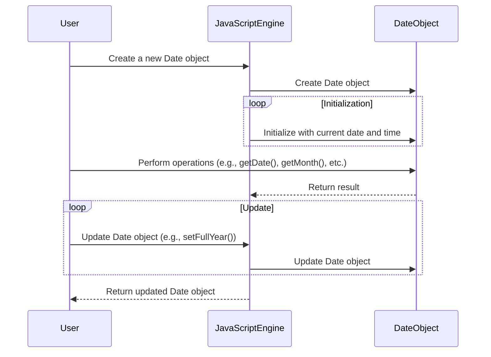

Date is a built-in object in JavaScript that is used to work with dates and times. It is used to represent a date and time in JavaScript. It is used to work with dates and times in JavaScript.



## What is a Date in JavaScript?

A Date object in JavaScript is used to work with dates and times. It is used to represent a date and time in JavaScript. It is used to work with dates and times in JavaScript.

## Creating a Date Object

A Date object can be created using the `new` keyword followed by the `Date` constructor.

```js title="Creating a Date object"
let date = new Date();
```

This will create a new Date object initialized with the current date and time.

## Date Methods

The Date object has several methods that can be used to work with dates and times. Some of the most commonly used methods are:

- `getDate()`: Returns the day of the month (1-31).
- `getMonth()`: Returns the month (0-11).
- `getFullYear()`: Returns the year.
- `getHours()`: Returns the hour (0-23).
- `getMinutes()`: Returns the minutes (0-59).
- `getSeconds()`: Returns the seconds (0-59).
- `getMilliseconds()`: Returns the milliseconds (0-999).
- `getTime()`: Returns the number of milliseconds since January 1, 1970.

```js title="Using Date methods"
let date = new Date();
console.log(date.getDate()); // 1-31
console.log(date.getMonth()); // 0-11
console.log(date.getFullYear()); // year
console.log(date.getHours()); // 0-23
console.log(date.getMinutes()); // 0-59
console.log(date.getSeconds()); // 0-59
console.log(date.getMilliseconds()); // 0-999
console.log(date.getTime()); // milliseconds since January 1, 1970
```

```jsx live
function myDate() {
  const [date, setDate] = useState(new Date());
  useEffect(() => {
    const timerID = setInterval(() => tick(), 1000);

    return function cleanup() {
      clearInterval(timerID);
    };
  });

  function tick() {
    setDate(new Date());
  }

  return (
    <div>
      <p>date.getDate(): {date.getDate()}</p>
      <p>date.getMonth(): {date.getMonth()}</p>
      <p>date.getFullYear(): {date.getFullYear()}</p>
      <p>getHours(): {date.getHours()}</p>
      <p>date.getMinutes(): {date.getMinutes()}</p>
      <p>date.getSeconds(): {date.getSeconds()}</p>
      <p>date.getMilliseconds(): {date.getMilliseconds()}</p>
      <p>date.getTime(): {date.getTime()}</p>
    </div>
  );
}
```

## Updating a Date Object

A Date object can be updated using the various `set` methods.

- `setDate()`: Sets the day of the month (1-31).
- `setMonth()`: Sets the month (0-11).
- `setFullYear()`: Sets the year.
- `setHours()`: Sets the hour (0-23).
- `setMinutes()`: Sets the minutes (0-59).
- `setSeconds()`: Sets the seconds (0-59).
- `setMilliseconds()`: Sets the milliseconds (0-999).
- `setTime()`: Sets the number of milliseconds since January 1, 1970.

```js title="Updating a Date object"
let date = new Date();
date.setDate(15); // set the day of the month to 15
date.setMonth(6); // set the month to July
date.setFullYear(2022); // set the year to 2022
date.setHours(12); // set the hour to 12
date.setMinutes(30); // set the minutes to 30
date.setSeconds(45); // set the seconds to 45
date.setMilliseconds(500); // set the milliseconds to 500
date.setTime(1640999405500); // set the date to January 1, 2022 12:30:45.500 PM
```

## Working with Dates and Times

The Date object can be used to work with dates and times in JavaScript. It can be used to perform various operations such as getting and updating date and time, calculating the difference between two dates, formatting dates, and so on.

```js title="Working with Dates and Times"
let date1 = new Date();
let date2 = new Date(2022, 6, 15, 12, 30, 0, 0); // July 15, 2022 12:30:00.000 PM

// calculate the difference between two dates
let diff = date2 - date1;

// format the date

let options = {
  weekday: "long",
  year: "numeric",
  month: "long",
  day: "numeric",
};

console.log(date1.toLocaleDateString("en-US", options)); // Monday, January 1, 2022

// add 10 days to the date

date1.setDate(date1.getDate() + 10);
```

:::info 📝 Note
The Date object in JavaScript uses a zero-based index for months (0-11) and a one-based index for days (1-31).
:::

## Conclusion

In this tutorial, we learned about the Date object in JavaScript and how to use it to work with dates and times. We learned how to create a Date object, use its methods to get and update date and time, and how to use it to work with dates and times in JavaScript.
