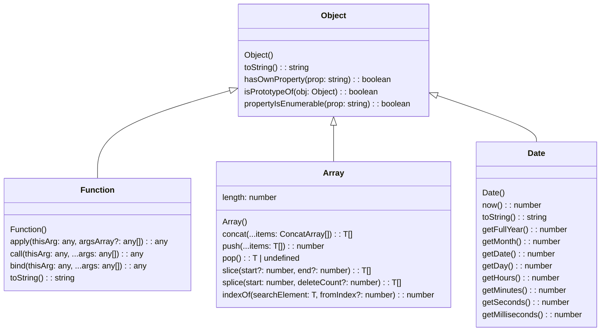

The `Object` is a non-primitive data type in JavaScript. It represents a collection of key-value pairs, where the keys are strings (or symbols) and the values can be of any data type, including other objects.



## What is Object in JavaScript?

In JavaScript, an `Object` is a non-primitive data type that represents a collection of key-value pairs. It is used to store various keyed collections and more complex entities. An object can be created using the object literal syntax `{}` or the `Object` constructor.

## Syntax of Object in JavaScript

The syntax for creating an object in JavaScript using the object literal syntax is as follows:

```js title="Object Literal Syntax"
let object = {
  key1: value1,
  key2: value2,
  // ...
  keyN: valueN
};
```

In the above syntax:

- `object` is the name of the object.
- `key1`, `key2`, and `keyN` are the keys of the object.
- `value1`, `value2`, and `valueN` are the values associated with the keys.
- The keys and values are separated by a colon (`:`), and the key-value pairs are separated by commas (`,`).
- The keys can be strings or symbols, and the values can be of any data type, including other objects.
- The object literal syntax `{}` is the most common way to create objects in JavaScript.

## How to Create Objects in JavaScript?

You can create an `Object` in JavaScript using the following syntax:

```js title="Creating Objects in JavaScript"
let person = {
  name: 'John Doe',
  age: 30,
  isEmployed: true
};

console.log(person); // Output: { name: 'John Doe', age: 30, isEmployed: true }
```

In the above example, the `person` object is created using the object literal syntax `{}`. It contains three key-value pairs: `name`, `age`, and `isEmployed`.

## Accessing Object Properties

You can access the properties of an object using the dot notation (`.`) or the bracket notation (`[]`).

### Dot Notation

You can access the properties of an object using the dot notation (`.`) as follows:

```js title="Accessing Object Properties using Dot Notation"
let person = {
  name: 'John Doe',
  age: 30,
  isEmployed: true
};

console.log(person.name); // Output: John Doe
console.log(person.age); // Output: 30
console.log(person.isEmployed); // Output: true
```

### Bracket Notation

You can also access the properties of an object using the bracket notation (`[]`) as follows:

```js title="Accessing Object Properties using Bracket Notation"
let person = {
  name: 'John Doe',
  age: 30,
  isEmployed: true
};

console.log(person['name']); // Output: John Doe
console.log(person['age']); // Output: 30
console.log(person['isEmployed']); // Output: true
```

## Modifying Object Properties

You can modify the properties of an object using the assignment operator (`=`).

```js title="Modifying Object Properties"
let person = {
  name: 'John Doe',
  age: 30,
  isEmployed: true
};

person.age = 35;

console.log(person.age); // Output: 35
```

In the above example, the `age` property of the `person` object is modified from `30` to `35`.

## Adding Object Properties

You can add new properties to an object using the assignment operator (`=`).

```js title="Adding Object Properties"
let person = {
  name: 'Ajay Dhangar',
  age: 23,
  isEmployed: true
};

person.city = 'Mandsaur';

console.log(person.city); // Output: Mandsaur
```

In the above example, the `city` property is added to the `person` object with the value `'Mandsaur'`.

## Deleting Object Properties

You can delete properties from an object using the `delete` operator.

```js title="Deleting Object Properties"
let person = {
  name: 'John Doe',
  age: 30,
  isEmployed: true
};

delete person.isEmployed;

console.log(person); // Output: { name: 'John Doe', age: 30 }
```

In the above example, the `isEmployed` property is deleted from the `person` object.

## What Can an Object Contain?

An object can contain properties and methods. Properties are key-value pairs, and methods are functions associated with the object.

```js title="Object Properties and Methods"
let person = {
  name: 'John Doe',
  age: 30,
  isEmployed: true,
  greet: function() {
    return `Hello, my name is ${this.name} and I am ${this.age} years old.`;
  }
};

console.log(person.name); // Output: John Doe
console.log(person.age); // Output: 30
console.log(person.isEmployed); // Output: true
console.log(person.greet()); // Output: Hello, my name is John Doe and I am 30 years old.
```

In the above example, the `person` object contains four properties: `name`, `age`, `isEmployed`, and `greet`. The `greet` property is a method that returns a greeting message using the `name` and `age` properties of the object.

## Object Methods

An object can also contain methods, which are functions that are associated with the object. You can define methods as properties of an object.

```js title="Object Methods"
let person = {
  name: 'John Doe',
  age: 30,
  isEmployed: true,
  greet: function() {
    return `Hello, my name is ${this.name} and I am ${this.age} years old.`;
  }
};

console.log(person.greet()); // Output: Hello, my name is John Doe and I am 30 years old.
```

In the above example, the `greet` method is defined as a property of the `person` object. It returns a greeting message using the `name` and `age` properties of the object.

## Object Constructor

You can also create objects using the `Object` constructor.

```js title="Creating Objects using Object Constructor"
let person = new Object();

person.name = 'John Doe';

console.log(person.name); // Output: John Doe
```

:::info 📝 Note
The object literal syntax `{}` is the preferred way to create objects in JavaScript. The `Object` constructor is rarely used to create objects.

The object literal syntax is more concise and easier to read than the `Object` constructor.
:::

:::tip tips and tricks

**1. Object Literals**: The object literal syntax `{}` is the most common way to create objects in JavaScript.

**2. Object Properties**: Objects can contain properties and methods. Properties are key-value pairs, and methods are functions associated with the object.

**3. Accessing Object Properties**: You can access object properties using the dot notation (`.`) or the bracket notation (`[]`).

**4. Modifying Object Properties**: You can modify object properties using the assignment operator (`=`).

**5. Adding Object Properties**: You can add new properties to an object using the assignment operator (`=`).

**6. Deleting Object Properties**: You can delete properties from an object using the `delete` operator.

**7. Object Methods**: Objects can contain methods, which are functions associated with the object.

**8. Object Constructor**: You can create objects using the `Object` constructor, but the object literal syntax is preferred.

:::


## Conclusion

In JavaScript, the `Object` is a non-primitive data type that represents a collection of key-value pairs. You can create objects using the object literal syntax `{}` or the `Object` constructor. Objects can contain properties and methods, and you can access, modify, add, and delete properties of an object using various techniques.