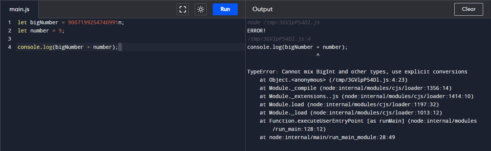

`BigInt` is a primitive data type in JavaScript. It represents an arbitrary-precision integer. It is used to represent integers larger than the maximum safe integer value.


## What is BigInt in JavaScript?    

In JavaScript, `BigInt` is a primitive data type that represents an arbitrary-precision integer. It is used to represent integers larger than the maximum safe integer value.

## How to Create BigInt in JavaScript?

You can create `BigInt` in JavaScript using the following syntax:

```js title="Creating BigInt in JavaScript"
let bigNumber = 9007199254740991n; // BigInt

console.log(bigNumber); // Output: 9007199254740991n
```

In the above example, the variable `bigNumber` is assigned the value `9007199254740991n`. The `n` at the end of the number indicates that it is a `BigInt`.

## Checking for BigInt in JavaScript

You can check if a variable is a `BigInt` using the `typeof` operator.

```js title="Checking for BigInt in JavaScript"
let bigNumber = 9007199254740991n;

console.log(typeof bigNumber); // Output: bigint
```

In the above example, the `typeof` operator returns `bigint` for the `bigNumber` variable, indicating that it is a `BigInt`.

## BigInt vs. Number

| No. | BigInt | Number |
| --- | ------ | ------ |
| 1.  | `BigInt` is used to represent integers larger than the maximum safe integer value. | `Number` is used to represent both integer and floating-point numbers. |
| 2.  | `BigInt` is suffixed with `n` to indicate that it is a `BigInt`. | `Number` is not suffixed with any character. |
| 3.  | `BigInt` is a primitive data type. | `Number` is a primitive data type. |
| 4.  | `BigInt` is used to perform arithmetic operations on large integers. | `Number` is used to perform arithmetic operations on numbers. |

## BigInt Literals

A `BigInt` literal is created by appending `n` to the end of an integer or by calling the `BigInt()` function.

```js title="BigInt Literals"
let bigNumber1 = 9007199254740991n; // BigInt literal

let bigNumber2 = BigInt(9007199254740991); // BigInt literal using BigInt() function
```

In the above example, `bigNumber1` and `bigNumber2` are both `BigInt` literals.

:::info 📝 Note
- The `n` at the end of the number indicates that it is a `BigInt`. You can also create a `BigInt` using the `BigInt()` function. For example: `let bigNumber = BigInt(9007199254740991);`.
- `n` is not a part of the number, it is a part of the syntax to create a `BigInt`.
- You cannot perform arithmetic operations between `BigInt` and other number types. You need to convert the other number types to `BigInt` before performing arithmetic operations.
  
  

- `BigInt` is not supported in all browsers. You should check for browser compatibility before using `BigInt`.
- `BigInt` is a new feature in JavaScript and is not supported in older versions of browsers.
- You can use the `typeof` operator to check if a variable is a `BigInt`.

:::


## Conclusion

In this tutorial, you learned about the `BigInt` data type in JavaScript, how to create `BigInt` in JavaScript, and how to check for `BigInt` in JavaScript. You also learned that `BigInt` is a primitive data type that represents an arbitrary-precision integer and is used to represent integers larger than the maximum safe integer value.