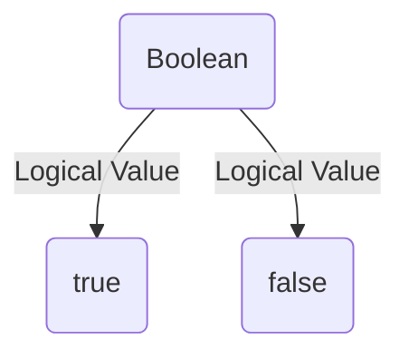

Booleans are a primitive data type in JavaScript. They are used to represent logical values. JavaScript uses the `Boolean` object to represent `true` or `false`.



## What is a Boolean in JavaScript?

In JavaScript, booleans are used to represent logical values. JavaScript uses the `Boolean` object to represent `true` or `false`.

## How to Create a Boolean in JavaScript?

You can create a boolean in JavaScript using the following syntax:

```js title="Creating a Boolean in JavaScript"
let isTrue = true;
let isFalse = false;
```

In the above example, `isTrue` and `isFalse` are booleans.

## Boolean Values

The boolean data type has only two possible values: `true` and `false`. For example:

```js title="Boolean Values"
let isTrue = true;
let isFalse = false;
```

## Boolean Methods

The `Boolean` object has several methods that are used to perform operations on boolean values. For example:

```js title="Boolean Methods"
let isTrue = true;
let isFalse = false;

console.log(isTrue.toString()); // Output: "true"
console.log(isFalse.valueOf()); // Output: false
```

In the above example, the `toString()` method is used to convert a boolean to a string, and the `valueOf()` method is used to return the primitive value of a boolean.

:::info 📝 Note
The `Boolean` object is a wrapper for a boolean value. It is rarely used in practice, as booleans can be created directly without using the `Boolean` object.

The `Boolean` object is not a constructor. It does not have a `new` operator. It is a function that converts a value to a boolean.

The `Boolean` object has a single property: `prototype`. It is the prototype for the `Boolean` object.

for example:

```js title="Boolean Object"
let isTrue = true;
let isFalse = false;

console.log(Boolean(isTrue)); // Output: true
console.log(Boolean(isFalse)); // Output: false
```

In the above example, the `Boolean` object is used to convert a value to a boolean.

**1. What is truthy and falsy in JavaScript?**

In JavaScript, a value is considered "falsy" if it converts to `false` when evaluated in a boolean context. The following values are considered "falsy" in JavaScript:

- `false`
- `0`
- `""` (empty string)
- `null`
- `undefined`
- `NaN` (Not a Number)
- `document.all` (an object that is present in Internet Explorer)

All other values are considered "truthy" in JavaScript.

For example:

```js title="Truthy and Falsy Values"
let isTrue = true;
let isFalse = false;

console.log(Boolean(isTrue)); // Output: true
console.log(Boolean(isFalse)); // Output: false
console.log(Boolean(0)); // Output: false
console.log(Boolean("")); // Output: false
console.log(Boolean(null)); // Output: false
console.log(Boolean(undefined)); // Output: false
console.log(Boolean(NaN)); // Output: false
console.log(Boolean(document.all)); // Output: false
```

In the above example, the `Boolean` object is used to convert values to booleans. The values `0`, `""`, `null`, `undefined`, `NaN`, and `document.all` are considered "falsy" in JavaScript.

**2. Difference between truthy and falsy**

The difference between truthy and falsy is that truthy values are considered `true` when evaluated in a boolean context, while falsy values are considered `false` when evaluated in a boolean context.

For example:

**Truthy Values**

- `true`: The boolean value `true` is considered "truthy" in JavaScript.
- `1`: The number `1` is considered "truthy" in JavaScript.
- `"hello"`: The string `"hello"` is considered "truthy" in JavaScript.
- `[]` (empty array): An empty array is considered "truthy" in JavaScript.
- `{}` (empty object): An empty object is considered "truthy" in JavaScript.
- `function() {}` (empty function): An empty function is considered "truthy" in JavaScript.
- `new Date()`: A new date is considered "truthy" in JavaScript.
- `Infinity`: The value `Infinity` is considered "truthy" in JavaScript.
- `-Infinity`: The value `-Infinity` is considered "truthy" in JavaScript.
- `3.14`: The number `3.14` is considered "truthy" in JavaScript.

**Falsy Values**

- `false`: The boolean value `false` is considered "falsy" in JavaScript.
- `0`: The number `0` is considered "falsy" in JavaScript.
- `""` (empty string): An empty string is considered "falsy" in JavaScript.
- `null`: The value `null` is considered "falsy" in JavaScript.
- `undefined`: The value `undefined` is considered "falsy" in JavaScript.
- `NaN`: The value `NaN` is considered "falsy" in JavaScript.
- `0n`: The bigint value `0n` is considered "falsy" in JavaScript.
- `-0`: The number `-0` is considered "falsy" in JavaScript.
  

for example:

```js title="Truthy Values"
let isTrue = true;
const num = 1;
const str = "hello";
const arr = [];
const obj = {};
const func = function() {};
const date = new Date();
const inf = Infinity;
const ninf = -Infinity;
const pi = 3.14;

console.log(Boolean(isTrue)); // Output: true
console.log(Boolean(num)); // Output: true
console.log(Boolean(str)); // Output: true
console.log(Boolean(arr)); // Output: true
console.log(Boolean(obj)); // Output: true
console.log(Boolean(func)); // Output: true
console.log(Boolean(date)); // Output: true
console.log(Boolean(inf)); // Output: true
console.log(Boolean(ninf)); // Output: true
console.log(Boolean(pi)); // Output: true
```

```js title="Falsy Values"
let isFalse = false;
const zero = 0;
const emptyStr = "";
const nul = null;
const undef = undefined;
const nan = NaN;
const bigZero = 0n;
const negZero = -0;

console.log(Boolean(isFalse)); // Output: false
console.log(Boolean(zero)); // Output: false
console.log(Boolean(emptyStr)); // Output: false
console.log(Boolean(nul)); // Output: false
console.log(Boolean(undef)); // Output: false
console.log(Boolean(nan)); // Output: false
console.log(Boolean(bigZero)); // Output: false
console.log(Boolean(negZero)); // Output: false
```

:::

## Conclusion

In this tutorial, you learned about the boolean data type in JavaScript, including how to create a boolean, boolean values, and boolean methods. You also learned about the `Boolean` object and its methods.