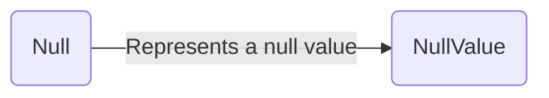

`null` is a primitive data type in JavaScript. It represents a null value. It is used to represent an empty value or no value at all.



## What is Null in JavaScript?

In JavaScript, `null` is a primitive data type that represents a null value. It is used to represent an empty value or no value at all.

## How to Create Null in JavaScript?

You can create `null` in JavaScript using the following syntax:

```js title="Creating Null in JavaScript"
let data = null;

console.log(data); // Output: null
```

In the above example, the variable `data` is assigned the value `null`. When you log the value of `data`, it will output `null`.

## Checking for Null in JavaScript

You can check if a variable is `null` using the `typeof` operator or by comparing the variable to `null`.

```js title="Checking for Null in JavaScript"
let data = null;

console.log(typeof data); // Output: object

if (data === null) {
  console.log('The variable is null');
} else {
  console.log('The variable is not null');
}
```

In the above example, the `typeof` operator returns `object` for the `data` variable, and the comparison `data === null` returns `true`, indicating that the variable is `null`.


:::info 📝Note
In JavaScript, `null` is of type `object`. This is a bug in the language that has been kept for compatibility reasons.

## Null vs. Undefined

`null` and `undefined` are both used to represent the absence of a value in JavaScript. However, they are not the same.

- `null` is a primitive data type that represents a null value. It is often used to explicitly set a variable to have no value.

- `undefined` is a primitive data type that represents an undefined value. If a variable has been declared, but has not been assigned a value, it is of type `undefined`.

:::

## Conclusion

In this article, you learned about the `null` data type in JavaScript, how to create `null` in JavaScript, and how to check for `null` in JavaScript. You also learned that `null` is a primitive data type that represents a null value and is used to represent an empty value or no value at all.