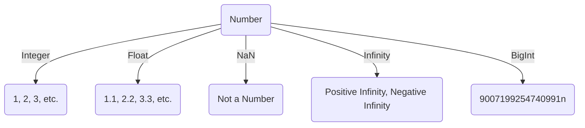

Numbers are a primitive data type in JavaScript. They are used to represent numeric values. JavaScript uses the `Number` object to represent both integer and floating-point numbers.



## What is a Number in JavaScript?

In JavaScript, numbers are used to represent numeric values. JavaScript uses the `Number` object to represent both integer and floating-point numbers.

## How to Create a Number in JavaScript?

You can create a number in JavaScript using the following syntax:

```js title="Creating a Number in JavaScript"
let count = 100; // Integer
let price = 99.99; // Floating-point number
```

In the above example, `count` is an integer, and `price` is a floating-point number.

## Integer

An integer is a whole number, positive or negative, without decimals, of unlimited length. For example:

```js title="Integer"
let count = 100;
let temperature = -10;
```

## Floating-Point Number

A floating-point number is a number with a decimal point or an exponent. For example:

```js title="Floating-Point Number"
let price = 99.99;
let pi = 3.14;
```

## NaN (Not a Number)

`NaN` is a special value that represents "Not-a-Number". It indicates that a value is not a legal number. For example:

```js title="NaN"
let result = 100 / "Apple";
console.log(result); // Output: NaN
```

## Infinity

`Infinity` is a special value that represents positive infinity. It is displayed when a number exceeds the upper limit of the floating-point numbers. For example:

```js title="Infinity"
let max = Number.MAX_VALUE;
let infinity = max * 2;
console.log(infinity); // Output: Infinity
```

## BigInt

The `bigint` data type is used to represent whole numbers larger than `2^53 - 1`. It is a new feature in JavaScript and is not supported in all browsers. For example:

```js title="BigInt"
let value = 9007199254740991n;
```

:::info 📝 Note
- The `n` at the end of the number indicates that it is a `bigint`. You can also create a `bigint` using the `BigInt()` function. For example: `let value = BigInt(9007199254740991);`.
- `n` is not a part of the number, it is a part of the syntax to create a `bigint`.
- You cannot perform arithmetic operations between `bigint` and other number types. You need to convert the other number types to `bigint` before performing arithmetic operations.
- infinity is used to represent positive infinity, and `-Infinity` is used to represent negative infinity.
- `NaN` is used to represent "Not-a-Number". It indicates that a value is not a legal number.
- `Number.MAX_VALUE` is the largest positive finite value representable in JavaScript.
- `Number.MIN_VALUE` is the smallest positive value representable in JavaScript.
- `Number.EPSILON` is the smallest interval between two representable numbers.
- `Number.POSITIVE_INFINITY` is the positive infinity value.
:::

:::tip tipes and tricks
1. Integers:
   - An integer is a whole number, positive or negative, without decimals, of unlimited length.
   - For example: `let count = 100;`, `let temperature = -10;`
   - Output: `100`, `-10`
2. Floating-Point Numbers:
   - A floating-point number is a number with a decimal point or an exponent.
   - For example: `let price = 99.99;`, `let pi = 3.14;`
   - Output: `99.99`, `3.14`
3. NaN (Not a Number):
    - `NaN` is a special value that represents "Not-a-Number".
    - It indicates that a value is not a legal number.
    - For example: `let result = 100 / "Apple";`
    - Output: `NaN`
4. Infinity:
    - `Infinity` is a special value that represents positive infinity.
    - It is displayed when a number exceeds the upper limit of the floating-point numbers.
    - For example: `let max = Number.MAX_VALUE;`, `let infinity = max * 2;`
    - Output: `Infinity`
5.  BigInt:
    - The `bigint` data type is used to represent whole numbers larger than `2^53 - 1`.
    - It is a new feature in JavaScript and is not supported in all browsers.
    - For example: `let value = 9007199254740991n;`
    - Output: `9007199254740991n`
:::

## Conclusion

In this article, you learned about the number data type in JavaScript and how to use it. You also learned about integers, floating-point numbers, `NaN`, `Infinity`, and `BigInt`. You can use these data types to represent numeric values in JavaScript.