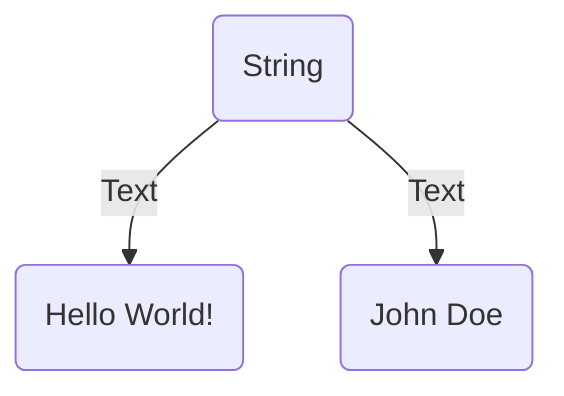

Strings are a primitive data type in JavaScript. They are used to represent text. JavaScript uses the `String` object to represent a sequence of characters.



## What is a String in JavaScript?

In JavaScript, strings are used to represent text. JavaScript uses the `String` object to represent a sequence of characters.

## How to Create a String in JavaScript?

You can create a string in JavaScript using the following syntax:

```js title="Creating a String in JavaScript"
let name = "Ajay Dhangar"; // Double quotes
let message = 'Hello World!'; // Single quotes
```

In the above example, `name` and `message` are strings.

## Double Quotes vs. Single Quotes

| No. | Double Quotes  | Single Quotes  |
| --- | -------------- | -------------- |
| 1.  | "Hello World!" | 'Hello World!' |
| 2.  | "John Doe"     | 'John Doe'     |

## Escape Characters

In JavaScript, you can use the backslash (`\`) to escape characters in a string. The following table lists the escape characters in JavaScript:

| Escape Character | Description                              |
| ---------------- | ---------------------------------------- |
| `\'`             | Single quote                             |
| `\"`             | Double quote                             |
| `\\`             | Backslash                                |
| `\n`             | New line                                 |
| `\r`             | Carriage return                          |
| `\t`             | Tab                                      |
| `\b`             | Backspace                                |
| `\f`             | Form feed                                |
| `\v`             | Vertical tab                             |

## String Length

In JavaScript, you can use the `length` property to get the length of a string. For example:

```js title="String Length"
let name = "John Doe";

console.log(name.length); // Output: 8
```

In the above example, the length of the string `name` is `8`.

## String Methods

JavaScript provides several methods to work with strings. Some of the most commonly used string methods are:

- `concat()`: Concatenates two or more strings. For example:

  ```js title="concat()"
  let firstName = "John";
  let lastName = "Doe";

  let fullName = firstName.concat(" ", lastName);
  console.log(fullName); // Output: John Doe
  ```

- `toUpperCase()`: Converts a string to uppercase. For example:

  ```js title="toUpperCase()"
  let name = "John Doe";

  console.log(name.toUpperCase()); // Output: JOHN DOE
  ```

- `toLowerCase()`: Converts a string to lowercase. For example:

  ```js title="toLowerCase()"
  let name = "John Doe";

  console.log(name.toLowerCase()); // Output: john doe
  ```

- `charAt()`: Returns the character at a specified index. For example:
  
  ```js title="charAt()"
  let name = "John Doe";

  console.log(name.charAt(0)); // Output: J
  ```

- `indexOf()`: Returns the index of the first occurrence of a specified value. For example:

  ```js title="indexOf()"
  let name = "John Doe";

  console.log(name.indexOf("Doe")); // Output: 5
  ```

- `lastIndexOf()`: Returns the index of the last occurrence of a specified value. For example:
  ```js title="lastIndexOf()"
  let name = "John Doe";

  console.log(name.lastIndexOf("Doe")); // Output: 5
  ```

- `includes()`: Returns `true` if a string contains a specified value, otherwise `false`. For example:

  ```js title="includes()"
  let name = "John Doe";

  console.log(name.includes("Doe")); // Output: true
  ```

- `startsWith()`: Returns `true` if a string starts with a specified value, otherwise `false`. For example:

  ```js title="startsWith()"
   let name = "John Doe";
   console.log(name.startsWith("John")); // Output: true
  ```

- `endsWith()`: Returns `true` if a string ends with a specified value, otherwise `false`. For example:

  ```js title="endsWith()"
    let name = "John Doe";
    console.log(name.endsWith("Doe")); // Output: true
  ```

- `slice()`: Extracts a part of a string and returns a new string. For example:

    ```js title="slice()"
      let name = "John Doe";
      console.log(name.slice(5)); // Output: Doe
    ```

- `substring()`: Extracts a part of a string and returns a new string. For example:

    ```js title="substring()"
      let name = "John Doe";
      console.log(name.substring(5)); // Output: Doe
    ```

- `substr()`: Extracts a part of a string and returns a new string. For example:

    ```js title="substr()"
      let name = "John Doe";
      console.log(name.substr(5)); // Output: Doe
    ```

- `replace()`: Replaces a specified value with another value in a string. For example:

    ```js title="replace()"
      let name = "John Doe";
      console.log(name.replace("Doe", "Smith")); // Output: John Smith
    ```

- `split()`: Splits a string into an array of substrings. For example:

    ```js title="split()"
      let name = "John Doe";
      console.log(name.split(" ")); // Output: ["John", "Doe"]
    ```

- `trim()`: Removes whitespace from both ends of a string. For example:

    ```js title="trim()"
      let name = " John Doe ";
      console.log(name.trim()); // Output: John Doe
    ```

## Template Literals

Template literals are string literals that allow embedded expressions. You can use multi-line strings and string interpolation features with template literals. Template literals are enclosed by the backtick (\`) character.

```js {2} title="Template Literals"
let name = "John Doe";
let message = `Hello, ${name}!`; // String interpolation using template literals
console.log(message); // Output: Hello, John Doe!
```

In the above example, the `${name}` is a placeholder that is replaced by the value of the `name` variable.

:::info 📝 Note
Template literals are a new feature in ECMAScript 6 (ES6).
:::

## Conclusion

In this tutorial, you learned about the string data type in JavaScript and how to use it. You also learned about escape characters, string length, and string methods. You can use strings to represent text in JavaScript.
