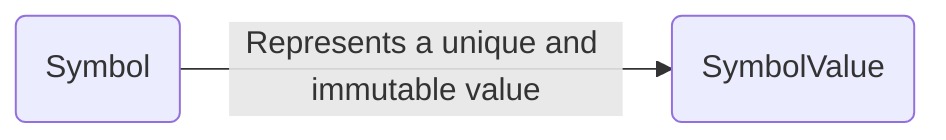

`Symbol` is a primitive data type in JavaScript. It represents a unique and immutable value. It is used to create unique identifiers for object properties.



## What is Symbol in JavaScript?

In JavaScript, `Symbol` is a primitive data type that represents a unique and immutable value. It is used to create unique identifiers for object properties.

## How to Create Symbols in JavaScript?

You can create `Symbol` in JavaScript using the following syntax:

```js title="Creating Symbols in JavaScript"
let id = Symbol('id');

console.log(id); // Output: Symbol(id)
``` 

In the above example, the variable `id` is assigned the value `Symbol('id')`. The string `'id'` is used as a description for the symbol, which can be useful for debugging.

## Checking for Symbols in JavaScript

You can check if a variable is a `Symbol` using the `typeof` operator.

```js title="Checking for Symbols in JavaScript"
let id = Symbol('id');

console.log(typeof id); // Output: symbol
```

In the above example, the `typeof` operator returns `symbol` for the `id` variable, indicating that it is a `Symbol`.

## Symbol Descriptions

When creating a `Symbol`, you can provide an optional description that can be used for debugging purposes.

```js title="Symbol Descriptions"
let id = Symbol('id');

console.log(id.description); // Output: id
```

In the above example, the `description` property of the `id` symbol returns the string `'id'`, which was provided as a description when creating the symbol.

## Unique Identifiers

Symbols are unique and immutable. Even if you create multiple symbols with the same description, they are different values.

```js title="Unique Identifiers"
let id1 = Symbol('id');

let id2 = Symbol('id');

console.log(id1 === id2); // Output: false
```

In the above example, `id1` and `id2` are both symbols with the same description, but they are different values.

:::info 📝Note
The description of a `Symbol` is not used in any operations. It is purely a human-readable label for debugging purposes.
:::

## Conclusion

In this tutorial, you learned about the `Symbol` data type in JavaScript and how to create symbols. You also learned how to check for symbols and use symbol descriptions. Symbols are useful for creating unique identifiers for object properties and are often used in advanced JavaScript programming.