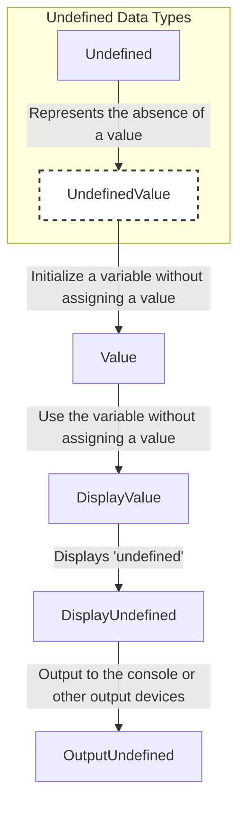
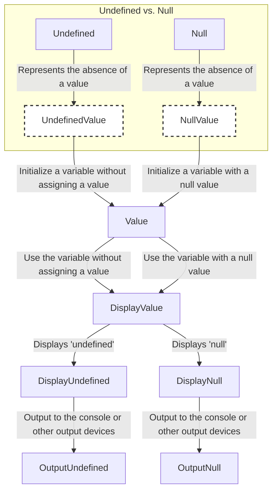

`undefined` is a primitive data type in JavaScript. It represents an undefined value. If a variable has been declared, but has not been assigned a value, it is of type `undefined`.



## What is Undefined in JavaScript?

In JavaScript, `undefined` is a primitive data type that represents an undefined value. If a variable has been declared, but has not been assigned a value, it is of type `undefined`.

## How to Create Undefined in JavaScript?

You can create `undefined` in JavaScript using the following syntax:

```js title="Creating Undefined in JavaScript"
let data;

console.log(data); // Output: undefined
```

In the above example, the variable `data` is declared but not assigned a value. When you log the value of `data`, it will output `undefined`.

## Checking for Undefined in JavaScript

You can check if a variable is `undefined` using the `typeof` operator or by comparing the variable to `undefined`.

### Using the `typeof` Operator

You can use the `typeof` operator to check if a variable is `undefined`:

```js title="Using the typeof Operator to Check for Undefined"
let data;

console.log(typeof data === 'undefined'); // Output: true
```

### Comparing to `undefined`

You can also compare a variable to `undefined` to check if it is `undefined`:

```js title="Comparing to Undefined to Check for Undefined"
let data;

console.log(data === undefined); // Output: true
```

## Undefined vs. Null

`undefined` and `null` are both used to represent the absence of a value in JavaScript. However, they are not the same.

`undefined` is a primitive data type that represents an undefined value. If a variable has been declared, but has not been assigned a value, it is of type `undefined`.

`null` is an object that represents the absence of a value. It is often used to explicitly set a variable to have no value.

:::info 📝 Note
In JavaScript, `null` is of type `object`. This is a bug in the language that has been kept for compatibility reasons.

You can check if a variable is `null` using the `typeof` operator or by comparing the variable to `null`.

**1. Difference bitween `undefined` and `null`**


:::

:::tip tips and tricks
**Why use undefined?**

`undefined` is used to represent the absence of a value. It is often used to check if a variable has been assigned a value or not. For example, you can use `undefined` to check if a function argument has been passed or not.

**What means undefined?**

`undefined` means that a variable has been declared, but has not been assigned a value. It is a primitive data type that represents an undefined value.

**Why JavaScript has undefined?**

JavaScript has `undefined` to represent the absence of a value. It is often used to check if a variable has been assigned a value or not.

**Assume that a variable is undefined?**

If a variable is `undefined`, it means that it has been declared, but has not been assigned a value. You can check if a variable is `undefined` using the `typeof` operator or by comparing the variable to `undefined`.

**How to play with undefined?**

You can create `undefined` in JavaScript by declaring a variable without assigning a value to it. You can check if a variable is `undefined` using the `typeof` operator or by comparing the variable to `undefined`.

for example:

```js title="Creating Undefined in JavaScript"
let data;

console.log(data); // Output: undefined
```

```js title="Using the typeof Operator to Check for Undefined"
let data;

console.log(typeof data === 'undefined'); // Output: true
```

```js title="Comparing to Undefined to Check for Undefined"
let data;

console.log(data === undefined); // Output: true
```
:::


## Conclusion

In JavaScript, `undefined` is a primitive data type that represents an undefined value. If a variable has been declared, but has not been assigned a value, it is of type `undefined`. You can create `undefined` in JavaScript by declaring a variable without assigning a value to it. You can check if a variable is `undefined` using the `typeof` operator or by comparing the variable to `undefined`.