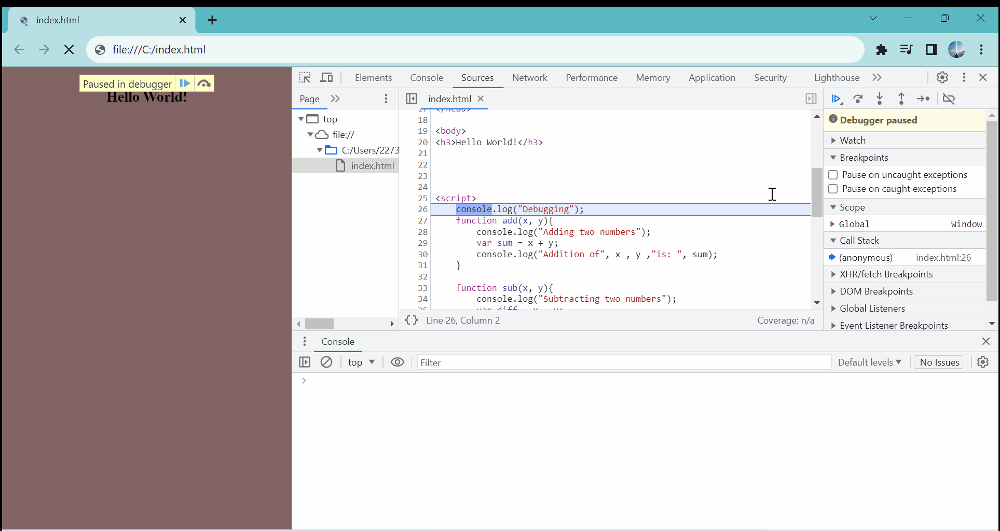
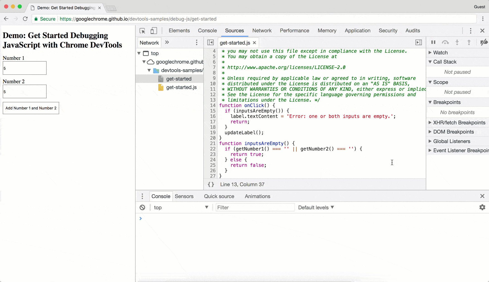
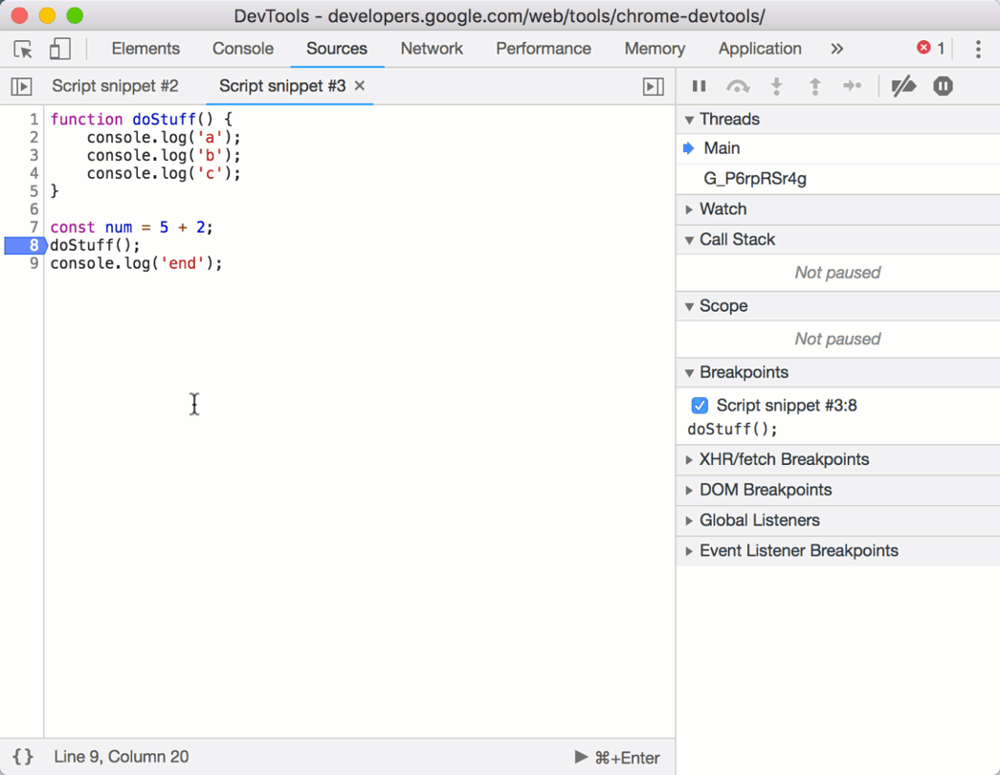

Debugging is the process of finding and fixing errors in your code. It is an essential skill for developers to master, as it helps you identify and resolve issues quickly and efficiently. In this tutorial, you will learn how to debug JavaScript code in the browser using the Chrome DevTools. We will cover the basics of debugging, including breakpoints, console, sources, call stack, watch, scope, network, performance, memory, profiling, and code coverage.

## Common Debugging Techniques

Here are some common debugging techniques that you can use to debug JavaScript code:

- **Breakpoints**: Pause the execution of your code at a specific line to inspect the state of your application.
- **Console**: Log messages to the console to track the flow of your code and inspect variables.
- **Sources**: View and edit the source code of your application.
- **Call Stack**: View the sequence of function calls that led to the current point in your code.
- **Watch**: Monitor the value of variables in real-time.
- **Scope**: Inspect the variables in the current scope.
- **Network**: Monitor network requests made by your application.
- **Performance**: Analyze the performance of your application.
- **Memory**: Inspect the memory usage of your application.
- **Profiling**: Profile the performance of your application.
- **Code Coverage**: Measure how much of your code is executed during a test.
- **Debugger Statement**: Use the `debugger` statement to pause the execution of your code.
- **Error Messages**: Read error messages in the console to identify issues in your code.
- **Code Review**: Review your code with a colleague to get a fresh perspective.

## Debugging with Chrome DevTools

Chrome DevTools is a set of web developer tools built into the Google Chrome browser. It provides a rich set of debugging tools that you can use to inspect and debug your web applications. To open Chrome DevTools, right-click on a web page and select "Inspect" or press `Ctrl+Shift+I` (Windows/Linux) or `Cmd+Option+I` (Mac).

### Breakpoints

Breakpoints allow you to pause the execution of your code at a specific line to inspect the state of your application. To set a breakpoint, click on the line number in the source code panel. When the code reaches the breakpoint, it will pause, and you can inspect the variables and step through the code using the controls in the debugger.



### Console

The console is a powerful tool for logging messages to track the flow of your code and inspect variables. You can log messages using `console.log()`, `console.error()`, `console.warn()`, `console.info()`, and `console.debug()`. You can also evaluate expressions in the console and interact with the page using JavaScript.

```javascript title="Console Logging"
console.log("Hello, World!");
console.error("An error occurred!");
console.warn("Warning: This is a warning!");
console.info("Information: This is an information message!");
console.debug("Debug: This is a debug message!");
```

### Sources

The sources panel allows you to view and edit the source code of your application. You can set breakpoints, step through the code, and inspect variables in the debugger. You can also search for files, navigate the call stack, and view the network requests made by your application.



### Call Stack

The call stack panel shows the sequence of function calls that led to the current point in your code. It helps you understand the flow of your code and identify where an error occurred. You can navigate the call stack, inspect the variables in each function, and step through the code using the controls in the debugger.



### Watch

The watch panel allows you to monitor the value of variables in real-time. You can add variables to the watch list and see their values update as you step through the code. This is useful for tracking the state of your application and identifying issues in your code.

### Scope

The scope panel allows you to inspect the variables in the current scope. You can view the local, closure, and global variables, as well as the `this` context. This helps you understand the state of your application and debug issues related to variable scoping.

### Network

The network panel allows you to monitor the network requests made by your application. You can view the request and response headers, payloads, and timing information. This helps you identify performance issues, debug network-related errors, and optimize the performance of your application.

### Performance

The performance panel allows you to analyze the performance of your application. You can record performance profiles, analyze CPU and memory usage, and identify performance bottlenecks. This helps you optimize the performance of your application and deliver a better user experience.

### Memory

The memory panel allows you to inspect the memory usage of your application. You can take heap snapshots, analyze memory allocations, and identify memory leaks. This helps you optimize the memory usage of your application and prevent memory-related issues.

### Profiling

The profiling panel allows you to profile the performance of your application. You can record CPU profiles, analyze JavaScript execution, and identify performance bottlenecks. This helps you optimize the performance of your application and deliver a better user experience.

### Code Coverage

The code coverage panel allows you to measure how much of your code is executed during a test. You can record code coverage profiles, analyze the coverage of your code, and identify unused code. This helps you ensure that your tests cover all parts of your code and identify areas for improvement.

### Debugger Statement

The `debugger` statement allows you to pause the execution of your code at a specific point. When the code reaches the `debugger` statement, it will pause, and you can inspect the variables and step through the code using the controls in the debugger. This is useful for debugging complex issues and identifying errors in your code.

```javascript title="Debugger Statement"
function add(a, b) {
  debugger;
  return a + b;
}

add(1, 2); // The code will pause at the debugger statement
```

### Error Messages

Error messages in the console provide valuable information about issues in your code. They help you identify syntax errors, runtime errors, and logic errors. By reading error messages, you can quickly pinpoint the source of the issue and fix it.

### Code Review

Code review is a collaborative process where you review your code with a colleague to get a fresh perspective. By sharing your code with others, you can identify issues, improve the quality of your code, and learn new techniques. Code review helps you catch bugs early, improve code readability, and foster a culture of collaboration.

:::note
Debugging is an iterative process that requires patience and persistence. By mastering the debugging techniques and tools available to you, you can identify and fix errors in your code quickly and efficiently.
:::

:::tip
When debugging, start with the simplest possible case and gradually add complexity. Break down the problem into smaller parts, test each part individually, and identify the source of the issue. By following a systematic approach, you can debug your code effectively and efficiently.
:::

:::tip Major Browsers' Debugging Tools

- **Chrome DevTools**: Built into Google Chrome, it provides a rich set of debugging tools for web developers.
- **Firefox Developer Tools**: Built into Mozilla Firefox, it provides a set of debugging tools for web developers.
- **Safari Web Inspector**: Built into Apple Safari, it provides a set of debugging tools for web developers.
- **Edge DevTools**: Built into Microsoft Edge, it provides a set of debugging tools for web developers.
- **Opera Developer Tools**: Built into Opera, it provides a set of debugging tools for web developers.
- **Internet Explorer Developer Tools**: Built into Internet Explorer, it provides a set of debugging tools for web developers.
- **Brave DevTools**: Built into Brave, it provides a set of debugging tools for web developers.
- **Vivaldi DevTools**: Built into Vivaldi, it provides a set of debugging tools for web developers.
- **Tor Browser DevTools**: Built into Tor Browser, it provides a set of debugging tools for web developers.
- **UC Browser DevTools**: Built into UC Browser, it provides a set of debugging tools for web developers.
- **Yandex Browser DevTools**: Built into Yandex Browser, it provides a set of debugging tools for web developers.
- **Samsung Internet DevTools**: Built into Samsung Internet, it provides a set of debugging tools for web developers.
- **Puffin Browser DevTools**: Built into Puffin Browser, it provides a set of debugging tools for web developers.

:::

## Conclusion

In this tutorial, you learned how to debug JavaScript code in the browser using the Chrome DevTools. We covered the basics of debugging, including breakpoints, console, sources, call stack, watch, scope, network, performance, memory, profiling, and code coverage. By mastering these debugging techniques, you can identify and fix errors in your code quickly and efficiently. Happy debugging!
