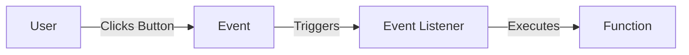
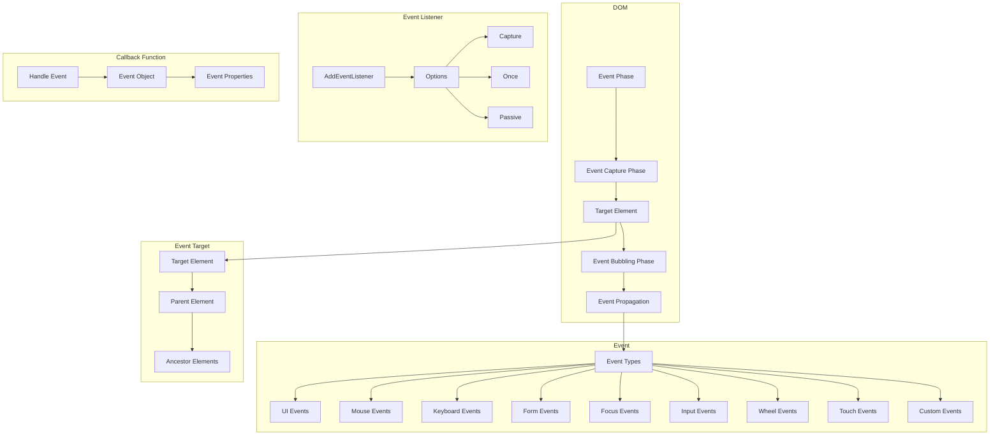

An event is a signal that something has happened. For example, when a user clicks a button, the click event is triggered. Events are a part of the Document Object Model (DOM) and are used to interact with the user.



In the above diagram, when a user clicks a button, the click event is triggered. The event listener listens for the click event and executes the function when the event occurs.

## Event Types

There are many types of events in JavaScript. Some of the most common events are:

### 1. `click` Event

```html title="index.html"
<!DOCTYPE html>
<html>
  <head>
    <title>Click Event</title>
  </head>
  <body>
    <button id="button">Click Me</button>
    <script>
      document.getElementById("button").addEventListener("click", function () {
        alert("Button Clicked");
      });
    </script>
  </body>
</html>
```

<BrowserWindow minHeight="300px" url="http://127.0.0.1:5500/index.html">
  <button onClick={()=>{alert('Button Clicked')}}>Click Me</button>
</BrowserWindow>

### 2. `mouseover` Event

```html title="index.html"
<!DOCTYPE html>
<html>
  <head>
    <title>Mouseover Event</title>
  </head>
  <body>
    <button id="button">Mouseover Me</button>
    <script>
      document
        .getElementById("button")
        .addEventListener("mouseover", function () {
          alert("Mouseover Event");
        });
    </script>
  </body>
</html>
```

<BrowserWindow minHeight="300px" url="http://127.0.0.1:5500/index.html">
  <button onMouseOver={()=>{alert('Mouseover Event')}}>Mouseover Me</button>
</BrowserWindow>

### 3. `mouseout` Event

```html title="index.html"
<!DOCTYPE html>
<html>
  <head>
    <title>Mouseout Event</title>
  </head>
  <body>
    <button id="button">Mouseout Me</button>
    <script>
      document
        .getElementById("button")
        .addEventListener("mouseout", function () {
          alert("Mouseout Event");
        });
    </script>
  </body>
</html>
```

<BrowserWindow minHeight="300px" url="http://127.0.0.1:5500/index.html">
  <button onMouseOut={()=>{alert("Mouseout Event")}}>Mouseout Me</button>
</BrowserWindow>

### 3. `change` Event

```html title="index.html"
<!DOCTYPE html>
<html>
  <head>
    <title>Change Event</title>
  </head>
  <body>
    <input type="text" id="input" />
    <script>
      document.getElementById("input").addEventListener("change", function () {
        alert("Input Changed");
      });
    </script>
  </body>
</html>
```

<BrowserWindow minHeight="300px" url="http://127.0.0.1:5500/index.html">
  <input type="text" id="input" onChange={() => alert("Input Changed")} />
</BrowserWindow>

### 4. `submit` Event

```html title="index.html"
<!DOCTYPE html>
<html>
  <head>
    <title>Submit Event</title>
  </head>
  <body>
    <form id="form">
      <input type="text" name="name" />
      <input type="submit" value="Submit" />
    </form>
    <script>
      document
        .getElementById("form")
        .addEventListener("submit", function (event) {
          event.preventDefault();
          alert("Form Submitted");
        });
    </script>
  </body>
</html>
```

<BrowserWindow minHeight="300px" url="http://127.0.0.1:5500/index.html">
  <form id="form" onSubmit={(e) => {e.preventDefault(); alert("Form Submitted")}}>
    <input type="text" name="name" />
    {' '}
    <input type="submit" value="Submit" />
  </form>
</BrowserWindow>

## Event Listener

An event listener is a function that listens for a specific event to occur. It is used to handle the event when it occurs. The `addEventListener` method is used to add an event listener to an element.

```js title="index.js"
document.getElementById("button").addEventListener("click", function () {
  alert("Button Clicked");
});
```

In the above example, the `click` event listener is added to the button element. When the button is clicked, the function is executed.

## Event Object

The event object is passed to the event listener function as an argument. It contains information about the event that occurred. For example, the `target` property of the event object contains a reference to the element that triggered the event.

```js title="index.js"
document.getElementById("button").addEventListener("click", function (event) {
  alert("Button Clicked");
  console.log(event.target);
});
```

In the above example, the `target` property of the event object is logged to the console. It contains a reference to the button element that triggered the event.

## Event Propagation

Event propagation is the process of event bubbling and event capturing. When an event occurs on an element, it first runs the event listeners on the element itself, then on its parent, and so on, until it reaches the top of the document. This is called event bubbling. Event capturing is the opposite, where the event listeners on the parent element are run first, then on the element itself.

```html title="index.html"
<!DOCTYPE html>
<html>
  <head>
    <title>Event Propagation</title>
  </head>
  <body>
    <div id="outer">
      <div id="inner">Click Me</div>
    </div>
    <script>
      document.getElementById("inner").addEventListener("click", function () {
        alert("Inner Div Clicked");
      });
      document.getElementById("outer").addEventListener("click", function () {
        alert("Outer Div Clicked");
      });
    </script>
  </body>
</html>
```

<BrowserWindow minHeight="300px" url="http://127.0.0.1:5500/index.html">
  <div id="outer" onClick={() => alert("Outer Div Clicked")}>
    <div id="inner" onClick={() => alert("Inner Div Clicked")}>Click Me</div>    
  </div>
</BrowserWindow>

In the above example, when the inner div is clicked, the event bubbles up to the outer div, and the event listener on the outer div is also triggered.

## Prevent Default

The `preventDefault` method is used to prevent the default behavior of an event. For example, it can be used to prevent a form from being submitted or a link from being followed.

```html title="index.html"
<!DOCTYPE html>
<html>
  <head>
    <title>Prevent Default</title>
  </head>
  <body>
    <a href="https://cmhq.tech" id="link">Click Me</a>
    <script>
      document
        .getElementById("link")
        .addEventListener("click", function (event) {
          event.preventDefault();
          alert("Link Clicked");
        });
    </script>
  </body>
</html>
```

<BrowserWindow minHeight="300px" url="http://127.0.0.1:5500/index.html">
  <a href="https://cmhq.tech" onClick={(e) => {e.preventDefault(); alert("Link Clicked")}}>Click Me</a>
</BrowserWindow>

In the above example, the `preventDefault` method is used to prevent the link from being followed when it is clicked.

## Stop Propagation

The `stopPropagation` method is used to stop the event from propagating to the parent elements. It prevents the event from bubbling up the DOM tree.

```html title="index.html"
<!DOCTYPE html>
<html>
  <head>
    <title>Stop Propagation</title>
  </head>
  <body>
    <div id="outer">
      <div id="inner">Click Me</div>
    </div>
    <script>
      document
        .getElementById("inner")
        .addEventListener("click", function (event) {
          event.stopPropagation();
          alert("Inner Div Clicked");
        });
      document.getElementById("outer").addEventListener("click", function () {
        alert("Outer Div Clicked");
      });
    </script>
  </body>
</html>
```

<BrowserWindow minHeight="300px" url="http://127.0.0.1:5500/index.html">
  <div id="outer" onClick={() => alert("Outer Div Clicked")}>
    <div id="inner" onClick={(e) => {e.stopPropagation(); alert("Inner Div Clicked")}}>Click Me</div>
  </div>
</BrowserWindow>

In the above example, when the inner div is clicked, the event does not bubble up to the outer div because the `stopPropagation` method is used.

:::info
The `stopPropagation` method only stops the event from propagating to the parent elements. It does not stop the default behavior of the event.
:::



In the above diagram, the event capture phase occurs first, followed by the target element, and then the event bubbling phase. The event object contains information about the event, and the event listener is used to handle the event when it occurs.

## Summary

In this article, we learned about events in JavaScript. We learned about different types of events, event listeners, event objects, event propagation, and how to prevent default behavior and stop event propagation. Events are an important part of web development and are used to create interactive user interfaces.
