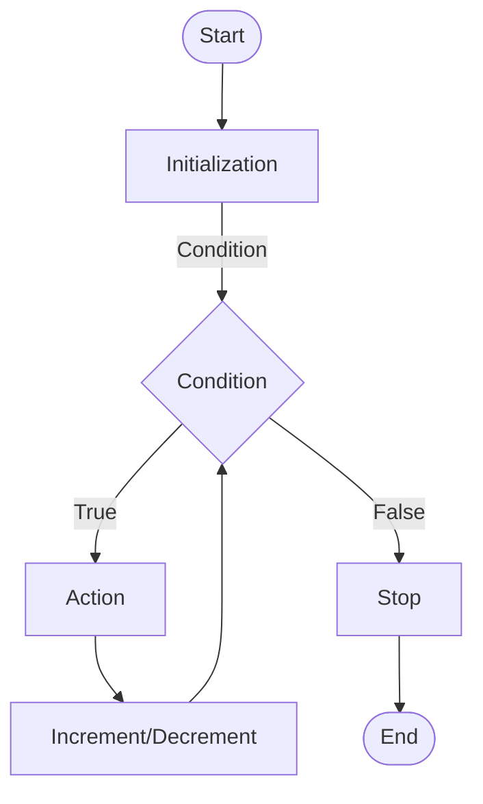

In JavaScript, the `for` loop is used to execute a block of code multiple times. It is often used when you know the number of iterations you want to perform.

## Syntax

The syntax of the `for` loop is as follows:

```js title="app.js"
for (initialization; condition; increment / decrement) {
  // code to be executed
}
```

- The `for` loop starts with the `for` keyword followed by parentheses.
- Inside the parentheses, you need to specify three expressions separated by semicolons:
  - The `initialization` expression is executed only once before the loop starts. It is used to initialize the loop variable.
  - The `condition` expression is evaluated before each iteration. If the condition is `true`, the code inside the loop is executed. If the condition is `false`, the loop terminates.
  - The `increment/decrement` expression is executed at the end of each iteration. It is used to update the loop variable.

## Flow Chart of the `for` Loop



## Example

The following example demonstrates how to use the `for` loop to print the numbers from 1 to 5:

```js title="app.js"
for (let i = 1; i <= 5; i++) {
  console.log(i);
}
```

In this example, the `for` loop initializes the loop variable `i` to `1`. It then checks if `i` is less than or equal to `5`. If the condition is `true`, it executes the code inside the loop and increments `i` by `1`. This process continues until `i` is no longer less than or equal to `5`.

The output of the above example will be:

```plaintext title="Output"
1
2
3
4
5
```

In each iteration, the value of `i` is printed to the console.

## Infinite `for` Loop

If you omit the `condition` expression, the `for` loop will run indefinitely. This is known as an infinite loop. For example:

```js title="app.js"
for (let i = 1; ; i++) {
  console.log(i);
}
```

In this example, the `condition` expression is omitted, so the loop will run indefinitely. You can use the `break` statement to exit the loop when a certain condition is met.

## Nested `for` Loop

You can use a `for` loop inside another `for` loop. This is known as a nested `for` loop. For example:

```js title="app.js"
for (let i = 1; i <= 3; i++) {
  for (let j = 1; j <= 3; j++) {
    console.log(`i = ${i}, j = ${j}`);
  }
}
```

In this example, the outer `for` loop runs three times, and the inner `for` loop runs three times for each iteration of the outer loop. The output of the above example will be:

```plaintext title="Output"
i = 1, j = 1
i = 1, j = 2
i = 1, j = 3
i = 2, j = 1
i = 2, j = 2
i = 2, j = 3
i = 3, j = 1
i = 3, j = 2
i = 3, j = 3
```

In each iteration of the outer loop, the inner loop runs three times, printing the value of `i` and `j` to the console.

:::info 📝 Note

**1.** You can use the `break` statement to exit a `for` loop prematurely. You can also use the `continue` statement to skip the current iteration and continue with the next iteration.

**2. Live Example**

```js live
function printNumbers() {
  return (
    <div>
      {(() => {
        let numbers = [];
        for (let i = 1; i <= 5; i++) {
          numbers.push(<p key={i}>{i}</p>);
        }
        return numbers;
      })()}
    </div>
  );
}
```

:::

## Conclusion

In this tutorial, you learned about the `for` loop in JavaScript and how to use it to execute a block of code multiple times. You also learned about infinite `for` loops and nested `for` loops.
