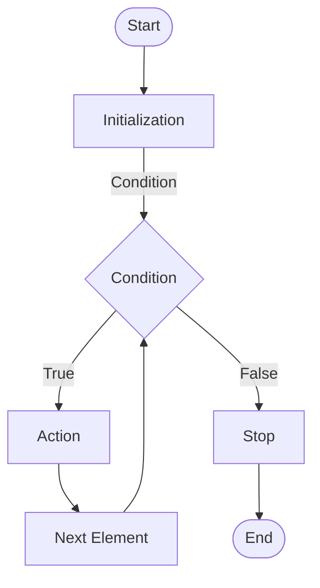

In JavaScript, the `for...of` loop is used to iterate over the elements of an iterable object. It is often used when you want to perform an action on each element of an array, set, map, string, or any other iterable object.

## Syntax

The syntax of the `for...of` loop is as follows:

```js title="app.js"
for (variable of iterable) {
  // code to be executed
}
```

- The `for...of` loop starts with the `for` keyword followed by parentheses.
- Inside the parentheses, you need to specify a `variable` to hold the element value and the `iterable` over which you want to iterate.
- The `variable` will be assigned the value of each element of the iterable on each iteration.
- The code inside the loop will be executed for each element of the iterable.
- The loop will iterate over the elements of the iterable object in the order of their insertion.
- The `for...of` loop can be used with arrays, sets, maps, strings, and any other iterable object.
- The `for...of` loop cannot be used to iterate over plain objects (i.e., objects created using `{}`) because they are not iterable. To iterate over the properties of an object, you should use the `for...in` loop or the `Object.keys`, `Object.values`, or `Object.entries` methods.
- The `for...of` loop can also be used with generator functions to iterate over the values generated by the generator.
- The `for...of` loop cannot be used to iterate over asynchronous iterators, such as the iterators returned by the `Symbol.asyncIterator` method.
- The `for...of` loop can be used with the `await` keyword to iterate over the values of asynchronous iterators in an asynchronous function.
- The `for...of` loop can be used with the `break` and `continue` statements to control the flow of the loop.

## Example

The following example demonstrates how to use the `for...of` loop to iterate over the elements of an array:

```js title="app.js"
const numbers = [1, 2, 3, 4, 5];

for (const number of numbers) {
  console.log(number);
}
```

In this example, the `for...of` loop iterates over the elements of the `numbers` array and assigns each element to the `number` variable on each iteration. It then executes the code inside the loop to log each element to the console.

The output of the above example will be:

```plaintext title="Output"
1
2
3
4
5
```

The `for...of` loop is a convenient and concise way to iterate over the elements of an iterable object in JavaScript. It provides a simple and readable syntax for performing actions on each element of the iterable.

## Flow Chart of the `for...of` Loop



The flow chart above illustrates the flow of the `for...of` loop. It starts with the `Initialization` step, where the loop variable is initialized to the first element of the iterable. It then checks the `Condition` before each iteration. If the condition is `true`, it executes the `Action` and moves to the next element. This process continues until the condition is `false`, at which point the loop stops.

## Using `break` and `continue` Statements

You can use the `break` and `continue` statements to control the flow of the `for...of` loop. The `break` statement can be used to terminate the loop prematurely, while the `continue` statement can be used to skip the current iteration and move to the next element.

Here's an example that demonstrates the use of the `break` and `continue` statements with the `for...of` loop:

```js title="app.js"
const numbers = [1, 2, 3, 4, 5];

for (const number of numbers) {
  if (number === 3) {
    continue; // Skip the number 3
  }

  if (number === 5) {
    break; // Terminate the loop when the number 5 is encountered
  }

  console.log(number);
}
```

In this example, the `continue` statement is used to skip the number `3`, and the `break` statement is used to terminate the loop when the number `5` is encountered. The code inside the loop logs the numbers to the console, skipping the number `3` and terminating the loop when the number `5` is encountered.

The output of the above example will be:

```plaintext title="Output"
1
2
4
```

In each iteration, the code inside the loop checks if the current number is `3` or `5`. If the number is `3`, it skips the current iteration using the `continue` statement. If the number is `5`, it terminates the loop using the `break` statement. Otherwise, it logs the number to the console.

The `for...of` loop is a powerful and flexible construct that provides a convenient way to iterate over the elements of an iterable object in JavaScript. It can be used with arrays, sets, maps, strings, and any other iterable object to perform actions on each element in a concise and readable manner.

:::tip 📝 Note

The `for...of` loop cannot be used to iterate over plain objects (i.e., objects created using `{}`) because they are not iterable. To iterate over the properties of an object, you should use the `for...in` loop or the `Object.keys`, `Object.values`, or `Object.entries` methods.

The `for...of` loop can also be used with generator functions to iterate over the values generated by the generator.

The `for...of` loop cannot be used to iterate over asynchronous iterators, such as the iterators returned by the `Symbol.asyncIterator` method. However, it can be used with the `await` keyword to iterate over the values of asynchronous iterators in an asynchronous function.

The `for...of` loop can be used with the `break` and `continue` statements to control the flow of the loop.

:::

## Summary

In this tutorial, we learned about the `for...of` loop in JavaScript. We learned how to use the `for...of` loop to iterate over the elements of an iterable object. We also learned about using the `break` and `continue` statements to control the flow of the loop. The `for...of` loop is a powerful and flexible construct that provides a convenient and concise way to iterate over the elements of an iterable object in JavaScript.
