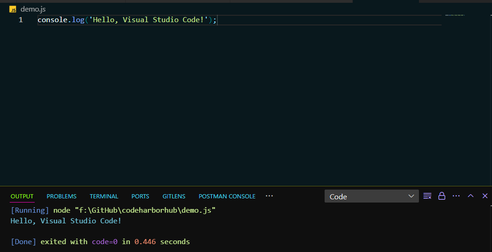

JavaScript is a versatile language that can be run in various environments. Whether you're creating interactive web pages, building server-side applications, or scripting automation tasks, JavaScript has you covered. In this chapter, we'll explore different ways to run JavaScript, from your browser to the server and beyond.

## 1. Running JavaScript in the Browser

### The Browser Console

The simplest way to run JavaScript in the browser is through the developer console. You can open the console by right-clicking on a web page and selecting "Inspect" or pressing `Ctrl+Shift+I` (or `Cmd+Option+I` on macOS). Then, navigate to the "Console" tab.

Here, you can type JavaScript code directly into the console and press `Enter` to execute it. For example, you can run the following code to display a message:

```javascript
console.log("Hello, world!");
```

### Inline Script Tags

Another way to run JavaScript in the browser is by embedding it directly into an HTML document using `<script>` tags. You can include JavaScript code inside the `<script>` tags, either in the `<head>` or `<body>` section of the HTML document.

Here's an example of an inline script that displays a message when the page loads:

```html
<!doctype html>
<html>
  <head>
    <title>Inline Script Example</title>
  </head>
  <body>
    <h1>Running JavaScript in the Browser</h1>
    <script>
      console.log("Hello, world!");
    </script>
  </body>
</html>
```

### External Script Files

For larger JavaScript codebases, it's common to store the code in external script files with a `.js` extension. You can then include these files in your HTML document using the `<script>` tag with the `src` attribute.

Here's an example of an external script file named `script.js` that displays a message when the page loads:

<Tabs>
  <TabItem value="HTML" label="HTML">
```html title="index.html"
<!DOCTYPE html>
<html>
<head>
  <title>External Script Example</title>
</head>
<body>
  <h1>Running JavaScript in the Browser</h1>
  <script src="script.js"></script>
</body>
</html>
```
  </TabItem>
  <TabItem value="JavaScript" label="JavaScript">
```javascript title="script.js"
console.log('Hello, world!');
```
  </TabItem>

</Tabs>

## 2. Running JavaScript on the Server with Node.js

JavaScript is not limited to the browser; you can also run it on the server using Node.js. This allows you to build back-end services, APIs, and even full-stack applications using JavaScript.

### Installing Node.js

1. **Download Node.js:** Visit the [Node.js website](https://nodejs.org/) and download the latest LTS (Long-Term Support) version for your operating system. Node.js comes with npm (Node Package Manager) to install additional packages.
2. **Install Node.js:** Follow the installation instructions for your platform (Windows, macOS, or Linux).
3. **Verify Installation:** Open a terminal or command prompt and run the following commands to check if Node.js and npm are installed:

<Tabs>
  <TabItem value="node" label="Node">
```bash
node -v
```
  </TabItem>
  <TabItem value="npm" label="npm">
```bash
npm -v
```
  </TabItem>
</Tabs>

If you see version numbers for Node.js and npm, you've successfully installed Node.js on your system.

### Running JavaScript with Node.js

Once Node.js is installed, you can create JavaScript files with Node.js code and run them from the command line. Here's an example of a simple Node.js script that displays a message:

```javascript title="hello.js"
console.log("Hello, Node.js!");
```

To run this script, save it as `hello.js` and open a terminal or command prompt. Navigate to the directory where the script is saved and run the following command:

```bash
node hello.js
```

You should see the message `Hello, Node.js!` printed to the console, indicating that the script ran successfully.

### Node.js as a JavaScript Runtime

Picture Node.js as a powerful engine that can take your JavaScript code and run it outside the browser. This opens up possibilities like building web servers, interacting with databases, handling file systems, and much more—all using JavaScript!

**For example:** You can create a simple web server using Node.js with just a few lines of code:

```javascript title="server.js"
// Load the HTTP module
const http = require("http");

// Create an HTTP server that responds with a message
const server = http.createServer((req, res) => {
  res.writeHead(200, { "Content-Type": "text/plain" });
  res.end("Hello, Node.js Server!");
});

// Listen on port 3000
server.listen(3000, () => {
  console.log("Server running at http://localhost:3000/");
});
```

Save this code as `server.js` and run it with Node.js using the following command:

```bash
node server.js
```

You've now created a simple web server that listens on port 3000 and responds with the message `Hello, Node.js Server!` when accessed in a browser.

## 3. Running JavaScript in Online Editors

If you want to experiment with JavaScript without setting up a local development environment, you can use online code editors that support JavaScript. These editors provide a browser-based environment where you can write, run, and share JavaScript code snippets.

### Popular Online Editors:

1. **[CodePen](https://codepen.io/):** A social development environment for front-end designers and developers.
2. **[JSFiddle](https://jsfiddle.net/):** An online playground for web development, testing, and sharing HTML, CSS, and JavaScript code snippets.
3. **[Repl.it](https://repl.it/):** An online IDE that supports multiple programming languages, including JavaScript.
4. **[StackBlitz](https://stackblitz.com/):** An online IDE for web applications powered by Visual Studio Code.

These online editors provide a convenient way to write and run JavaScript code without the need for local setup. You can experiment with different features, test libraries, and share your code with others in real-time.

:::note Example Using CodePen:

- **Imagination:** Imagine you're working on a quick project or trying out a new idea. You open CodePen, type your JavaScript code, and instantly see the results on the screen—no setup required!

1. **[Open CodePen](https://codepen.io/pen/):** Create a new pen.
2. **Write JavaScript:** Add your JavaScript code in the JavaScript editor.

   ```javascript
   console.log("Hello, CodePen!");
   ```

3. **Run Code:** Click the "Run" button to execute the code and see the output in the console.
4. **Share Your Pen:** You can share your pen with others by copying the URL or embedding it in a webpage.
5. **Explore More:** CodePen offers additional features like HTML, CSS, preprocessors, and frameworks to enhance your projects.
   :::

:::tip
When using online editors, remember that your code runs in a sandboxed environment, so you may encounter limitations compared to running JavaScript locally on your machine.
:::

## 4. Running JavaScript in Integrated Development Environments (IDEs)

For more advanced JavaScript development, you can use Integrated Development Environments (IDEs) that provide powerful tools, debugging capabilities, and project management features. IDEs offer a comprehensive environment for writing, testing, and deploying JavaScript applications.

### Popular JavaScript IDEs:

1. **[Visual Studio Code](https://code.visualstudio.com/):** A lightweight, open-source code editor with built-in support for JavaScript, debugging, and extensions.
2. **[WebStorm](https://www.jetbrains.com/webstorm/):** A professional IDE for web development with advanced JavaScript features, debugging, and integration with popular frameworks.
3. **[Sublime Text](https://www.sublimetext.com/):** A versatile code editor with a rich ecosystem of plugins and packages for JavaScript development.
4. **[Atom](https://atom.io/):** A hackable text editor for the 21st century with built-in package manager and support for JavaScript development.

These IDEs offer features like code completion, syntax highlighting, version control, and project management tools to streamline your JavaScript development workflow. You can customize the editor to suit your preferences and enhance your productivity when working on JavaScript projects.

:::note Example Using Visual Studio Code:

- **Imagination:** Imagine you're building a complex web application with multiple files, dependencies, and configurations. You open Visual Studio Code, create a new project, write your JavaScript code, and run the application with live debugging and testing.

1. **[Download Visual Studio Code](https://code.visualstudio.com/):** Install the editor on your machine.
2. **Create a New Project:** Open Visual Studio Code and create a new folder for your project.
3. **Write JavaScript Code:** Add your JavaScript code to a new file in the project folder.

   ```javascript
   console.log("Hello, Visual Studio Code!");
   ```

4. **Run Code:** Use the built-in terminal to run your JavaScript code and see the output in the console.

   

:::

## Conclusion

JavaScript is a versatile language that can be run in various environments, from the browser to the server and online editors. By mastering the different ways to run JavaScript, you can build interactive web pages, server-side applications, and full-stack projects with ease. Experiment with running JavaScript in different environments, explore new features, and discover the endless possibilities of this powerful language.
