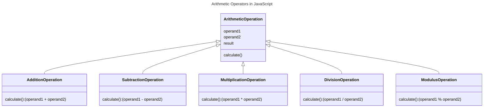

In JavaScript, the arithmetic operators are used to perform arithmetic operations on numbers. The arithmetic operators include addition, subtraction, multiplication, division, and modulus.



## Types of Arithmetic Operators in JavaScript 

The following are the types of arithmetic operators in JavaScript:

## Addition Operator (+)

The addition operator (`+`) is used to add two numbers.

```js {3} title="Addition Operator" showLineNumbers
const num1 = 10;
const num2 = 20;
const sum = num1 + num2;
console.log(sum); // Output: 30
```

## Subtraction Operator (-)

The subtraction operator (`-`) is used to subtract one number from another.

```js {3} title="Subtraction Operator" showLineNumbers
const num1 = 20;
const num2 = 10;
const difference = num1 - num2;
console.log(difference); // Output: 10
```

## Multiplication Operator (*)

The multiplication operator (`*`) is used to multiply two numbers.

```js {3} title="Multiplication Operator" showLineNumbers
const num1 = 10;
const num2 = 20;
const product = num1 * num2;
console.log(product); // Output: 200
```

## Division Operator (/)

The division operator (`/`) is used to divide one number by another.

```js {3} title="Division Operator" showLineNumbers
const num1 = 20;
const num2 = 10;
const quotient = num1 / num2;
console.log(quotient); // Output: 2
```

## Modulus Operator (%)

The modulus operator (`%`) is used to find the remainder when one number is divided by another.

```js {3} title="Modulus Operator" showLineNumbers
const num1 = 20;
const num2 = 10;
const remainder = num1 % num2;
console.log(remainder); // Output: 0
```

## Increment Operator (++) and Decrement Operator (--)

The increment operator (`++`) is used to increase the value of a variable by 1, and the decrement operator (`--`) is used to decrease the value of a variable by 1.

```js {2,5} title="Increment and Decrement Operators" showLineNumbers
let num = 10;
num++; // Increment num by 1
console.log(num); // Output: 11

num--; // Decrement num by 1
console.log(num); // Output: 10
```

:::note
The increment and decrement operators can be used as a prefix or postfix. When used as a prefix, the value of the variable is incremented or decremented before it is used in the expression. When used as a postfix, the value of the variable is incremented or decremented after it is used in the expression.

```js {2,4,7} title="Prefix and Postfix Increment and Decrement Operators" showLineNumbers
let num = 10;
let result;

result = ++num; // Increment num by 1 and then use it
console.log(result); // Output: 11

result = num++; // Use num and then increment it by 1
console.log(result); // Output: 11
console.log(num); // Output: 12
```

:::

## Conclusion

In this article, you learned about the arithmetic operators in JavaScript, including the addition, subtraction, multiplication, division, and modulus operators. You also learned about the increment and decrement operators. You can use these operators to perform arithmetic operations on numbers in JavaScript.