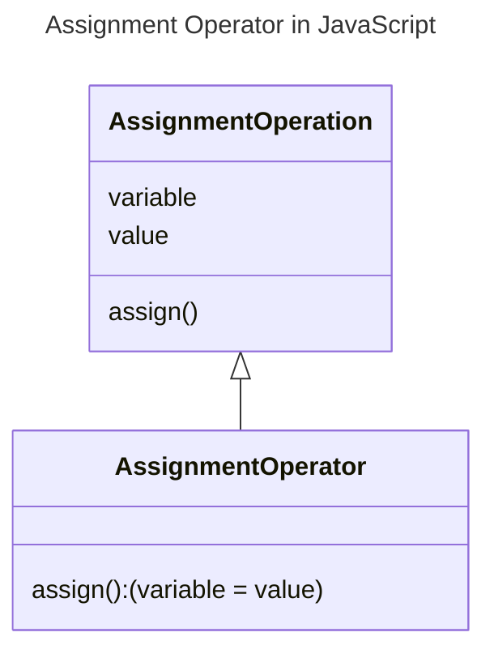

In JavaScript, the assignment operator (`=`) is used to assign a value to a variable. The value on the right-hand side of the assignment operator is assigned to the variable on the left-hand side.



## Syntax

The syntax for the assignment operator is as follows:

```js
variable = value;
```

Where:
- `variable`: The name of the variable to which the value is assigned.
- `value`: The value to be assigned to the variable.
- `=`: The assignment operator.
- `;`: The semicolon is used to terminate the statement.
- The value on the right-hand side of the assignment operator is assigned to the variable on the left-hand side.

## Example

Here's an example of using the assignment operator in JavaScript:

```js {3} title="Assignment Operator Example" showLineNumbers 
let x = 10;
let y = 20;
let z = x + y;
console.log(z); // Output: 30
```

In this example:
- The value `10` is assigned to the variable `x`.
- The value `20` is assigned to the variable `y`.
- The value of `x + y` is assigned to the variable `z`.
- The value of `z` is logged to the console, which is `30`.
- The assignment operator (`=`) is used to assign values to the variables `x`, `y`, and `z`.
- The addition operator (`+`) is used to add the values of `x` and `y` and assign the result to `z`.
- The value of `z` is logged to the console using `console.log`.
- The output of the code is `30`.

## Types of Assignment Operators in JavaScript

The following are the types of assignment operators in JavaScript:

### Simple Assignment Operator (`=`)

The simple assignment operator (`=`) is used to assign a value to a variable.

```js {1} title="Simple Assignment Operator" showLineNumbers
let num = 10;
console.log(num); // Output: 10
```

In this example, the value `10` is assigned to the variable `num` using the simple assignment operator (`=`).

### Compound Assignment Operators

JavaScript provides compound assignment operators that combine an arithmetic operation with the simple assignment operator. The compound assignment operators include `+=`, `-=`, `*=`, `/=`, and `%=`.

1. **Addition Assignment Operator (`+=`)**: The addition assignment operator (`+=`) adds the value on the right-hand side to the value of the variable and assigns the result to the variable.

    ```js {2} title="Addition Assignment Operator" showLineNumbers
    let num = 10;
    num += 5; // Equivalent to: num = num + 5;
    console.log(num); // Output: 15
    ```

2. **Subtraction Assignment Operator (`-=`)**: The subtraction assignment operator (`-=`) subtracts the value on the right-hand side from the value of the variable and assigns the result to the variable.

    ```js {2} title="Subtraction Assignment Operator" showLineNumbers
    let num = 10;
    num -= 5; // Equivalent to: num = num - 5;
    console.log(num); // Output: 5
    ```

3. **Multiplication Assignment Operator (`*=`)**: The multiplication assignment operator (`*=`) multiplies the value of the variable by the value on the right-hand side and assigns the result to the variable.

    ```js {2} title="Multiplication Assignment Operator" showLineNumbers
    let num = 10;
    num *= 5; // Equivalent to: num = num * 5;
    console.log(num); // Output: 50
    ```

4. **Division Assignment Operator (`/=`)**: The division assignment operator (`/=`) divides the value of the variable by the value on the right-hand side and assigns the result to the variable.

    ```js {2} title="Division Assignment Operator" showLineNumbers
    let num = 10;
    num /= 5; // Equivalent to: num = num / 5;
    console.log(num); // Output: 2
    ```

5. **Modulus Assignment Operator (`%=`)**: The modulus assignment operator (`%=`) calculates the remainder when the value of the variable is divided by the value on the right-hand side and assigns the result to the variable.

    ```js {2} title="Modulus Assignment Operator" showLineNumbers
    let num = 10;
    num %= 5; // Equivalent to: num = num % 5;
    console.log(num); // Output: 0
    ```

6. **Exponentiation Assignment Operator (`**=`)**: The exponentiation assignment operator (`**=`) raises the value of the variable to the power of the value on the right-hand side and assigns the result to the variable.

    ```js {2} title="Exponentiation Assignment Operator" showLineNumbers
    let num = 2;
    num **= 3; // Equivalent to: num = num ** 3;
    console.log(num); // Output: 8
    ```

In each of the above examples, the compound assignment operator is used to perform an arithmetic operation and assign the result to the variable.

### Destructuring Assignment

Destructuring assignment is a special syntax that allows you to extract values from arrays or objects and assign them to variables.

1. **Array Destructuring**: The destructuring assignment can be used to extract values from an array and assign them to variables.

    ```js {1} title="Array Destructuring Assignment" showLineNumbers
    const [x, y] = [10, 20];
    console.log(x); // Output: 10
    console.log(y); // Output: 20
    ```

2. **Object Destructuring**: The destructuring assignment can be used to extract values from an object and assign them to variables.

    ```js {1} title="Object Destructuring Assignment" showLineNumbers
    const { name, age } = { name: 'John', age: 30 };
    console.log(name); // Output: John
    console.log(age); // Output: 30
    ```

In each of the above examples, the destructuring assignment is used to extract values from an array or object and assign them to variables.

### Assignment Operator with Chaining (`=`) 

The assignment operator can be used to chain multiple assignments in a single statement.

```js {1} title="Assignment Operator with Chaining" showLineNumbers
let a, b, c;
a = b = c = 10;
console.log(a); // Output: 10
console.log(b); // Output: 10
console.log(c); // Output: 10
```

In this example, the value `10` is assigned to the variables `a`, `b`, and `c` using the assignment operator with chaining.

### Few More Examples

Here are a few more examples of using the assignment operator in JavaScript:

1. **Shift Assignment Operators:** The shift assignment operators (`<<=`, `>>=`, and `>>>=`) can be used to perform bitwise shift operations and assign the result to the variable.

| Operator | Description | Example |
| -------- | ----------- | ------- |
| `<<=`    | Left shift assignment | `num <<= 2;` |
| `>>=`    | Right shift assignment | `num >>= 2;` |
| `>>>=`   | Unsigned right shift assignment | `num >>>= 2;` |

2. **Logical Assignment Operators:** The logical assignment operators (`&&=`, `||=`, and `??=`) can be used to perform logical operations and assign the result to the variable.

| Operator | Description | Example |
| -------- | ----------- | ------- |
| `&&=`    | Logical AND assignment | `a &&= b;` |
| `||=`    | Logical OR assignment | `a ||= b;` |
| `??=`    | Nullish coalescing assignment | `a ??= b;` |

3. **String Assignment Operators:** The string assignment operators (`+=`, `||=`, and `??=`) can be used to concatenate strings and assign the result to the variable.

| Operator | Description | Example |
| -------- | ----------- | ------- |
| `+=`     | String concatenation assignment | `str += ' World';` |
| `||=`    | String concatenation assignment | `str ||= 'Hello';` |
| `??=`    | String concatenation assignment | `str ??= 'Hello';` |


4. **Bitwise Assignment Operators:** The bitwise assignment operators (`&=`, `|=`, and `^=`) can be used to perform bitwise operations and assign the result to the variable.

| Operator | Description | Example |
| -------- | ----------- | ------- |
| `&=`     | Bitwise AND assignment | `num &= 2;` |
| `|=`     | Bitwise OR assignment | `num |= 2;` |
| `^=`     | Bitwise XOR assignment | `num ^= 2;` |

:::note
The assignment operator can be used to assign values to variables, perform arithmetic operations, and chain multiple assignments in a single statement. It can also be used with destructuring assignment, shift assignment operators, logical assignment operators, string assignment operators, and bitwise assignment operators.
:::

## Conclusion

In this article, you learned about the assignment operator in JavaScript and its various types, including the simple assignment operator, compound assignment operators, destructuring assignment, and assignment operator with chaining. You also learned about the shift assignment operators, logical assignment operators, string assignment operators, and bitwise assignment operators. You can use the assignment operator to assign values to variables and perform various operations in JavaScript.