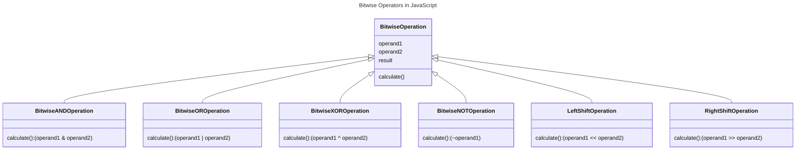

In JavaScript, the bitwise operators are used to perform bitwise operations on integers. The bitwise operators include AND, OR, XOR, NOT, left shift, and right shift.



## Types of Bitwise Operators in JavaScript

The following are the types of bitwise operators in JavaScript:

| Operand 1 | Operand 2 | `&` (AND) | `\|` (OR) | `^` (XOR) | `~ `(NOT) | `<<` (Left Shift) | `>>` (Right Shift) |
|-----------|-----------|---------|-------|---------|---------|-----------------|------------------|
| 0         | 0         | 0       | 0     | 0       | 1       | 0               | 0                |
| 0         | 1         | 0       | 1     | 1       | 1       | 0               | 0                |
| 1         | 2         | 0       | 3     | 3       | 1       | 2               | 0                |
| 2         | 3         | 2       | 3     | 1       | 1       | 4               | 1                |
| 3         | 4         | 0       | 7     | 7       | 1       | 6               | 1                |
| 4         | 5         | 4       | 5     | 1       | 1       | 8               | 2                |
| 5         | 6         | 4       | 7     | 3       | 1       | 10              | 2                |
| 6         | 7         | 6       | 7     | 1       | 1       | 12              | 3                |
| 7         | 8         | 0       | 15    | 15      | 1       | 14              | 3                |
| 8         | 9         | 8       | 9     | 1       | 1       | 16              | 4                |
| 9         | 10        | 8       | 11    | 3       | 1       | 18              | 4                |
| 10        | 11        | 10      | 11    | 1       | 1       | 20              | 5                |
| 11        | 12        | 10      | 15    | 7       | 1       | 24              | 5                |
| 12        | 13        | 12      | 13    | 1       | 1       | 26              | 6                |
| 13        | 14        | 12      | 15    | 3       | 1       | 28              | 6                |
| 14        | 15        | 14      | 15    | 1       | 1       | 30              | 7                |
| 15        | 16        | 0       | 31    | 31      | 1       | 30              | 7                |
| 16        | 17        | 16      | 17    | 1       | 1       | 32              | 8                |
| 17        | 18        | 16      | 19    | 3       | 1       | 36              | 8                |
| 18        | 19        | 18      | 19    | 1       | 1       | 40              | 9                |
| 19        | 20        | 16      | 23    | 3       | 1       | 44              | 9                |
| 20        | 21        | 16      | 21    | 5       | 1       | 48              | 10               |
| 21        | 22        | 20      | 23    | 3       | 1       | 52              | 10               |
| 22        | 23        | 22      | 23    | 1       | 1       | 56              | 11               |
| 23        | 24        | 16      | 31    | 7       | 1       | 56              | 11               |
| 24        | 25        | 24      | 25    | 1       | 1       | 48              | 12               |
| 25        | 26        | 24      | 27    | 3       | 1       | 52              | 12               |


## Bitwise AND Operator (`&`) 

The bitwise AND operator (`&`) is used to perform a bitwise AND operation on two integers.

```js {3} title="Bitwise AND Operator" showLineNumbers
const num1 = 5; // 101
const num2 = 3; // 011
const result = num1 & num2; // 001
console.log(result); // Output: 1
```

In the above example, the binary representation of `num1` is `101` and the binary representation of `num2` is `011`. The bitwise AND operation on `num1` and `num2` results in `001`, which is `1` in decimal.

## Bitwise OR Operator (`|`)

The bitwise OR operator (`|`) is used to perform a bitwise OR operation on two integers.

```js {3} title="Bitwise OR Operator" showLineNumbers
const num1 = 5; // 101
const num2 = 3; // 011
const result = num1 | num2; // 111
console.log(result); // Output: 7
```

In the above example, the binary representation of `num1` is `101` and the binary representation of `num2` is `011`. The bitwise OR operation on `num1` and `num2` results in `111`, which is `7` in decimal.

## Bitwise XOR Operator (`^`)

The bitwise XOR operator (`^`) is used to perform a bitwise XOR operation on two integers.

```js {3} title="Bitwise XOR Operator" showLineNumbers
const num1 = 5; // 101
const num2 = 3; // 011
const result = num1 ^ num2; // 110
console.log(result); // Output: 6
```

In the above example, the binary representation of `num1` is `101` and the binary representation of `num2` is `011`. The bitwise XOR operation on `num1` and `num2` results in `110`, which is `6` in decimal.

## Bitwise NOT Operator (`~`)

The bitwise NOT operator (`~`) is used to perform a bitwise NOT operation on an integer.

```js {3} title="Bitwise NOT Operator" showLineNumbers
const num = 5; // 101
const result = ~num; // -6 (two's complement of 101 is 010, which is 6 in decimal, and the negative of 6 is -6)
console.log(result); // Output: -6
```

In the above example, the binary representation of `num` is `101`. The bitwise NOT operation on `num` results in `-6`.

## Left Shift Operator (`<<`)

The left shift operator (`<<`) is used to perform a left shift operation on an integer.

```js {3} title="Left Shift Operator" showLineNumbers
const num = 5; // 101
const result = num << 1; // 1010 (which is 10 in decimal)
console.log(result); // Output: 10
```

In the above example, the binary representation of `num` is `101`. The left shift operation on `num` by 1 bit results in `1010`, which is `10` in decimal.

## Right Shift Operator (`>>`)

The right shift operator (`>>`) is used to perform a right shift operation on an integer.

```js {3} title="Right Shift Operator" showLineNumbers
const num = 5; // 101
const result = num >> 1; // 10 (which is 2 in decimal)
console.log(result); // Output: 2
```

In the above example, the binary representation of `num` is `101`. The right shift operation on `num` by 1 bit results in `10`, which is `2` in decimal.

:::note
The left shift operator (`<<`) and the right shift operator (`>>`) are used to shift the bits of an integer to the left or right by a specified number of positions. When shifting to the left, the empty positions are filled with zeros. When shifting to the right, the empty positions are filled with the sign bit (0 for positive numbers and 1 for negative numbers).
:::

:::tip tips and tricks
**1. How to convert a decimal number to binary and vice versa?**

To convert a decimal number to binary, you can use the `toString` method with a radix of `2`. For example:

```js {2} title="Convert Decimal to Binary" showLineNumbers
const num = 5;
const binary = num.toString(2);
console.log(binary); // Output: 101
```

To convert a binary number to decimal, you can use the `parseInt` method with a radix of `2`. For example:

```js {2} title="Convert Binary to Decimal" showLineNumbers
const binary = '101';
const num = parseInt(binary, 2);
console.log(num); // Output: 5
```

**2. How to perform bitwise operations on large integers?**

JavaScript uses 32-bit integers for bitwise operations. If you need to perform bitwise operations on large integers, you can use the `BigInt` data type, which allows you to work with arbitrarily large integers. For example:

```js {2,5} title="Perform Bitwise Operations on Large Integers" showLineNumbers
const num1 = 9007199254740991n; // Large integer
const num2 = 9007199254740991n; // Large integer
const result = num1 & num2; // Bitwise AND operation
console.log(result); // Output: 9007199254740991n
```

In the above example, the `n` suffix is used to indicate that the number is a `BigInt`.

**3. How to use bitwise operators in cryptography?**

Bitwise operators are used in cryptography to perform low-level operations on binary data. For example, the XOR operator is used in the one-time pad encryption algorithm to encrypt and decrypt messages. The left shift and right shift operators are used in the DES (Data Encryption Standard) algorithm to perform permutation and substitution operations.

**4. How to use bitwise operators in network programming?**

Bitwise operators are used in network programming to perform low-level operations on IP addresses, port numbers, and network masks. For example, the bitwise AND operator is used to perform subnetting and supernetting operations, and the bitwise OR operator is used to combine IP addresses and port numbers.

**5. How to solve problems with the help of Right Shift Operator and Left Shift Operator? and explain in brief?**

The right shift operator (`>>`) and the left shift operator (`<<`) can be used to solve problems related to binary representation, bit manipulation, and low-level optimization. For example, the right shift operator can be used to divide an integer by a power of 2, and the left shift operator can be used to multiply an integer by a power of 2. These operators can also be used to optimize code by replacing multiplication and division operations with shift operations, which are faster and more efficient.

for example, if you want to multiply a number by 2, you can use the left shift operator as follows:

```js {2} title="Multiply a Number by 2 using Left Shift Operator" showLineNumbers
const num = 5;
const result = num << 1; // Multiply num by 2
console.log(result); // Output: 10
```

Similarly, if you want to divide a number by 2, you can use the right shift operator as follows:

```js {2} title="Divide a Number by 2 using Right Shift Operator" showLineNumbers
const num = 10;
const result = num >> 1; // Divide num by 2
console.log(result); // Output: 5
```

```js {2} title="Divide a Number by 4 using Right Shift Operator" showLineNumbers
const num = 10;
const result = num >> 2; // Divide num by 4
console.log(result); // Output: 2
```
:::

## Conclusion

In this article, you learned about the bitwise operators in JavaScript, including the bitwise AND, OR, XOR, NOT, left shift, and right shift operators. You also saw examples of how to use these operators to perform bitwise operations on integers. Bitwise operators are used in low-level programming, such as device drivers, network programming, and cryptography. They are also used in JavaScript to perform low-level operations on binary data. 