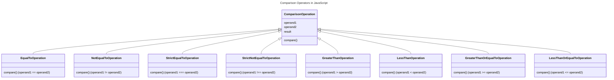

In JavaScript, the comparison operators are used to compare two values. The comparison operators include equal to (`==`), not equal to (`!=`), strict equal to (`===`), strict not equal to (`!==`), greater than (`>`), less than (`<`), greater than or equal to (`>=`), and less than or equal to (`<=`).



## Types of Comparison Operators in JavaScript

The following are the types of comparison operators in JavaScript:

### Equal To Operator (==)

The equal to operator (`==`) is used to compare two values. It returns `true` if the values are equal, otherwise `false`.

```js {3} title="Equal To Operator" showLineNumbers
const num1 = 10;
const num2 = 10;
console.log(num1 == num2); // Output: true
```

### Not Equal To Operator (!=)

The not equal to operator (`!=`) is used to compare two values. It returns `true` if the values are not equal, otherwise `false`.

```js {3} title="Not Equal To Operator" showLineNumbers
const num1 = 10;
const num2 = 20;
console.log(num1 != num2); // Output: true
```

### Strict Equal To Operator (===)

The strict equal to operator (`===`) is used to compare two values. It returns `true` if the values are equal and of the same type, otherwise `false`.

```js {3} title="Strict Equal To Operator" showLineNumbers
const num1 = 10;
const num2 = '10';
console.log(num1 === num2); // Output: false
```

### Strict Not Equal To Operator (!==)

The strict not equal to operator (`!==`) is used to compare two values. It returns `true` if the values are not equal and of the same type, otherwise `false`.

```js {3} title="Strict Not Equal To Operator" showLineNumbers
const num1 = 10;
const num2 = '10';
console.log(num1 !== num2); // Output: true
```

### Greater Than Operator (`>`)

The greater than operator (`>`) is used to compare two values. It returns `true` if the left operand is greater than the right operand, otherwise `false`.

```js {3} title="Greater Than Operator" showLineNumbers
const num1 = 20;
const num2 = 10;
console.log(num1 > num2); // Output: true
```

### Less Than Operator (`<`)

The less than operator (`<`) is used to compare two values. It returns `true` if the left operand is less than the right operand, otherwise `false`.

```js {3} title="Less Than Operator" showLineNumbers
const num1 = 10;
const num2 = 20;
console.log(num1 < num2); // Output: true
```

### Greater Than or Equal To Operator (`>=`)

The greater than or equal to operator (`>=`) is used to compare two values. It returns `true` if the left operand is greater than or equal to the right operand, otherwise `false`.

```js {3} title="Greater Than or Equal To Operator" showLineNumbers
const num1 = 20;
const num2 = 20;
console.log(num1 >= num2); // Output: true
```

### Less Than or Equal To Operator (`<=`)

The less than or equal to operator (`<=`) is used to compare two values. It returns `true` if the left operand is less than or equal to the right operand, otherwise `false`.

```js {3} title="Less Than or Equal To Operator" showLineNumbers
const num1 = 10;
const num2 = 20;
console.log(num1 <= num2); // Output: true
```

In the above examples, the comparison operators are used to compare two values and return a boolean value based on the comparison result.

:::info
The strict equality (`===`) and strict inequality (`!==`) operators are preferred over the equality (`==`) and inequality (`!=`) operators because they compare both the value and the type of the operands.
:::

:::tip tips and tricks
**1. Defference between `==` and `===`**
|No. | `==` | `===` |
|---|---|---|
|1. | The `==` operator is used to compare two values. It returns `true` if the values are equal, otherwise `false`. | The `===` operator is used to compare two values. It returns `true` if the values are equal and of the same type, otherwise `false`. |
|2. | The `==` operator does not consider the type of the operands. | The `===` operator considers the type of the operands. |
|3. | The `==` operator is called the equality operator. | The `===` operator is called the strict equality operator. |

**2. Defference between `!=` and `!==`**
|No. | `!=` | `!==` |
|---|---|---|
|1. | The `!=` operator is used to compare two values. It returns `true` if the values are not equal, otherwise `false`. | The `!==` operator is used to compare two values. It returns `true` if the values are not equal and of the same type, otherwise `false`. |
|2. | The `!=` operator does not consider the type of the operands. | The `!==` operator considers the type of the operands. |
|3. | The `!=` operator is called the inequality operator. | The `!==` operator is called the strict inequality operator. |

**3. Defference between `>` and `>=`**

|No. | `>` | `>=` |
|---|---|---|
|1. | The `>` operator is used to compare two values. It returns `true` if the left operand is greater than the right operand, otherwise `false`. | The `>=` operator is used to compare two values. It returns `true` if the left operand is greater than or equal to the right operand, otherwise `false`. |
|2. | The `>` operator is called the greater than operator. | The `>=` operator is called the greater than or equal to operator. |

**4. Defference between `<` and `<=`**

|No. | `<` | `<=` |
|---|---|---|
|1. | The `<` operator is used to compare two values. It returns `true` if the left operand is less than the right operand, otherwise `false`. | The `<=` operator is used to compare two values. It returns `true` if the left operand is less than or equal to the right operand, otherwise `false`. |
|2. | The `<` operator is called the less than operator. | The `<=` operator is called the less than or equal to operator. |


:::

## Conclusion

In this tutorial, you learned about the comparison operators in JavaScript and how to use them to compare two values. You also learned about the different types of comparison operators and their usage with examples. You can use the comparison operators to compare values and make decisions based on the comparison result in your JavaScript programs.