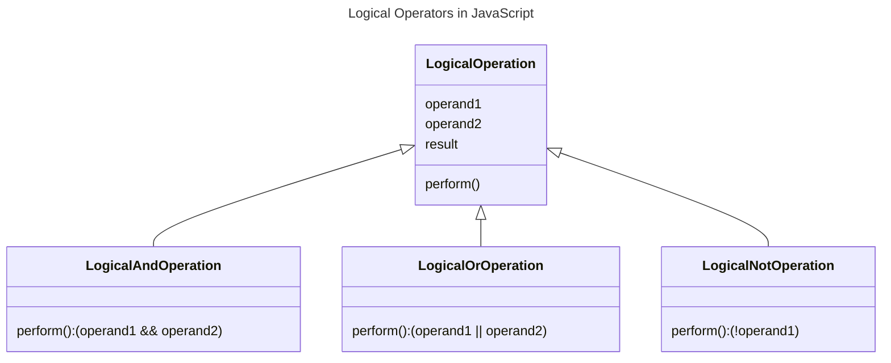

In JavaScript, the logical operators are used to perform logical operations on values. The logical operators include logical AND (`&&`), logical OR (`||`), and logical NOT (`!`).



## Types of Logical Operators in JavaScript

The following are the types of logical operators in JavaScript:

### Logical AND (&&)

The logical AND (`&&`) operator returns `true` if both operands are `true`, otherwise it returns `false`.

```js {3} title="Logical AND Operator" showLineNumbers
let a = true;
let b = false;
console.log(a && b); // Output: false
```

### Logical OR (||)

The logical OR (`||`) operator returns `true` if at least one of the operands is `true`, otherwise it returns `false`.

```js {3} title="Logical OR Operator" showLineNumbers
let a = true;
let b = false;
console.log(a || b); // Output: true
```

### Logical NOT (!)

The logical NOT (`!`) operator returns `true` if the operand is `false`, and returns `false` if the operand is `true`.

```js {2} title="Logical NOT Operator" showLineNumbers
let a = true;
console.log(!a); // Output: false
```

In the above examples, the logical AND (`&&`) operator returns `false` because the second operand is `false`. The logical OR (`||`) operator returns `true` because the first operand is `true`. The logical NOT (`!`) operator returns `false` because the operand is `true`.


## Precedence of Logical Operators

The logical AND (`&&`) operator has higher precedence than the logical OR (`||`) operator. The logical NOT (`!`) operator has the highest precedence.

You can use parentheses to change the order of evaluation of logical operators.

```js {4,5} title="Precedence of Logical Operators" showLineNumbers
let a = true;
let b = false;
let c = true;
console.log(a || b && c); // Output: true
console.log((a || b) && c); // Output: true
```

:::tip tips and tricks
**1. Understanding Truthy and Falsy Values**: In JavaScript, every value is either truthy or falsy. The logical operators return the value of the operand that determined the result, rather than `true` or `false`. You can use the logical operators to check for truthy or falsy values.

**2. Handling Nullish Values**: The logical operators can be used to handle nullish values. The logical OR (`||`) operator returns the first truthy operand, otherwise it returns the last operand. The logical AND (`&&`) operator returns the first falsy operand, otherwise it returns the last operand.

**3. Logical Operators with Non-Boolean Values**: The logical operators can be used with non-boolean values. The logical NOT (`!`) operator converts the operand to a boolean value and negates it. The logical AND (`&&`) and logical OR (`||`) operators return the value of the operand that determined the result.

**4. Logical Operators with Multiple Operands**: The logical operators can be used with multiple operands. The logical AND (`&&`) operator returns the first falsy operand, otherwise it returns the last operand. The logical OR (`||`) operator returns the first truthy operand, otherwise it returns the last operand.

**5. Logical Operators with Side Effects**: The logical operators can be used with expressions that have side effects. The logical AND (`&&`) operator returns the first operand if it is falsy, otherwise it returns the second operand. The logical OR (`||`) operator returns the first operand if it is truthy, otherwise it returns the second operand.
:::

## Conclusion

In JavaScript, the logical operators are used to perform logical operations on values. The logical operators include logical AND (`&&`), logical OR (`||`), and logical NOT (`!`). The logical AND (`&&`) operator returns `true` if both operands are `true`, otherwise it returns `false`. The logical OR (`||`) operator returns `true` if at least one of the operands is `true`, otherwise it returns `false`. The logical NOT (`!`) operator returns `true` if the operand is `false`, and returns `false` if the operand is `true`.