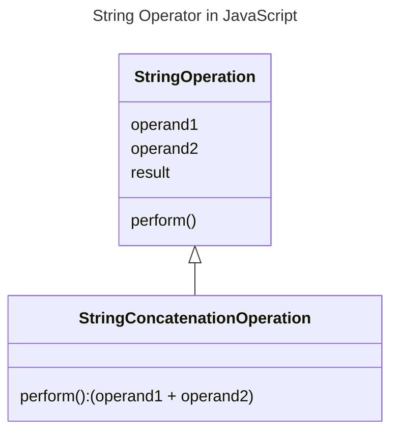

In JavaScript, the string operator (`+`) is used to concatenate two or more strings. It can also be used to concatenate a string with other data types by implicitly converting them to strings.



## Types of String Operator in JavaScript

The following are the types of string operators in JavaScript:

### String Concatenation Operator (+)

The string concatenation operator (`+`) is used to concatenate two or more strings.

```js {3} title="String Concatenation Operator" showLineNumbers
let str1 = "Hello";
let str2 = "World";
console.log(str1 + " " + str2); // Output: Hello World
```

### Implicit Type Conversion

The string operator (`+`) can also be used to concatenate a string with other data types by implicitly converting them to strings.

```js {3} title="Implicit Type Conversion" showLineNumbers
let str = "Hello";
let num = 123;
console.log(str + num); // Output: Hello123
```

### String Concatenation with Assignment

The string concatenation operator (`+`) can be combined with the assignment operator (`=`) to concatenate and assign the result to a variable.

```js {2} title="String Concatenation with Assignment" showLineNumbers
let str = "Hello";
str += " World";
console.log(str); // Output: Hello World
```

### String Concatenation with Template Literals

The string concatenation operator (`+`) can be replaced with template literals to concatenate strings in a more readable way.

```js {3} title="String Concatenation with Template Literals" showLineNumbers
let str1 = "Hello";
let str2 = "World";
console.log(`${str1} ${str2}`); // Output: Hello World
```

In this example, the `${}` syntax is used to embed expressions within the string. The expressions are evaluated and concatenated with the surrounding string.

In the above examples, the string concatenation operator (`+`) is used to concatenate two strings, implicitly convert a number to a string, concatenate and assign the result to a variable, and concatenate strings using template literals.

:::info 📝 Note
The string concatenation operator (`+`) can also be used to concatenate strings with other data types, such as numbers, booleans, and objects, by implicitly converting them to strings.

For example, `console.log("Hello" + 123);` will output `Hello123`.

String template literals can also be used to concatenate strings in a more readable way. For example, <code>console.log(&#96;`${"Hello"} ${"World"}`&#96;);</code> will output `Hello World`. It is intruduced in ECMAScript 6 (ES6).

When using template literals, expressions within <code>&#96;`${}`&#96;</code> are evaluated and concatenated with the surrounding string.
:::

## Conclusion

The string operator (`+`) is used to concatenate two or more strings. It can also be used to concatenate a string with other data types by implicitly converting them to strings. It can be combined with the assignment operator (`=`) to concatenate and assign the result to a variable. It can also be replaced with template literals to concatenate strings in a more readable way.