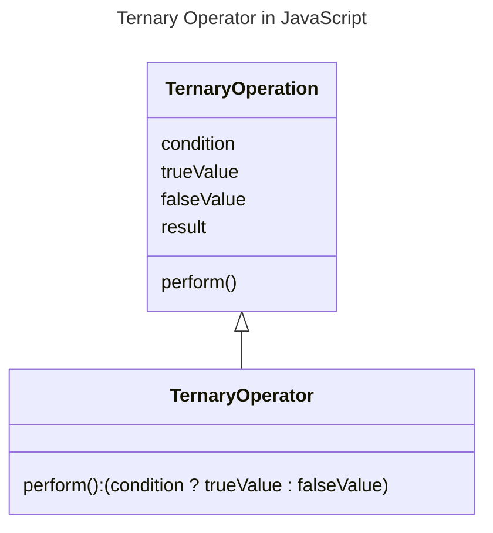

In JavaScript, the ternary operator (`? :`) is a conditional operator that takes three operands and returns a value based on a condition. It is a shorthand for the `if...else` statement.



## Syntax of Ternary Operator

The syntax of the ternary operator is as follows:

```js {3} title="Ternary Operator Syntax" showLineNumbers
let result = (condition) ? trueValue : falseValue;
```

- `condition`: A boolean expression that evaluates to `true` or `false`.
- `trueValue`: The value to be returned if the `condition` is `true`.
- `falseValue`: The value to be returned if the `condition` is `false`.
- `result`: The value returned based on the `condition`.
- The `trueValue` and `falseValue` can be of any data type.
- The parentheses around the entire ternary operation are optional.
- The ternary operator can be used as an expression or as part of an assignment statement.

## Example of Ternary Operator

The following example demonstrates the usage of the ternary operator:

```js {2} title="Ternary Operator Example" showLineNumbers
let age = 20;
let message = (age >= 18) ? "You are eligible to vote" : "You are not eligible to vote";
console.log(message); // Output: You are eligible to vote
```

In this example, the ternary operator checks if the `age` is greater than or equal to `18`. If the condition is `true`, it returns the message `"You are eligible to vote"`, otherwise it returns the message `"You are not eligible to vote".`

:::info 📝 Note
- The ternary operator is a concise way to write simple conditional expressions, but it is recommended to use the `if...else` statement for complex conditions to improve readability.
- The ternary operator can also be used as part of an assignment statement to assign the result to a variable.
- It is also known as the conditional operator.
- It is introduced in ECMAScript 1 (1997).

:::

In this guide, you have learned about the ternary operator in JavaScript and how to use it to write concise conditional expressions. You have also seen the syntax and an example of the ternary operator. Now, you can use the ternary operator to write simple conditional expressions in your JavaScript code.

Happy learning! 🎉