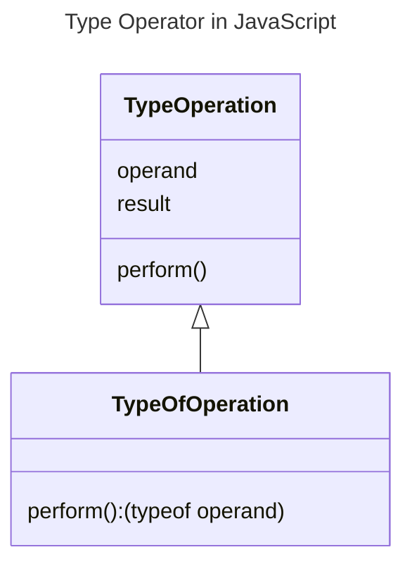

In JavaScript, the type operator (`typeof`) is a unary operator that returns a string indicating the type of the operand. It is used to check the data type of a value or variable.



## Syntax of Type Operator

The syntax of the type operator is as follows:

```js {1} title="Type Operator Syntax" showLineNumbers
let result = typeof operand;
```

- `operand`: The value or variable for which the type is to be checked.

## Example of Type Operator

The following example demonstrates the usage of the type operator:

```js title="Type Operator Example" showLineNumbers
let num = 10;
let str = "Hello";
let bool = true;
let obj = {};
let arr = [];
let func = function() {};

console.log(typeof num); // Output: number
console.log(typeof str); // Output: string
console.log(typeof bool); // Output: boolean
console.log(typeof obj); // Output: object
console.log(typeof arr); // Output: object
console.log(typeof func); // Output: function
```

In this example, the type operator is used to check the data type of the values and variables. The `typeof` operator returns a string indicating the type of the operand.

The `typeof` operator returns the following values for different data types:

- `number` for numbers
- `string` for strings
- `boolean` for booleans
- `object` for objects, arrays, and null
- `function` for functions
- `undefined` for undefined values
- `symbol` for symbols
- `bigint` for big integers
- `null` for null values

The `typeof` operator is a useful tool for checking the data type of a value or variable in JavaScript. It is often used in conditional statements and type checking operations.

:::info 📝 Note
- The `typeof` operator is a unary operator that returns a string indicating the type of the operand.
- It is introduced in ECMAScript 1 (1997).
- The `typeof` operator can be used to check the data type of a value or variable, and it returns a string indicating the type of the operand.
- The `typeof` operator returns different values for different data types, such as `number`, `string`, `boolean`, `object`, `function`, `undefined`, `symbol`, `bigint`, `null`.
- The `typeof` operator is often used in conditional statements and type checking operations to determine the data type of a value or variable.

:::

In this guide, you learned about the type operator in JavaScript and how to use it to check the data type of a value or variable. You also saw examples of using the `typeof` operator to check the data type of numbers, strings, booleans, objects, arrays, and functions. The `typeof` operator is a useful tool for type checking and conditional statements in JavaScript.

## Conclusion

The type operator (`typeof`) is a unary operator that returns a string indicating the type of the operand. It is used to check the data type of a value or variable. The `typeof` operator returns different values for different data types, such as `number`, `string`, `boolean`, `object`, `function`, `undefined`, `symbol`, `bigint`, `null`. It is often used in conditional statements and type checking operations to determine the data type of a value or variable. The `typeof` operator is a useful tool for type checking and conditional statements in JavaScript.