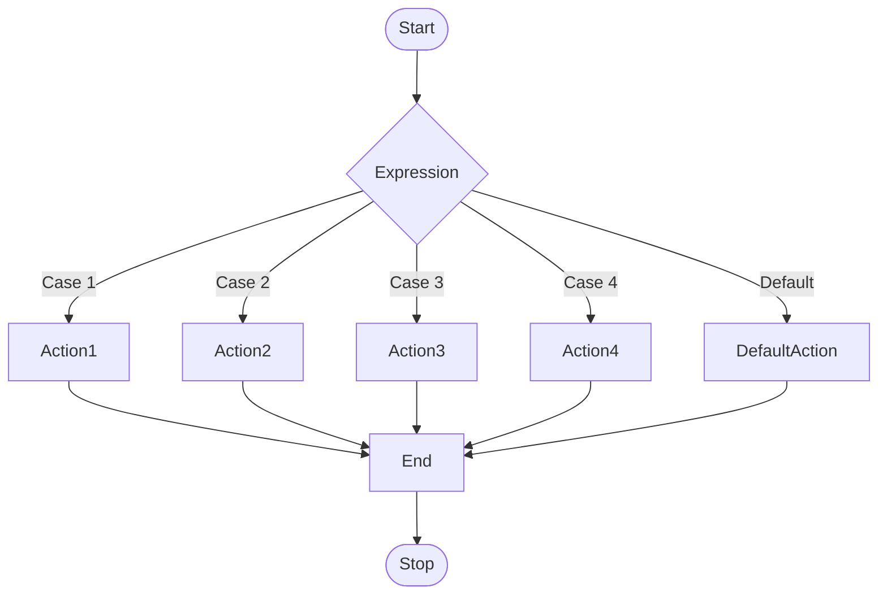
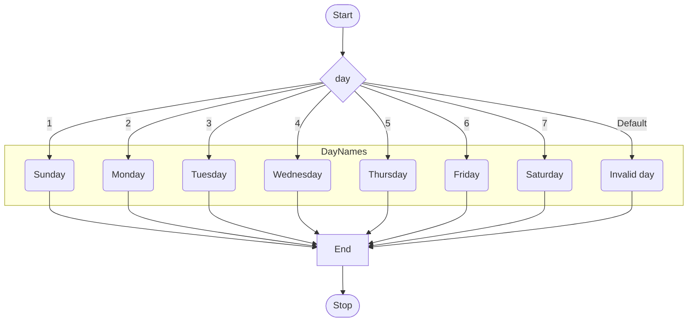

In JavaScript, the `switch` statement is used to execute a block of code based on the value of a variable. It is an alternative to the `if...else` statement when you need to compare the value of a variable to multiple values.

## Syntax

The syntax of the `switch` statement is as follows:

```js title="app.js"
switch (expression) {
  case value1:
    // code to be executed if expression is equal to value1
    break;
  case value2:
    // code to be executed if expression is equal to value2
    break;
  case value3:
    // code to be executed if expression is equal to value3
    break;
  default:
    // code to be executed if expression is different from all values
}
```

- The `switch` statement starts with the `switch` keyword followed by an expression in parentheses.
- The `case` keyword is followed by a value and a colon. If the value of the expression matches the value of the `case`, the code inside the `case` block is executed.
- The `break` statement is used to exit the `switch` statement. If the `break` statement is omitted, the code will continue to execute the next `case` block.
- The `default` case is optional and is executed if the value of the expression does not match any of the `case` values.
- The `default` case does not require a `break` statement because it is always the last case in the `switch` statement.
- The `default` case can be placed anywhere in the `switch` statement.

## Flow Chart of the `switch` Statement



## Example

The following example demonstrates how to use the `switch` statement to check the day of the week:

```js title="app.js"
let day = 3;
let dayName;

switch (day) {
  case 1:
    dayName = "Sunday";
    break;
  case 2:
    dayName = "Monday";
    break;
  case 3:
    dayName = "Tuesday";
    break;
  case 4:
    dayName = "Wednesday";
    break;
  case 5:
    dayName = "Thursday";
    break;
  case 6:
    dayName = "Friday";
    break;
  case 7:
    dayName = "Saturday";
    break;
  default:
    dayName = "Invalid day";
}

console.log(dayName); // Tuesday
```

In the above example, the `switch` statement checks the value of the `day` variable and assigns the corresponding day name to the `dayName` variable.

:::tip Flow Chart for the Example


:::

## Multiple Cases

You can use multiple `case` blocks to execute the same code for different values. For example:

```js title="app.js"
let grade = "B+";
let message;

switch (grade) {
  case "A+":
  case "A":
  case "A-":
    message = "Excellent";
    break;
  case "B+":
  case "B":
  case "B-":
    message = "Good";
    break;
  case "C+":
  case "C":
  case "C-":
    message = "Fair";
    break;
  case "D+":
  case "D":
  case "D-":
    message = "Poor";
    break;
  case "F":
    message = "Fail";
    break;
  default:
    message = "Invalid grade";
}

console.log(message); // Good
```

In the above example, the `switch` statement checks the value of the `grade` variable and assigns a message based on the grade.

:::info 📝 Note

<h2>Live Example</h2>

```js live
function todayIs(){
    let day = new Date().getDay();
    let dayName;

    switch (day) {
      case 0:
        dayName = "Sunday";
        break;
      case 1:
        dayName = "Monday";
        break;
      case 2:
        dayName = "Tuesday";
        break;
      case 3:
        dayName = "Wednesday";
        break;
      case 4:
        dayName = "Thursday";
        break;
      case 5:
        dayName = "Friday";
        break;
      case 6:
        dayName = "Saturday";
        break;
      default:
        dayName = "Invalid day";
    }

    return (
        <div>
            <h3>Today is {dayName}</h3>
        </div>
    )
}

```

In the above example, the `switch` statement checks the value of the `day` variable and assigns the corresponding day name to the `dayName` variable.

:::

## Conclusion

In this tutorial, you learned about the `switch` statement in JavaScript and how to use it to make decisions based on the value of a variable. You also learned how to use multiple `case` blocks to execute the same code for different values.