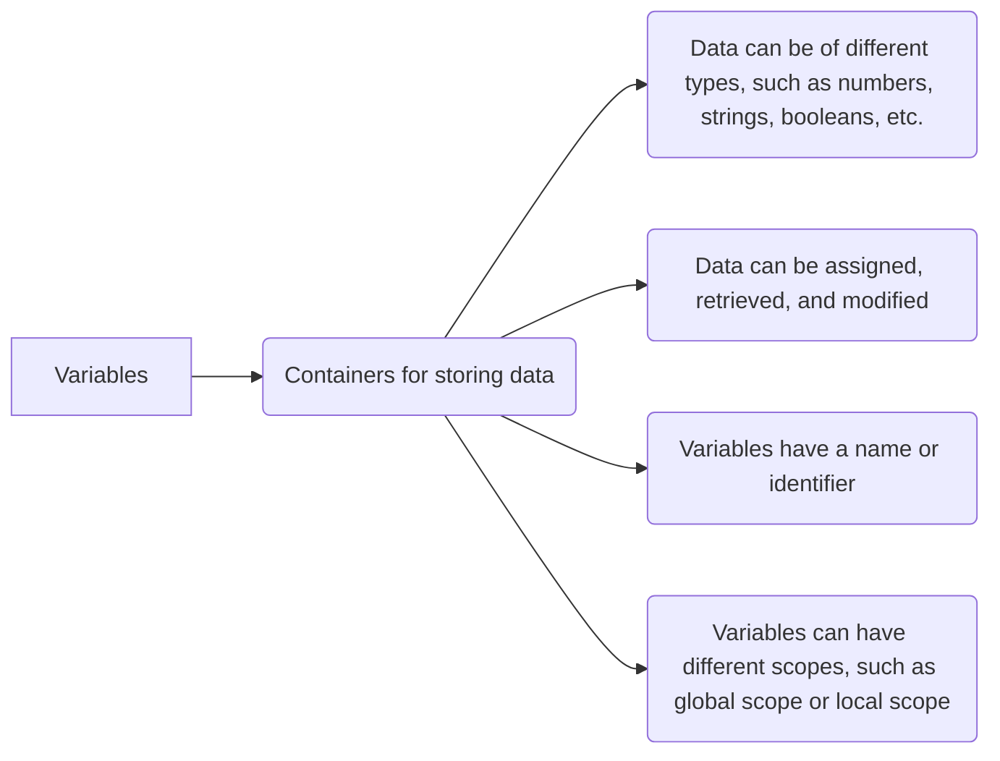
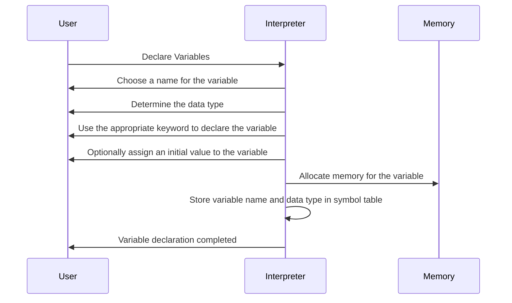
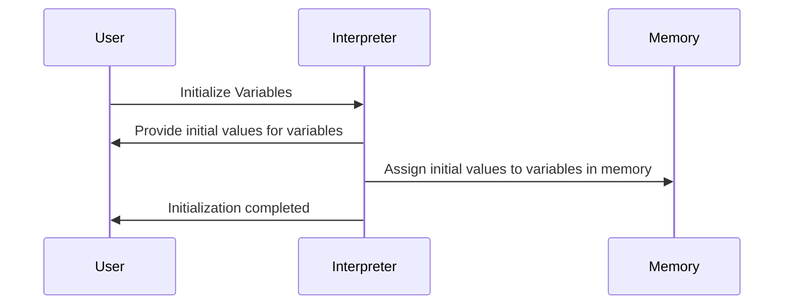
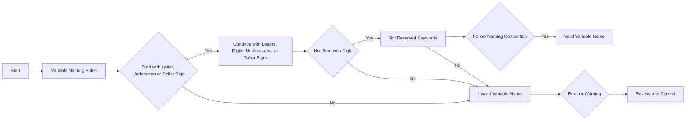
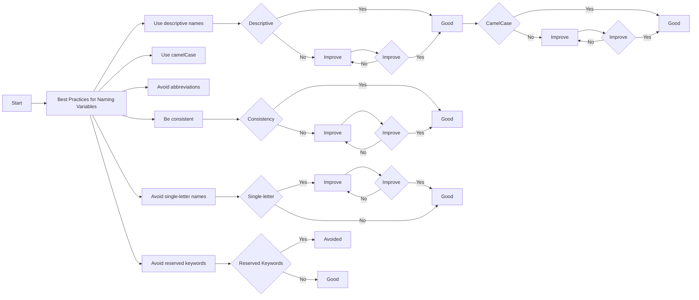

In this tutorial, you will learn about variables in JavaScript. Variables are used to store data. They are like containers that hold data. You can think of them as a box that holds different items. You can put anything in the box and give it a name. Similarly, you can store different types of data in a variable and give it a name. 

## What are Variables?

A variable is a named storage location that holds data. It has a name and a value. The value of a variable can change during the execution of a program.



In JavaScript, you can declare a variable using the `var`, `let`, or `const` keyword.

## Declaring Variables

You can declare a variable using the `var`, `let`, or `const` keyword followed by the variable name.



For example,

```js title="declaring-variables.js"
var name;
let age;
const PI = 3.14;
```

In this example, we have declared three variables: `name`, `age`, and `PI`. The `var` and `let` keywords are used to declare variables. The `const` keyword is used to declare constants.

:::important
The `var` keyword is used to declare variables in JavaScript. However, it is recommended to use `let` and `const` instead of `var` to declare variables. We will learn more about `let` and `const` in the upcoming sections.
:::

## Initializing Variables

You can initialize a variable at the time of declaration. To initialize a variable, you can assign a value to it using the assignment operator (`=`).



For example,

```js title="initializing-variables.js"
var name = "John";
let age = 25;
const PI = 3.14;
```

In this example, we have initialized three variables: `name`, `age`, and `PI`. The `name` variable is initialized with the value `"John"`, the `age` variable is initialized with the value `25`, and the `PI` constant is initialized with the value `3.14`.

## Variable Naming Rules



When naming variables in JavaScript, there are a few rules you need to follow:

1. The variable name must start with a letter, underscore (`_`), or dollar sign (`$`).
2. The variable name can contain letters, digits, underscores (`_`), or dollar signs (`$`).
3. The variable name cannot contain spaces or special characters, except underscores (`_`) or dollar signs (`$`).
4. The variable name is case-sensitive. For example, `name`, `Name`, and `NAME` are three different variables.  
5. The variable name should be descriptive and meaningful.
6. The variable name should not be a reserved keyword.
7. The variable name should follow camelCase or snake_case naming convention.
8. The variable name should not start with a capital letter.
9. The variable name should not be too long or too short.
10. The variable name should not be a JavaScript built-in object, method, or property.

## Best Practices for Naming Variables



When naming variables in JavaScript, you should follow these best practices:

1. Use descriptive and meaningful variable names.
   for example, `firstName`, `lastName`, `age`, `email`, `address`, etc.
2. Use camelCase or snake_case naming convention.
    for example, `firstName`, `last_name`, `userAge`, `user_email`, etc.
3. Do not use reserved keywords as variable names.
   for example, `var`, `let`, `const`, `function`, `if`, `else`, `while`, `for`, etc.
4. Do not use JavaScript built-in objects, methods, or properties as variable names.
    for example, `Math`, `Date`, `String`, `Number`, `Object`, `Array`, `console`, `log`, `error`, etc.
5. Do not use a single character as a variable name.
    for example, `a`, `b`, `c`, `x`, `y`, `z`, etc.
6. Do not use a too long or too short variable name.
    for example, `thisIsAVeryLongVariableName`, `a`, `b`, etc.

## Differents between var, let, and const in JavaScript

In JavaScript, you can declare a variable using the `var`, `let`, or `const` keyword. Each keyword has different behavior and scope.

| Keyword | Scope | Hoisting |TDZ | Re-declaration | Re-assignment | Mutable | 
|:-------:|:-----:|:--------:|:--:|:--------------:|:-------------:|:-------:|
| var     | Function | Yes | No | Yes | Yes | Yes |
| let     | Block | No | Yes | No | Yes | Yes |
| const   | Block | No | Yes | No | No | No |

- **Scope**: The scope of a variable is the region of the program where the variable is accessible. The scope of a variable can be global or local. The `var` keyword has a function scope, while the `let` and `const` keywords have a block scope.
  
  for example, 

  ```js title="scope.js"
    var x = 10;
    let y = 20;
    const z = 30;

    function test() {
      var a = 40;
      let b = 50;
      const c = 60;
      console.log(a, b, c); // 40 50 60
    }

    console.log(x, y, z); // 10 20 30
    console.log(a, b, c); // ReferenceError: a is not defined
    ```

- **Hoisting**: Hoisting is a JavaScript mechanism where variables and function declarations are moved to the top of their containing scope during the compilation phase. The `var` keyword is hoisted, while the `let` and `const` keywords are not hoisted.
  
    for example,

    ```js title="hoisting.js"
    console.log(x); // undefined
    var x = 10;
    ```

- **Temporal Dead Zone (TDZ)**: The temporal dead zone is a behavior in JavaScript where you cannot access a variable before it is declared. The `let` and `const` keywords have a temporal dead zone, while the `var` keyword does not have a temporal dead zone.
  
  for example,

  ```js title="tdz.js"
    console.log(x); // ReferenceError: Cannot access 'x' before initialization
    let x = 10;
  ```

- **Re-declaration**: The `var` keyword allows you to re-declare a variable in the same scope, while the `let` and `const` keywords do not allow you to re-declare a variable in the same scope.
  
    for example,
    
    ```js title="re-declaration.js"
        var x = 10;
        var x = 20;
        console.log(x); // 20
    
        let y = 30;
        let y = 40; // SyntaxError: Identifier 'y' has already been declared
    ```

- **Re-assignment**: The `var`, `let`, and `const` keywords allow you to re-assign a value to a variable. However, the `const` keyword does not allow you to re-assign a value to a variable.
      
     for example,
    
     ```js title="re-assignment.js"
     var x = 10;
     x = 20;
     console.log(x); // 20
    
     let y = 30;
     y = 40;
     console.log(y); // 40
    
     const z = 50;
     z = 60; // TypeError: Assignment to constant variable.
     ```

- **Mutable**: The `var` and `let` keywords allow you to mutate the value of a variable, while the `const` keyword does not allow you to mutate the value of a variable.
      
     for example,
    
     ```js title="mutable.js"
     var x = 10;
     x = 20;
     console.log(x); // 20
    
     let y = 30;
     y = 40;
     console.log(y); // 40
    
     const z = 50;
     z = 60; // TypeError: Assignment to constant variable.
     ```
      
      ```mermaid
        graph TD;
            A[Variables] --> B{Scope};
            B --> |var| C[Function];
            B --> |let| D[Block];
            B --> |const| E[Block];
            A --> F{Hoisting};
            F --> |var| G[Yes];
            F --> |let| H[No];
            F --> |const| I[No];
            A --> J{Temporal Dead Zone};
            J --> |var| K[No];
            J --> |let| L[Yes];
            J --> |const| M[Yes];
            A --> N{Re-declaration};
            N --> |var| O[Yes];
            N --> |let| P[No];
            N --> |const| Q[No];
            A --> R{Re-assignment};
            R --> |var| S[Yes];
            R --> |let| T[Yes];
            R --> |const| U[No];
            A --> V{Mutable};
            V --> |var| W[Yes];
            V --> |let| X[Yes];
            V --> |const| Y[No];
        ``` 

:::important
It is recommended to use `let` and `const` instead of `var` to declare variables. Use `let` when you want to declare a variable that can be re-assigned, and use `const` when you want to declare a variable that cannot be re-assigned.
:::

## Conclusion

In this tutorial, you learned about variables in JavaScript. You learned what variables are, how to declare and initialize variables, and the rules and best practices for naming variables. In the next tutorial, you will learn about data types in JavaScript.