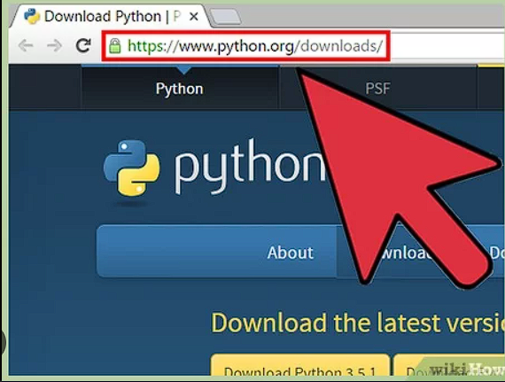
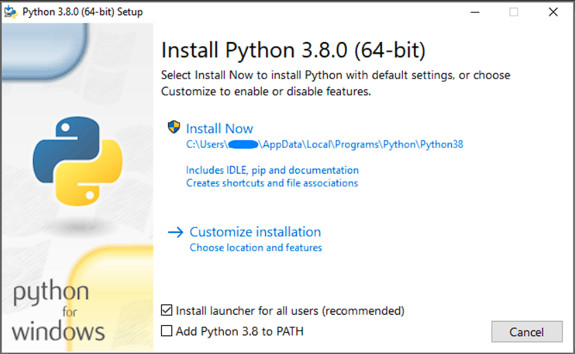

Here’s a basic guide to get you started with Python:

## Install Python

First, you need to install Python on your computer. To install Python on your computer, follow these steps:

<b>1.Download Python:</b> Go to the official Python website at https://www.python.org/. On the homepage, you will see a “Downloads” section. Click on the “Download Python” button.


<b>2.Choose the Version:</b> You will be directed to a page where you can choose the version of Python you want to download. Python usually has two main versions available: Python 3. Python 3 is the recommended version. Click on the appropriate version for your operating system (Windows, macOS, or Linux).

<b>3.Add Python to PATH (Optional):</b> On Windows, you may be given the option to add Python to your system’s PATH environment variable. This makes it easier to run Python from the command line. If you’re not sure, it’s usually safe to select this option.

<b>4.Install Python:</b> Click the “Install Now” button to begin the installation. The installer will copy the necessary files to your computer.


<b>5.Verify the Installation:</b> After the installation is complete, you can verify that Python was installed correctly by opening a command prompt (on Windows) or a terminal (on macOS or Linux) and typing python --version. This should display the version of Python you installed.

That’s it! Python should now be installed on your computer, and you’re ready to start using Python.

## Setting up a Python Development Environment
An IDE makes coding easier. Popular choices include PyCharm, Visual Studio Code, and Jupyter Notebook. Install one and set it up for Python development. Or you can also use an online Python IDE.

## Create and Run your First Python Program
For the first program, we will try to print a very simple message “Hello World” in Python, the code for which is given below:

Once you have Python installed, you can run the program by following these steps:

- Open a text editor (e.g., Notepad on Windows, TextEdit on macOS, or any code editor like VS Code, PyCharm, etc.).
- Copy the code above and paste it into the text editor.
- Save the file with a .py extension (e.g., hello_world.py).
- Open a terminal or command prompt.
- Navigate to the directory where you saved the file using the cd command (e.g., cd path/to/your/directory).
- Run the program by typing python hello_world.py and pressing Enter.

You should see the output “Hello, World!” printed in the terminal.

```python title="hello.py"
# Print a message to the console
print("Hello, World!") # Output: Hello, World!

# Define a variable and print its value
message = "Hello, Python!"
print(message) # Output: Hello, Python!

```

