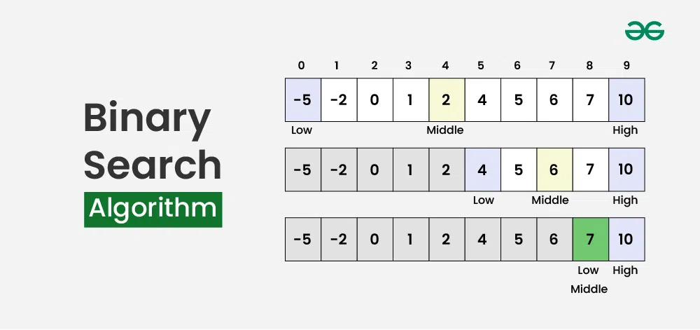

## What is Binary Search?

Binary Search is a highly efficient search algorithm used to find the position of a target element within a sorted list. It works by repeatedly dividing the search interval in half and comparing the target value to the middle element of the interval.

## Algorithm for Binary Search

1. Start with the left pointer at the beginning of the list and the right pointer at the end.
2. Calculate the middle index of the current search interval.
3. Compare the target value with the middle element:
   - If the target value equals the middle element, return the middle index.
   - If the target value is less than the middle element, move the right pointer to $middle - 1$.
   - If the target value is greater than the middle element, move the left pointer to $middle + 1$.
4. Repeat steps 2-3 until the left pointer exceeds the right pointer.
5. If the target value is not found, return -1.

## How does Binary Search work?

- It starts by comparing the target value to the middle element of the list.
- If the target value matches the middle element, the search is complete.
- If the target value is less than the middle element, the search continues in the left half of the list.
- If the target value is greater than the middle element, the search continues in the right half of the list.
- This process continues until the target value is found or the search interval is empty.



## Problem Description

Given a sorted list and a target element, implement the Binary Search algorithm to find the index of the target element in the list. If the element is not present, return -1.

## Examples

**Example 1:**
```
Input:
list = [1, 3, 5, 7, 9]
target = 5
Output: 2
```

**Example 2:**
```
Input:
list = [2, 4, 6, 8, 10]
target = 7
Output: -1
```

## Your Task:  

You dont need to read input or print anything. Complete the function binarysearch() which takes arr[], N and K as input parameters and returns the index of K in the array. If K is not present in the array, return -1.


Expected Time Complexity: $O(LogN)$
Expected Auxiliary Space: $O(LogN)$ if solving recursively and O(1) otherwise.

## Constraints

- $1 <= N <= 10^5$
- $1 <= arr[i] <= 10^6$
- $1 <= K <= 10^6$

## Implementation

<Tabs>
  <TabItem value="Python" label="Python" default>
  <SolutionAuthor name="@ngmuraqrdd"/>
  ```python
  def binary_search(lst, target):
      left, right = 0, len(lst) - 1
      while left <= right:
          mid = left + (right - left) // 2
          if lst[mid] == target:
              return mid
          elif lst[mid] < target:
              left = mid + 1
          else:
              right = mid - 1
      return -1
  ```
  </TabItem>

  <TabItem value="C++" label="C++">
  <SolutionAuthor name="@ngmuraqrdd"/>
  ```cpp
  #include <iostream>
  #include <vector>

  int binary_search(const std::vector<int>& lst, int target) {
      int left = 0, right = lst.size() - 1;
      while (left <= right) {
          int mid = left + (right - left) / 2;
          if (lst[mid] == target) {
              return mid;
          } else if (lst[mid] < target) {
              left = mid + 1;
          } else {
              right = mid - 1;
          }
      }
      return -1;
  }

  int main() {
      std::vector<int> lst = {1, 3, 5, 7, 9};
      int target = 5;
      std::cout << "Index: " << binary_search(lst, target) << std::endl;
      return 0;
  }
  ```
  </TabItem>

  <TabItem value="Java" label="Java">
  <SolutionAuthor name="@ngmuraqrdd"/>
  ```java
  public class BinarySearch {
      public static int binarySearch(int[] lst, int target) {
          int left = 0, right = lst.length - 1;
          while (left <= right) {
              int mid = left + (right - left) / 2;
              if (lst[mid] == target) {
                  return mid;
              } else if (lst[mid] < target) {
                  left = mid + 1;
              } else {
                  right = mid - 1;
              }
          }
          return -1;
      }

      public static void main(String[] args) {
          int[] lst = {1, 3, 5, 7, 9};
          int target = 5;
          System.out.println("Index: " + binarySearch(lst, target));
      }
  }
  ```
  </TabItem>

  <TabItem value="JavaScript" label="JavaScript">
  <SolutionAuthor name="@ngmuraqrdd"/>
  ```javascript
  function binarySearch(lst, target) {
      let left = 0, right = lst.length - 1;
      while (left <= right) {
          const mid = left + Math.floor((right - left) / 2);
          if (lst[mid] === target) {
              return mid;
          } else if (lst[mid] < target) {
              left = mid + 1;
          } else {
              right = mid - 1;
          }
      }
      return -1;
  }

  const lst = [1, 3, 5, 7, 9];
  const target = 5;
  console.log("Index:", binarySearch(lst, target));
  ```
  </TabItem>
</Tabs>

## Complexity Analysis

- **Time Complexity**: $O(log n)$, where $n$ is the number of elements in the list. The list is divided in half at each step, leading to logarithmic time complexity.
- **Space Complexity**: $O(1)$, as no extra space is required apart from the input list.

## Advantages and Disadvantages

**Advantages:**
- Highly efficient for large sorted lists.
- Fast search time due to logarithmic time complexity.

**Disadvantages:**
- Requires the list to be sorted.
- Less efficient for small lists compared to linear search.

## References

- **GFG Problem:** [GFG Problem](https://www.geeksforgeeks.org/binary-search/)
- **HackerRank Problem:** [HackerRank](https://www.hackerrank.com/challenges/binary-search/problem)
- **Author's Geeks for Geeks Profile:** [MuraliDharan](https://www.geeksforgeeks.org/user/ngmuraqrdd/)