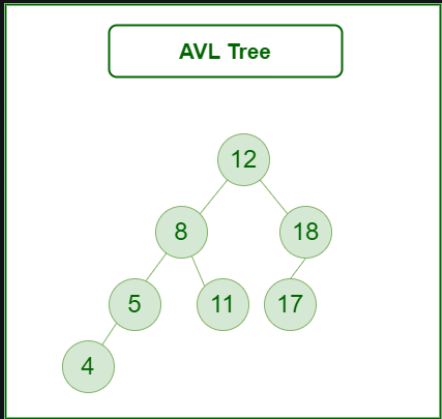

## What is AVL Tree Search?

AVL Tree Search is a search operation performed on an AVL tree, a self-balancing binary search tree. In an AVL tree, the heights of the two child subtrees of any node differ by no more than one, ensuring O(log N) time complexity for search operations.

## Algorithm for AVL Tree Search

1. Start at the root node of the AVL tree.
2. Compare the target value with the value of the current node:
- If the target value equals the current node's value, return the node.
- If the target value is less than the current node's value, move to the left child.
- If the target value is greater than the current node's value, move to the right child.
3. Repeat step 2 until the target value is found or the current node becomes null.
4. If the target value is not found, return null.

## How does AVL Tree Search work?

- It begins by comparing the target value to the value of the root node.
- If the target value matches the root node's value, the search is complete.
- If the target value is less than the root node's value, the search continues in the left subtree.
- If the target value is greater than the root node's value, the search continues in the right subtree.
- This process continues until the target value is found or a leaf node is reached without finding the target value.



## Problem Description

Given an AVL tree and a target element, implement the AVL Tree Search algorithm to find the node containing the target value in the tree. If the element is not present, return null.

## Examples

**Example 1:**
```
Input:
AVL Tree: 
        9
       / \
      5  12
     / \   \
    2   7  15

Target: 7
Output: Node with value 7

```

## Your Task:  

You don't need to read input or print anything. Complete the function avlTreeSearch() which takes the root of the AVL tree and a target value as input parameters and returns the node containing the target value. If the target value is not present in the tree, return null.

Expected Time Complexity: $O(LogN)$
Expected Auxiliary Space: $O(1)$

## Constraints

- $1 <= Number of nodes <= 10^5$
- $1 <= Node value <= 10^6$
- $1 <= Target value <= 10^6$

## Implementation

<Tabs>

  <TabItem value="C++" label="C++">
  <SolutionAuthor name="@ngmuraqrdd"/>
  ```cpp
  #include <iostream>

struct AVLNode {
    int value;
    AVLNode* left;
    AVLNode* right;
    AVLNode(int val) : value(val), left(nullptr), right(nullptr) {}
};

AVLNode* avlTreeSearch(AVLNode* root, int target) {
    AVLNode* current = root;
    while (current) {
        if (current->value == target) {
            return current;
        } else if (current->value < target) {
            current = current->right;
        } else {
            current = current->left;
        }
    }
    return nullptr;
}

int main() {
    AVLNode* root = new AVLNode(9);
    root->left = new AVLNode(5);
    root->right = new AVLNode(12);
    root->left->left = new AVLNode(2);
    root->left->right = new AVLNode(7);
    root->right->right = new AVLNode(15);

    int target = 7;
    AVLNode* result = avlTreeSearch(root, target);
    if (result) {
        std::cout << "Node with value " << result->value << " found." << std::endl;
    } else {
        std::cout << "Node not found." << std::endl;
    }

    return 0;
}

  </TabItem>

  <TabItem value="Java" label="Java">
  <SolutionAuthor name="@ngmuraqrdd"/>
  ```java
  class AVLNode {
    int value;
    AVLNode left, right;
    AVLNode(int value) {
        this.value = value;
        left = right = null;
    }
}

public class AVLTreeSearch {
    public static AVLNode avlTreeSearch(AVLNode root, int target) {
        AVLNode current = root;
        while (current != null) {
            if (current.value == target) {
                return current;
            } else if (current.value < target) {
                current = current.right;
            } else {
                current = current.left;
            }
        }
        return null;
    }

    public static void main(String[] args) {
        AVLNode root = new AVLNode(9);
        root.left = new AVLNode(5);
        root.right = new AVLNode(12);
        root.left.left = new AVLNode(2);
        root.left.right = new AVLNode(7);
        root.right.right = new AVLNode(15);

        int target = 7;
        AVLNode result = avlTreeSearch(root, target);
        if (result != null) {
            System.out.println("Node with value " + result.value + " found.");
        } else {
            System.out.println("Node not found.");
        }
    }
}

 ```
 </TabItem>  
</Tabs>

## Complexity Analysis

- **Time Complexity**:$O(log n)$, where $n$ is the number of nodes in the AVL tree. The height of the tree is kept balanced, leading to logarithmic time complexity.
- **Space Complexity**: $O(1)$, as no extra space is required apart from the input tree.

## Advantages and Disadvantages

**Advantages:**
- Ensures balanced tree structure for efficient search, insert, and delete operations.
- Fast search time due to logarithmic time complexity.

**Disadvantages:**
- Requires additional rotations to maintain balance during insert and delete operations.
- More complex to implement compared to simple binary search trees.


## References

- **GFG Problem:** [GFG Problem](https://www.geeksforgeeks.org/practice-questions-height-balancedavl-tree//)
- **Author's Geeks for Geeks Profile:** [MuraliDharan](https://www.geeksforgeeks.org/user/ngmuraqrdd/)

