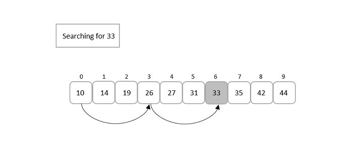

## What is Jump Search?

Jump Search is an efficient search algorithm for sorted arrays. It works by jumping ahead by fixed steps and then performing a linear search within a block, making it faster than linear search but less complex than binary search.

## Algorithm for Jump Search

1. Calculate the optimal step size $\sqrt{N}$, where $N$ is the length of the list.
2. Start from the first element and jump ahead by the step size until the target element is greater than or equal to the current element.
3. Perform a linear search within the identified block.
4. If the target element is found, return its index.
5. If the target element is not found, return -1.

## How does Jump Search work?

- It calculates a jump step based on the length of the list.
- It jumps ahead in blocks, comparing the target value with the current element at each step.
- Once the block where the target might be located is identified, a linear search within the block is performed.



## Problem Description

Given a sorted list and a target element, implement the Jump Search algorithm to find the index of the target element in the list. If the element is not present, return -1.

## Examples

**Example 1:**
Input:
list = [0, 1, 2, 3, 4, 5, 6, 7, 8, 9]
target = 6
Output: 6


**Example 2:**
Input:
list = [1, 2, 3, 4, 5, 6, 7, 8, 9, 10]
target = 15
Output: -1


## Your Task:

You don't need to read input or print anything. Complete the function jump_search() which takes arr[], N and K as input parameters and returns the index of K in the array. If K is not present in the array, return -1.

Expected Time Complexity: $O(\sqrt{N})$
Expected Auxiliary Space: $O(1)$

## Constraints

- $1 <= N <= 10^5$
- $1 <= arr[i] <= 10^6$
- $1 <= K <= 10^6$

## Implementation

<Tabs>
  <TabItem value="Python" label="Python" default>
    
```python
  import math

  def jump_search(lst, target):
      length = len(lst)
      step = int(math.sqrt(length))
      prev = 0

      while lst[min(step, length) - 1] < target:
          prev = step
          step += int(math.sqrt(length))
          if prev >= length:
              return -1

      for i in range(prev, min(step, length)):
          if lst[i] == target:
              return i
      return -1
  ```
 </TabItem>
  <TabItem value="C++" label="C++">
    
 ```cpp
  #include <iostream>
  #include <cmath>
  #include <vector>
int jump_search(const std::vector<int>& lst, int target) {
int length = lst.size();
int step = sqrt(length);
int prev = 0;
  while (lst[std::min(step, length) - 1] < target) {
      prev = step;
      step += sqrt(length);
      if (prev >= length) {
          return -1;
      }
  }

  for (int i = prev; i < std::min(step, length); ++i) {
      if (lst[i] == target) {
          return i;
      }
  }
  return -1;
}

int main() {
std::vector<int> lst = {0, 1, 2, 3, 4, 5, 6, 7, 8, 9};
int target = 6;
std::cout << "Index: " << jump_search(lst, target) << std::endl;
return 0;
}

```
</TabItem>

<TabItem value="Java" label="Java">
  
```java
import java.util.Arrays;

public class JumpSearch {
    public static int jumpSearch(int[] lst, int target) {
        int length = lst.length;
        int step = (int) Math.sqrt(length);
        int prev = 0;

        while (lst[Math.min(step, length) - 1] < target) {
            prev = step;
            step += (int) Math.sqrt(length);
            if (prev >= length) {
                return -1;
            }
        }

        for (int i = prev; i < Math.min(step, length); i++) {
            if (lst[i] == target) {
                return i;
            }
        }
        return -1;
    }

    public static void main(String[] args) {
        int[] lst = {0, 1, 2, 3, 4, 5, 6, 7, 8, 9};
        int target = 6;
        System.out.println("Index: " + jumpSearch(lst, target));
    }
}

```

</TabItem>
  <TabItem value="JavaScript" label="JavaScript">

 ```javascript
  function jumpSearch(lst, target) {
      let length = lst.length;
      let step = Math.floor(Math.sqrt(length));
      let prev = 0;
  while (lst[Math.min(step, length) - 1] < target) {
      prev = step;
      step += Math.floor(Math.sqrt(length));
      if (prev >= length) {
          return -1;
      }
  }

  for (let i = prev; i < Math.min(step, length); i++) {
      if (lst[i] === target) {
          return i;
      }
  }
  return -1;
}

const lst = [0, 1, 2, 3, 4, 5, 6, 7, 8, 9];
const target = 6;
console.log("Index:", jumpSearch(lst, target));
```

</TabItem>
</Tabs>

## Complexity Analysis

- **Time Complexity**: $O(\sqrt{n})$, where $n$ is the number of elements in the list. The list is divided into blocks, leading to a root-time complexity.
- **Space Complexity**: $O(1)$, as no extra space is required apart from the input list.

## Advantages and Disadvantages

**Advantages:**
- Faster than linear search for large sorted lists.
- Simpler than binary search while still being efficient.

**Disadvantages:**
- Requires the list to be sorted.
- Less efficient compared to binary search in terms of time complexity.
