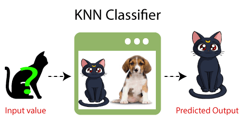

## What is the K-Nearest Neighbors Algorithm?

KNN is one of the most basic yet essential classification algorithms in machine learning. It belongs to the supervised learning domain and finds intense application in pattern recognition, data mining, and intrusion detection.

It is widely disposable in real-life scenarios since it is non-parametric, meaning it does not make any underlying assumptions about the distribution of data (as opposed to other algorithms such as GMM, which assume a Gaussian distribution of the given data). We are given some prior data (also called training data), which classifies coordinates into groups identified by an attribute.



## Intuition Behind KNN Algorithm

If we plot these points on a graph, we may be able to locate some clusters or groups. Now, given an unclassified point, we can assign it to a group by observing what group its nearest neighbors belong to. This means a point close to a cluster of points classified as ‘Red’ has a higher probability of getting classified as ‘Red’.

Intuitively, we can see that the first point (2.5, 7) should be classified as ‘Green’, and the second point (5.5, 4.5) should be classified as ‘Red’.

## How to select the value of K in the K-NN Algorithm?

The value of K is critical in the K-NN algorithm. A small K can make the model sensitive to noise, while a large K can smooth out the predictions too much. Typically, K is chosen by experimenting with different values and using cross-validation to evaluate the performance. A common approach is to start with K = sqrt(n), where n is the number of data points, and adjust based on the model’s performance.


### How does K-NN work?

K-Nearest Neighbor (K-NN) is a simple, supervised machine learning algorithm used for classification and regression tasks. It works by finding the K closest data points (neighbors) to the query point and using them to make predictions. For classification, it assigns the class most common among the neighbors. For regression, it averages the values of the neighbors.


## Problem Description

Given a dataset and a query point, implement the K-Nearest Neighbor (KNN) algorithm to find the k points in the dataset that are closest to the query point.

## Examples

**Example 1:**
```
Input:
dataset = [(2, 4), (4, 4), (4, 2), (2, 2)]
query_point = (3, 3)
k = 2
Output: [(2, 4), (4, 4)]
```

**Example 2:**
```
Input:
dataset = [(1, 2), (2, 3), (3, 4), (4, 5)]
query_point = (2, 2)
k = 3
Output: [(1, 2), (2, 3), (3, 4)]
```

## Your Task

Implement the function $knn()$ that takes in a dataset, a query point, and an integer k. The function should return the k points in the dataset that are closest to the query point based on Euclidean distance.

Expected Time Complexity: $O(n log n)$ for sorting the dataset.

Expected Auxiliary Space: $O(n)$ for storing the distances.

## Constraints

- $1 <= len(dataset) <= 10^4$
- $1 <= k <= len(dataset)$
- Each point in the dataset is a tuple of integers $(x, y)$.
- The query point is a tuple of integers $(x, y)$.

## Problem Explanation

Here's the step-by-step breakdown of the K-Nearest Neighbor algorithm:

1. **Calculate Distances**: Compute the Euclidean distance between the query point and each point in the dataset.
2. **Sort Distances**: Sort the points based on their distances from the query point.
3. **Select Neighbors**: Select the first k points from the sorted list as the nearest neighbors.

### Code Implementation

<Tabs>
  <TabItem value="Python" label="Python" default>
  <SolutionAuthor name="@ngmuraqrdd"/>
  ```python
  import math

  def euclidean_distance(point1, point2):
      return math.sqrt((point1[0] - point2[0]) ** 2 + (point1[1] - point2[1]) ** 2)

  def knn(dataset, query_point, k):
      distances = []
      for point in dataset:
          distance = euclidean_distance(point, query_point)
          distances.append((point, distance))
      distances.sort(key=lambda x: x[1])
      nearest_neighbors = [distances[i][0] for i in range(k)]
      return nearest_neighbors
  ```
  </TabItem>

  <TabItem value="C++" label="C++">
  <SolutionAuthor name="@ngmuraqrdd"/>
  ```cpp
  #include <iostream>
  #include <vector>
  #include <cmath>
  #include <algorithm>

  using namespace std;

  double euclidean_distance(pair<int, int> point1, pair<int, int> point2) {
      return sqrt(pow(point1.first - point2.first, 2) + pow(point1.second - point2.second, 2));
  }

  vector<pair<int, int>> knn(vector<pair<int, int>> dataset, pair<int, int> query_point, int k) {
      vector<pair<pair<int, int>, double>> distances;
      for (auto point : dataset) {
          double distance = euclidean_distance(point, query_point);
          distances.push_back(make_pair(point, distance));
      }
      sort(distances.begin(), distances.end(), [](auto &left, auto &right) {
          return left.second < right.second;
      });
      vector<pair<int, int>> nearest_neighbors;
      for (int i = 0; i < k; i++) {
          nearest_neighbors.push_back(distances[i].first);
      }
      return nearest_neighbors;
  }
  ```
  </TabItem>

  <TabItem value="Java" label="Java">
  <SolutionAuthor name="@ngmuraqrdd"/>
  ```java
  import java.util.*;

  public class KNN {
      public static double euclideanDistance(int[] point1, int[] point2) {
          return Math.sqrt(Math.pow(point1[0] - point2[0], 2) + Math.pow(point1[1] - point2[1], 2));
      }

      public static List<int[]> knn(List<int[]> dataset, int[] queryPoint, int k) {
          List<int[]> result = new ArrayList<>();
          PriorityQueue<int[]> maxHeap = new PriorityQueue<>((a, b) -> 
              Double.compare(euclideanDistance(b, queryPoint), euclideanDistance(a, queryPoint))
          );

          for (int[] point : dataset) {
              maxHeap.offer(point);
              if (maxHeap.size() > k) {
                  maxHeap.poll();
              }
          }

          while (!maxHeap.isEmpty()) {
              result.add(maxHeap.poll());
          }

          return result;
      }
  }
  ```
  </TabItem>

  <TabItem value="JavaScript" label="JavaScript">
  <SolutionAuthor name="@ngmuraqrdd"/>
  ```javascript
  function euclideanDistance(point1, point2) {
      return Math.sqrt(Math.pow(point1[0] - point2[0], 2) + Math.pow(point1[1] - point2[1], 2));
  }

  function knn(dataset, queryPoint, k) {
      let distances = dataset.map(point => {
          return { point: point, distance: euclideanDistance(point, queryPoint) };
      });

      distances.sort((a, b) => a.distance - b.distance);

      return distances.slice(0, k).map(d => d.point);
  }
  ```
  </TabItem>
</Tabs>

## Solution Logic

1. **Calculate Distances**: Iterate through each point in the dataset and compute the Euclidean distance to the query point.
2. **Sort Distances**: Use the sorting algorithm to sort the points by their distance.
3. **Select Neighbors**: Extract the k closest points from the sorted list.

## Time Complexity

$O(n log n)$, where n is the number of points in the dataset. This is due to the sorting step.

## Space Complexity

$O(n)$, for storing the distances of all points in the dataset.

## Resources

- **GFG Problem:** [GFG Problem](https://www.geeksforgeeks.org/k-nearest-neighbors/)
- **HackerRank Problem:** [HackerRank](https://www.hackerrank.com/challenges/k-nearest-neighbors/problem)
- **FreeCodeCamp Article:** [Freecodecamp](https://www.freecodecamp.org/news/k-nearest-neighbors-algorithm-classifiers-and-model-example/)
- **GFG Article** [GFG Article](https://www.geeksforgeeks.org/k-nearest-neighbours/)
- **Authors Geeks for Geeks Profile:** [MuraliDharan](https://www.geeksforgeeks.org/user/ngmuraqrdd/)

## Additional Topics

### Advantages and Disadvantages

**Advantages:**
- Simple to understand and implement.
- No training phase, making it fast for small datasets.
- Effective with a well-distributed dataset.

**Disadvantages:**
- Computationally intensive for large datasets as it requires calculating the distance of each data point.
- Performance degrades with high-dimensional data due to the curse of dimensionality.
- Sensitive to irrelevant or redundant features, requiring feature scaling and selection.
