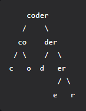

## Problem Description

Given two strings S1 and S2 of equal length, the task is to determine if S2 is a scrambled form of S1.

Scrambled string: Given string str, we can represent it as a binary tree by partitioning it into two non-empty substrings recursively.
Below is one possible representation of str = coder:

To scramble the string, we may choose any non-leaf node and swap its two children. 
Suppose, we choose the node co and swap its two children, it produces a scrambled string ocder.
Similarly, if we continue to swap the children of nodes der and er, it produces a scrambled string ocred.

Note: Scrambled string is not the same as an Anagram.
Print "Yes" if S2 is a scrambled form of S1 otherwise print "No".


## Examples

**Example:**

Consider the following graph:

```
      ocder
     / \
    oc   der
   / \
  o   c
```
**Input:** S1="coder", S2="ocder"
**Explanation:** ocder is a scrambled 
form of coder.
**Output:** Yes

## Your Task

You don't need to read input or print anything. You only need to complete the function isScramble() which takes two strings S1 and S2 as input and returns a boolean value.

Expected Time Complexity:  $O(N2)$.
Expected Auxiliary Space: $O(N2)$.

## Constraints

- S1.length = S2.length
- `S1.length<=31`
- S1 and S2 consist of lower-case English letters.

## Problem Explanation

Here's the step-by-step breakdown of the Scrambled String process:

**Step 1 :** A scrambled string is defined based on recursive partitioning and swapping of substrings. Here’s a more detailed explanation:

**Step 2 :** Binary Tree Representation:Given a string str, you can represent it as a binary tree by recursively partitioning it into two non-empty substrings.
**Step 3 :** For example, for the string "coder": You can split it into "co" and "der".
Each of these can be further split recursively, forming a binary tree structure.
**Step 4 :**Scrambling: A string S2 is a scrambled form of string S1 if S2 can be obtained by swapping the left and right children of some non-leaf nodes in the binary tree representation of S1.
For instance, "coder" can be scrambled to "ocder" by swapping "co" and "der", then further scrambling "co" to "oc".

### Code Implementation

<Tabs>
  <TabItem value="Python" label="Python" default>
  <SolutionAuthor name="@ngmuraqrdd"/>
  ```python
class Solution(object):
    def isScramble(self, s1, s2):
        """
        :type s1: str
        :type s2: str
        :rtype: bool
        """
        # Base cases

        n = len(s1)

        # If both strings are not equal in size
        if len(s2) != n:
            return False

        # If both strings are equal
        if s1 == s2:
            return True

        # If code is reached to this condition then following this are sure:
        # 1. size of both string is equal
        # 2. string are not equal
        # so size is equal (where size==1) and they are not equal then obviously false
        # example 'a' and 'b' size is equal, string are not equal
        if n == 1:
            return False

        key = s1 + " " + s2

        # Check if this problem has already been solved
        if key in self.mp:
            return self.mp[key]

        # For every iteration it can two condition
        # 1. We should proceed without swapping
        # 2. We should swap before looking next
        for i in range(1, n):
            # ex of without swap: gr|eat and rg|eat
            without_swap = (
                # Left part of first and second string
                self.isScramble(s1[:i], s2[:i])
                and
                # Right part of first and second string;
                self.isScramble(s1[i:], s2[i:])
            )

            # If without swap gives us the right answer then we do not need
            # to call the recursion with swap
            if without_swap:
                return True

            # ex of with swap: gr|eat rge|at
            # here we compare "gr" with "at" and "eat" with "rge"
            with_swap = (
                # Left part of first and right part of second
                self.isScramble(s1[:i], s2[n-i:])
                and
                # Right part of first and left part of second
                self.isScramble(s1[i:], s2[:n-i])
            )

            # If with swap gives us the right answer then we return True
            # otherwise, the for loop does its work
            if with_swap:
                return True

        self.mp[key] = False
        return False

    # for storing already solved problems
    mp = {}
  ```
  </TabItem>

  <TabItem value="C++" label="C++" default>
  <SolutionAuthor name="@ngmuraqrdd"/>
  ```cpp
class Solution {
public:
//for storing already solved problems
    unordered_map<string,bool> mp;
    
    
    bool isScramble(string s1, string s2) {
        //base cases
        
        int n = s1.size();
        
        //if both string are not equal in size
        if(s2.size()!=n)
            return false;
        
        //if both string are equal
        if(s1==s2)
         return true;   
        
            
        
        //if code is reached to this condition then following this are sure:
        //1. size of both string is equal
        //2.  string are not equal
        //so size is equal (where size==1) and they are not equal then obviously false
        //example 'a' and 'b' size is equal ,string are not equal
        if(n==1)
            return false;
        
        string key = s1+" "+s2;
        
		//check if this problem has already been solved
        if(mp.find(key)!=mp.end())
            return mp[key];
        
        //for every iteration it can two condition 
        //1.we should proceed without swapping
        //2.we should swap before looking next
        for(int i=1;i<n;i++)
        {

            //ex of without swap: gr|eat and rg|eat
            bool withoutswap = (
                //left part of first and second string
                isScramble(s1.substr(0,i),s2.substr(0,i)) 
                
                &&
                
                //right part of first and second string;
                isScramble(s1.substr(i),s2.substr(i))
                );
            
            
            
            //if without swap give us right answer then we do not need 
            //to call the recursion withswap
            if(withoutswap)
                return true;
            
            //ex of withswap: gr|eat  rge|at
			//here we compare "gr" with "at" and "eat" with "rge"
            bool withswap = (
                //left part of first and right part of second 
                isScramble(s1.substr(0,i),s2.substr(n-i)) 
                
                &&
                
                //right part of first and left part of second
                isScramble(s1.substr(i),s2.substr(0,n-i)) 
                );
            
            
            
            //if withswap give us right answer then we return true
            //otherwise the for loop do it work
            if(withswap)
                return true;
            //we are not returning false in else case 
            //because we want to check further cases with the for loop
        }
        
        
        return mp[key] = false;
        
    }
};
  ```
  </TabItem>
</Tabs>

## Solution Logic

**1.Base Cases:**If the lengths of the two strings are not equal, they cannot be scrambled forms of each other, so return false.
If the two strings are identical, they are trivially scrambled forms of each other, so return true.
If the length of the string is 1 and the strings are not equal, return false.
**2.Memoization:** Use a map mp to store already solved subproblems to avoid redundant computations.
The key for the map is a combination of the two strings, represented as s1 + " " + s2.
**3.Recursive Check:** Iterate over possible split points of the strings.
For each split point, there are two cases to consider:
1.Without swapping:
Compare the left part of s1 with the left part of s2 and the right part of s1 with the right part of s2.
2.With swapping:
Compare the left part of s1 with the right part of s2 and the right part of s1 with the left part of s2.
**4.Return Result:** If either of the conditions (with or without swapping) is satisfied, return true.
If none of the conditions are satisfied after checking all possible split points, store the result as false in the memoization map and return false.1.

## Time Complexity

 $O(N2)$.

## Space Complexity

 $O(N2)$.

## Resources

- **GFG Problem:** [GFG Problem](https://www.geeksforgeeks.org/problems/scrambled-string/1)
- **LeetCode Problem:** [LeetCode Problem](https://leetcode.com/problems/scramble-string/description/)
- **Author's Geeks for Geeks Profile:**  | [DaminiChachane](https://leetcode.com/u/divcxl15/) |

This format ensures that all necessary details about the problem and its solution are clearly presented and easy to follow.
