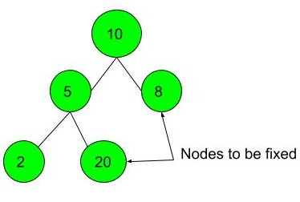

## Problem Description

Steps to solve a problem Fixing Two swapped nodes of a BST.

Two of the nodes of a Binary Search Tree (BST) are swapped. Fix (or correct) the BST by swapping them back. Do not change the structure of the tree.
Note: It is guaranteed that the given input will form BST, except for 2 nodes that will be wrong.

### Examples

#### Example 1:

**Input:** 
```
       10
     /    \
    5      8
   / \
  2   20
``` 
**Output: ** 1
**Explanation: ** 

#### Example 2:
**Input:**
``` 
         11
       /    \
      3      17
       \    /
        4  10
```  

**Output:**  1
**Explanation:** By swapping nodes 11 and 10, the BST 
can be fixed.


### Constraints

- `1 <= Number of nodes <= 10^5`

### Approach

So the basic approach here is maintaining four pointers previous , first, middle, last.
initially the previous pointer holds the value of minimum integer value and others are null.
when we find the first elemnt we simply make it prev then if the value of root is less then previous means in inorder if the value is smaller of the enct elemnt while traversing through the bst it means it is not acceptaable and we will make it first violation into our code but that is not the end of the code , we keep traversing through the binary search tree to find the last violation and if we find last violation we simply swap first and last but if that is not the case we swap our first violation with middle elemnt whol violated the traversal.

### Solution Code

#### Java

```
/**
 * Definition for a binary tree node.
 * public class TreeNode {
 *     int val;
 *     TreeNode left;
 *     TreeNode right;
 *     TreeNode() {}
 *     TreeNode(int val) { this.val = val; }
 *     TreeNode(int val, TreeNode left, TreeNode right) {
 *         this.val = val;
 *         this.left = left;
 *         this.right = right;
 *     }
 * }
 */
class Solution {
    public TreeNode first;
    public TreeNode middle;
    public TreeNode last;
    public TreeNode prev;
    public void inorder(TreeNode root){
        if(root ==  null) return;
        inorder(root.left);
        if(prev!=null && root.val < prev.val){
            if(first == null){
                first = prev;
                middle = root;
            }else{
                last = root;
            }
        }
        prev = root;
        inorder(root.right);
    }
    public void recoverTree(TreeNode root) {
        first = middle = last = null;
        prev = new TreeNode(Integer.MIN_VALUE);
        inorder(root);
        if(first!=null && last != null){
           int temp = first.val;
           first.val = last.val;
           last.val = temp;
        }else if(first!= null && middle !=null){
            int temp = first.val;
            first.val = middle.val;
            middle.val = temp;
        }
        
    }
}
```

#### C++

```
 
 class Solution {
    private: 
    TreeNode* prev;
    TreeNode* first;
    TreeNode* middle;
    TreeNode* last;
    private:
    void inorder( TreeNode* root){
        if(root==NULL) return;
        inorder( root->left);
        if( prev!=NULL && root->val < prev->val){
            if(first==NULL){
                first = prev;
                middle = root;
            }
            else last = root;
        }
        prev = root;
        inorder(root-> right);
    }
public:

    void recoverTree(TreeNode* root) {
        first = middle = last = NULL;
        prev = new TreeNode(INT_MIN);
        inorder(root);
         if( first && last){
            swap(first -> val, last->val);
        }
        
        else if( first && middle ){
            swap(first->val, middle-> val);
        }
        
    }
};

```
## Your Task

You don't need to take any input. Just complete the function correctBst() that takes root node as parameter. The function should return the root of corrected BST. BST will then be checked by driver code and 0 or 1 will be printed.
N = number of nodes
Expected Time Complexity: $O(N)$
Expected Auxiliary Space: $O(logN)$


| Problem Statement | Solution Link | LeetCode Profile |
| :---------------- | :------------ | :--------------- |
| [Fixing Two swapped nodes of a BST](https://www.geeksforgeeks.org/problems/fixing-two-swapped-nodes-of-a-bst--170646/1) | [Fixing Two swapped nodes of a BST](https://leetcode.com/problems/recover-binary-search-tree/solutions/3647453/easy-c-solution-inorder-efficient/) |  [DaminiChachane](https://leetcode.com/u/divcxl15/) |

