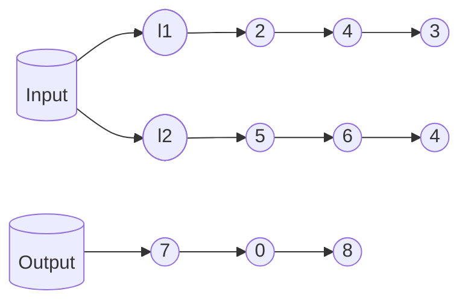
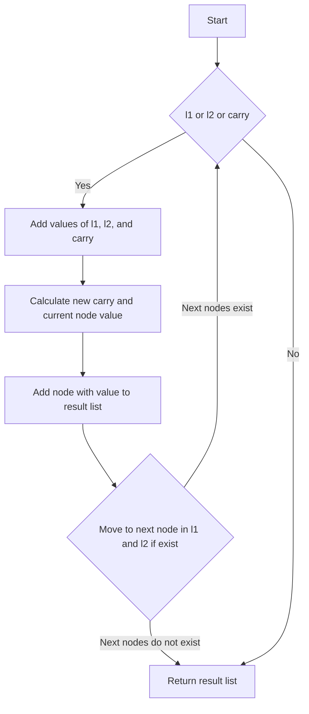

In this tutorial, we will solve the Add Two Numbers problem. We will provide an overview of the problem, the intuition and approach to solve it, the implementation, and the code in various languages, along with a detailed explanation of the solution and its complexity analysis. Let's start by understanding the problem.

## Problem Statement

You are given two **non-empty** linked lists representing two non-negative integers. The digits are stored in reverse order, and each of their nodes contains a single digit. Add the two numbers and return the sum as a linked list.

You may assume the two numbers do not contain any leading zero, except the number 0 itself.



**Example 1:**

```plaintext
Input: l1 = [2,4,3], l2 = [5,6,4]
Output: [7,0,8]
Explanation: 342 + 465 = 807.
```

**Example 2:**

```plaintext
Input: l1 = [0], l2 = [0]
Output: [0]
```

**Example 3:**

```plaintext
Input: l1 = [9,9,9,9,9,9,9], l2 = [9,9,9,9]
Output: [8,9,9,9,0,0,0,1]
```

### Constraints

- The number of nodes in each linked list is in the range `[1, 100]`.
- <code>$0 \leq \text{Node.val} \leq 9$</code>
- It is guaranteed that the list represents a number that does not have leading zeros.

---

## Solution for Add Two Numbers Problem

### Intuition and Approach

We iterate through both linked lists, adding corresponding node values along with a carry from the previous addition. If the sum of the current node values and carry is 10 or more, we keep the carry for the next addition. We continue this process until we traverse both linked lists.

### Flowchart



### Pseudocode

```plaintext
1. Initialize a dummy node and a current node to keep track of the current node.
2. Initialize a carry variable to 0.
3. Iterate through both linked lists until both are empty.
    1. Calculate the sum of the current node values and carry.
    2. Update the carry and current node value.
    3. Add the new node to the result list.
    4. Move to the next nodes in l1 and l2 if they exist.
4. Return the next node of the dummy node.
```

### Implementation and Code

Here is a live code editor for you to play around with the solution:

```jsx live
function addTwoNumbersProblem() {
  class ListNode {
    constructor(val = 0, next = null) {
      this.val = val;
      this.next = next;
    }
  }

  const l1 = new ListNode(2, new ListNode(4, new ListNode(3)));
  const l2 = new ListNode(5, new ListNode(6, new ListNode(4)));

  const addTwoNumbers = function (l1, l2) {
    let dummyHead = new ListNode(0);
    let p = l1,
      q = l2,
      curr = dummyHead;
    let carry = 0;

    while (p !== null || q !== null) {
      let x = p !== null ? p.val : 0;
      let y = q !== null ? q.val : 0;
      let sum = carry + x + y;
      carry = Math.floor(sum / 10);
      curr.next = new ListNode(sum % 10);
      curr = curr.next;
      if (p !== null) p = p.next;
      if (q !== null) q = q.next;
    }

    if (carry > 0) {
      curr.next = new ListNode(carry);
    }

    return dummyHead.next;
  };

  const result = addTwoNumbers(l1, l2);
  const listToArray = (node) => {
    const arr = [];
    while (node) {
      arr.push(node.val);
      node = node.next;
    }
    return arr;
  };

  const resultArray = listToArray(result);
  return (
    <div>
      <p>
        <b>Input:</b> l1 = {"[" + listToArray(l1).join(", ") + "]"}, l2 ={" "}
        {"[" + listToArray(l2).join(", ") + "]"}
      </p>
      <p>
        <b>Output:</b> {"[" + resultArray.join(", ") + "]"}
      </p>
    </div>
  );
}
```

### Code in Different Languages

<Tabs>
  <TabItem value="JavaScript" label="JavaScript" default>
  <SolutionAuthor name="@ajay-dhangar"/>
    ```javascript
    var addTwoNumbers = function(l1, l2) {
        let dummy = new ListNode(0);
        let curr = dummy;
        let carry = 0;
        while (l1 !== null || l2 !== null) {
            let x = (l1 !== null) ? l1.val : 0;
            let y = (l2 !== null) ? l2.val : 0;
            let sum = x + y + carry;
            carry = Math.floor(sum / 10);
            curr.next = new ListNode(sum % 10);
            curr = curr.next;
            if (l1 !== null) l1 = l1.next;
            if (l2 !== null) l2 = l2.next;
        }
        if (carry > 0) {
            curr.next = new ListNode(carry);
        }
        return dummy.next;
    };
    ```
  </TabItem>

  <TabItem value="Python" label="Python">
  <SolutionAuthor name="@ajay-dhangar"/>
    ```python
    def addTwoNumbers(self, l1: ListNode, l2: ListNode) -> ListNode:
        dummy = ListNode(0)
        curr = dummy
        carry = 0
        while l1 or l2:
            x = l1.val if l1 else 0
            y = l2.val if l2 else 0
            sum = x + y + carry
            carry = sum // 10
            curr.next = ListNode(sum % 10)
            curr = curr.next
            if l1:
                l1 = l1.next
            if l2:
                l2 = l2.next
        if carry > 0:
            curr.next = ListNode(carry)
        return dummy.next
    ```
  </TabItem>
  
  <TabItem value="Java" label="Java">
  <SolutionAuthor name="@ajay-dhangar"/>
    ```java
    public ListNode addTwoNumbers(ListNode l1, ListNode l2) {
        ListNode dummy = new ListNode(0);
        ListNode curr = dummy;
        int carry = 0;
        while (l1 != null || l2 != null) {
            int x = (l1 != null) ? l1.val : 0;
            int y = (l2 != null) ? l2.val : 0;
            int sum = x + y + carry;
            carry = sum / 10;
            curr.next = new ListNode(sum % 10);
            curr = curr.next;
            if (l1 != null) l1 = l1.next;
            if (l2 != null) l2 = l2.next;
        }
        if (carry > 0) {
            curr.next = new ListNode(carry);
        }
        return dummy.next;
    }
    ```
  </TabItem>
  
  <TabItem value="C++" label="C++">
  <SolutionAuthor name="@ajay-dhangar"/>
    ```cpp
    ListNode* addTwoNumbers(ListNode* l1, ListNode* l2) {
        ListNode* dummy = new ListNode(0);
        ListNode* curr = dummy;
        int carry = 0;
        while (l1 || l2) {
            int x = (l1) ? l1->val : 0;
            int y = (l2) ? l2->val : 0;
            int sum = x + y + carry;
            carry = sum / 10;
            curr->next = new ListNode(sum % 10);
            curr = curr->next;
            if (l1) l1 = l1->next;
            if (l2) l2 = l2->next;
        }
        if (carry > 0) {
            curr->next = new ListNode(carry);
        }
        return dummy->next;
    }
    ```
  </TabItem>
</Tabs>

## Complexity Analysis

### Time Complexity
The time complexity of the solution is **O(n)**, where **n** is the maximum length of the input linked lists.

### Space Complexity
The space complexity is **O(n)** due to the space required to store the resulting linked list.

## Conclusion

The solution provided efficiently adds two numbers represented by linked lists. By using dummy nodes and handling carry, we ensure that the solution is both easy to understand and efficient. The detailed explanation, flowchart, and code in multiple languages aim to help you understand and implement the solution effectively.

---

## References

- [LeetCode Problem](https://leetcode.com/problems/add-two-numbers/)
- [GeeksforGeeks Solution](https://www.geeksforgeeks.org/add-two-numbers-represented-by-linked-lists/)
- [YouTube Explanation](https://www.youtube.com/watch?v=wgFPrzTjm7s)

---

<h2>Authors:</h2>

<div style={{display: 'flex', flexWrap: 'wrap', justifyContent: 'space-between', gap: '10px'}}>
{['ajay-dhangar'].map(username => (
    <Author key={username} username={username} />
))}
</div>
