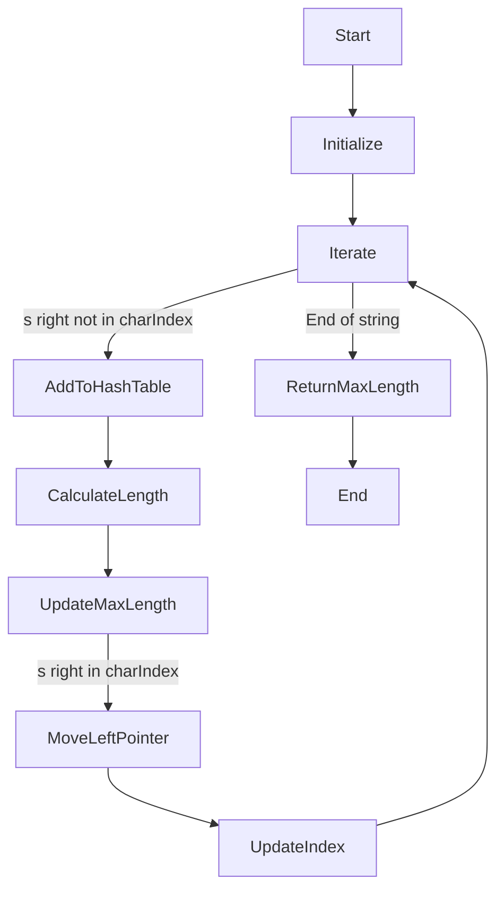

In this page we will solve the problem [Longest Substring Without Repeating Characters](https://leetcode.com/problems/longest-substring-without-repeating-characters/) from LeetCode.

## Problem Statement

Given a string `s`, find the length of the longest <b title="A substring is a contiguous non-empty sequence of characters within a string." style={{color:"blue", cursor: "pointer"}}>substring</b> without repeating characters.

### Example 1

```plaintext
Input: s = "abcabcbb"
Output: 3
Explanation: The answer is "abc", with the length of 3.
```

### Example 2

```plaintext
Input: s = "bbbbb"
Output: 1
Explanation: The answer is "b", with the length of 1.
```

### Example 3

```plaintext
Input: s = "pwwkew"
Output: 3
Explanation: The answer is "wke", with the length of 3.
Notice that the answer must be a substring, "pwke" is a subsequence and not a substring.
```

### Constraints:

- `0 <= s.length <= 5 * 10^4`
- `s` consists of English letters, digits, symbols and spaces.

---

## Solution for Longest Substring Without Repeating Characters

### Intuition and Approach

We can solve this problem using the sliding window technique. We will use a hash table to store the characters and their indices. We will also use two pointers, `left` and `right`, to define the window. The `left` pointer will point to the start of the window, and the `right` pointer will point to the end of the window.

We will iterate over the string `s` using the `right` pointer. If the character at the `right` pointer is not in the hash table, we will add it to the hash table with its index. We will then calculate the length of the current window by subtracting the `left` pointer from the `right` pointer and update the maximum length if needed.

If the character at the `right` pointer is already in the hash table, we will move the `left` pointer to the right of the last occurrence of the character. We will also update the index of the character in the hash table.

We will continue this process until we reach the end of the string `s`. The maximum length of the substring without repeating characters will be the answer.

### Algorithm

1. Initialize an empty hash table `charIndex` to store the characters and their indices.
2. Initialize the `left` and `right` pointers to 0.
3. Initialize the `maxLength` variable to store the maximum length of the substring without repeating characters.
4. Iterate over the string `s` using the `right` pointer:
   - If `s[right]` is not in `charIndex`, add it to the hash table with its index.
   - Calculate the length of the current window and update the `maxLength` if needed.
   - If `s[right]` is already in `charIndex`, move the `left` pointer to the right of the last occurrence of `s[right]`.
   - Update the index of `s[right]` in the hash table.
5. Continue this process until the end of the string `s`.
6. Return the `maxLength`.

### Flowchart

The flowchart below illustrates the steps involved in the algorithm:



### Pseudocode

```plaintext
function lengthOfLongestSubstring(s: string): number
    let charIndex = new Map()
    let left = 0
    let maxLength = 0

    for right from 0 to s.length - 1
        if s[right] in charIndex
            left = max(left, charIndex[s[right]] + 1)
        charIndex[s[right]] = right
        maxLength = max(maxLength, right - left + 1)

    return maxLength
```

### Implementation and Code

Here is a live code editor for you to play around with the solution:

```jsx live
function LongestSubstringProblem() {
  const findLongestSubstring = (s) => {
    let charIndexMap = {};
    let left = 0;
    let maxLength = 0;

    for (let right = 0; right < s.length; right++) {
      if (charIndexMap[s[right]] !== undefined) {
        left = Math.max(left, charIndexMap[s[right]] + 1);
      }
      charIndexMap[s[right]] = right;
      maxLength = Math.max(maxLength, right - left + 1);
    }

    return maxLength;
  };

  const testCases = [
    { input: "abcabcbb", expected: 3 },
    { input: "bbbbb", expected: 1 },
    { input: "pwwkew", expected: 3 },
  ];

  return (
    <div>
      {testCases.map((testCase, index) => (
        <div key={index}>
          <p>
            <b>Input:</b> {testCase.input}
          </p>
          <p>
            <b>Output:</b> {findLongestSubstring(testCase.input)}
          </p>
          <p>
            <b>Expected:</b> {testCase.expected}
          </p>
          <hr />
        </div>
      ))}
    </div>
  );
}
```

### Code in Different Languages

<Tabs>
 <TabItem value="JavaScript" label="JavaScript" default>
 <SolutionAuthor name="@ajay-dhangar"/>
 ```jsx
 /**
 * @param {string} s
 * @return {number}
 */
  var lengthOfLongestSubstring = function(s) {
    let charIndexMap = {};
    let left = 0;
    let maxLength = 0;

    for (let right = 0; right < s.length; right++) {
        if (charIndexMap[s[right]] !== undefined) {
            left = Math.max(left, charIndexMap[s[right]] + 1);
        }
        charIndexMap[s[right]] = right;
        maxLength = Math.max(maxLength, right - left + 1);
    }

    return maxLength;

  };

  ```
  </TabItem>
  <TabItem value="Python" label="Python3">
  <SolutionAuthor name="@ajay-dhangar"/>
  ```python
  class Solution:
    def lengthOfLongestSubstring(self, s: str) -> int:
        char_index_map = {}
        left = 0
        max_length = 0

        for right in range(len(s)):
            if s[right] in char_index_map:
                left = max(left, char_index_map[s[right]] + 1)
            char_index_map[s[right]] = right
            max_length = max(max_length, right - left + 1)

        return max_length
  ```

  </TabItem>
  <TabItem value="Java" label="Java">
  <SolutionAuthor name="@ajay-dhangar"/>
  ```java
  class Solution {
    public int lengthOfLongestSubstring(String s) {
        Map<Character, Integer> charIndexMap = new HashMap<>();
        int left = 0;
        int maxLength = 0;

        for (int right = 0; right < s.length(); right++) {
            if (charIndexMap.containsKey(s.charAt(right))) {
                left = Math.max(left, charIndexMap.get(s.charAt(right)) + 1);
            }
            charIndexMap.put(s.charAt(right), right);
            maxLength = Math.max(maxLength, right - left + 1);
        }

        return maxLength;
    }
  }

  ```
  </TabItem>
  <TabItem value="C++" label="C++">
  <SolutionAuthor name="@ajay-dhangar"/>
  ```cpp
  class Solution {
  public:
      int lengthOfLongestSubstring(string s) {
          unordered_map<char, int> charIndexMap;
          int left = 0;
          int maxLength = 0;

          for (int right = 0; right < s.length(); right++) {
              if (charIndexMap.find(s[right]) != charIndexMap.end()) {
                  left = max(left, charIndexMap[s[right]] + 1);
              }
              charIndexMap[s[right]] = right;
              maxLength = max(maxLength, right - left + 1);
          }

          return maxLength;
      }
  };
  ```

  </TabItem>

  <TabItem value="c" label="C">
  <SolutionAuthor name="@ajay-dhangar"/>
  ```c
  int lengthOfLongestSubstring(char * s){
    int charIndexMap[256];
    memset(charIndexMap, -1, sizeof(charIndexMap));
    int left = 0;
    int maxLength = 0;

    for (int right = 0; s[right] != '\0'; right++) {
        if (charIndexMap[s[right]] != -1) {
            left = fmax(left, charIndexMap[s[right]] + 1);
        }
        charIndexMap[s[right]] = right;
        maxLength = fmax(maxLength, right - left + 1);
    }

    return maxLength;
  }

  ```
  </TabItem>

  <TabItem value="ts" label="TypeScript">
  <SolutionAuthor name="@ajay-dhangar"/>
  ```ts
  function lengthOfLongestSubstring(s: string): number {
    const charIndexMap: Record<string, number> = {};
    let left = 0;
    let maxLength = 0;

    for (let right = 0; right < s.length; right++) {
        if (charIndexMap[s[right]] !== undefined) {
            left = Math.max(left, charIndexMap[s[right]] + 1);
        }
        charIndexMap[s[right]] = right;
        maxLength = Math.max(maxLength, right - left + 1);
    }

    return maxLength;
  }
  ```

  </TabItem>
  <TabItem value="other" label="Other">
  <Tabs>
    <TabItem value="py" label="Python3">
     <SolutionAuthor name="@amruta-jayanti"/>
     ```python
     class Solution:
       def lengthOfLongestSubstring(self, s: str) -> int:
           n = len(s)
           maxLength = 0
           charSet = set()
           left = 0

           for right in range(n):
               if s[right] not in charSet:
                   charSet.add(s[right])
                   maxLength = max(maxLength, right - left + 1)
               else:
                   while s[right] in charSet:
                       charSet.remove(s[left])
                       left += 1
                   charSet.add(s[right])

           return maxLength
     ```
     </TabItem>
     <TabItem value="java" label="Java">
     <SolutionAuthor name="@amruta-jayanti"/>
     ```java
     class Solution {
       public int lengthOfLongestSubstring(String s) {
           int n = s.length();
           int maxLength = 0;
           Set<Character> charSet = new HashSet<>();
           int left = 0;

           for (int right = 0; right < n; right++) {
               if (!charSet.contains(s.charAt(right))) {
                   charSet.add(s.charAt(right));
                   maxLength = Math.max(maxLength, right - left + 1);
               } else {
                   while (charSet.contains(s.charAt(right))) {
                       charSet.remove(s.charAt(left));
                       left++;
                   }
                   charSet.add(s.charAt(right));
               }
           }

           return maxLength;
       }
     }
     ```
     </TabItem>
     <TabItem value="c++" label="C++">
     <SolutionAuthor name="@amruta-jayanti"/>
     ```cpp
     #include <vector>
     #include <string>
     #include <algorithm>

     class Solution {
     public:
     int lengthOfLongestSubstring(string s) {
     if (s.empty()) return 0;

             int maxLength = 0;
             std::vector<char> seen;

             for (char c : s) {
                 auto it = std::find(seen.begin(), seen.end(), c);
                 if (it == seen.end()) {
                     seen.push_back(c);
                     maxLength = std::max(maxLength, static_cast<int>(seen.size()));
                 } else {
                     seen.erase(seen.begin(), it + 1); // Remove characters before the repeated character
                     seen.push_back(c);
                 }
             }

             return maxLength;
        }
     };
     ```
    </TabItem>
  </Tabs>
  </TabItem>

</Tabs>

### Complexity Analysis

- **Time Complexity:** The time complexity of this solution is $O(n)$, where n is the length of the input string `s`. We iterate over the string `s` once using the `right` pointer.

- **Space Complexity:** The space complexity of this solution is $O(min(n, m))$, where n is the length of the input string `s` and m is the size of the character set (e.g., 26 for lowercase English letters). We use a hash table to store the characters and their indices, which can have a maximum of m entries.

### Test Cases

We will test the solution with the sample test cases provided in the problem statement.

<Tabs>
  <TabItem value="testcase1" label="Case 1" default>
  ```plaintext
  Input: s = "abcabcbb"
  Output: 3
  Explanation: The answer is "abc", with the length of 3.
  ```
  </TabItem>
  <TabItem value="testcase2" label="Case 2">
  ```plaintext
  Input: s = "bbbbb"
  Output: 1
  Explanation: The answer is "b", with the length of 1.
  ```
  </TabItem>
  <TabItem value="testcase3" label="Case 3">
  ```plaintext
  Input: s = "pwwkew"
  Output: 3
  Explanation: The answer is "wke", with the length of 3.
  Notice that the answer must be a substring, "pwke" is a subsequence and not a substring.
  ```
  </TabItem>
</Tabs>


## Resources

---

<h2>Authors:</h2>

<div style={{display: 'flex', flexWrap: 'wrap', justifyContent: 'space-between', gap: '10px'}}>
{['ajay-dhangar'].map(username => (
    <Author key={username} username={username} />
))}
</div>