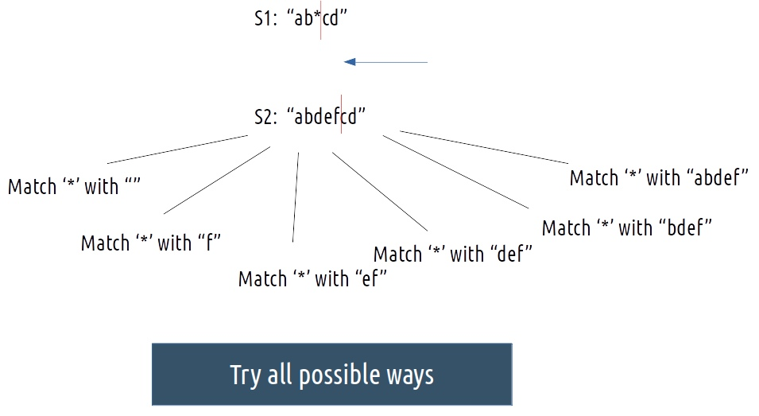
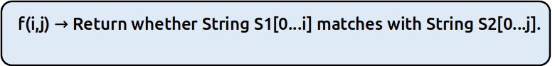
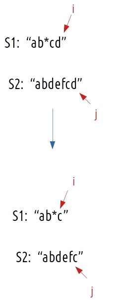
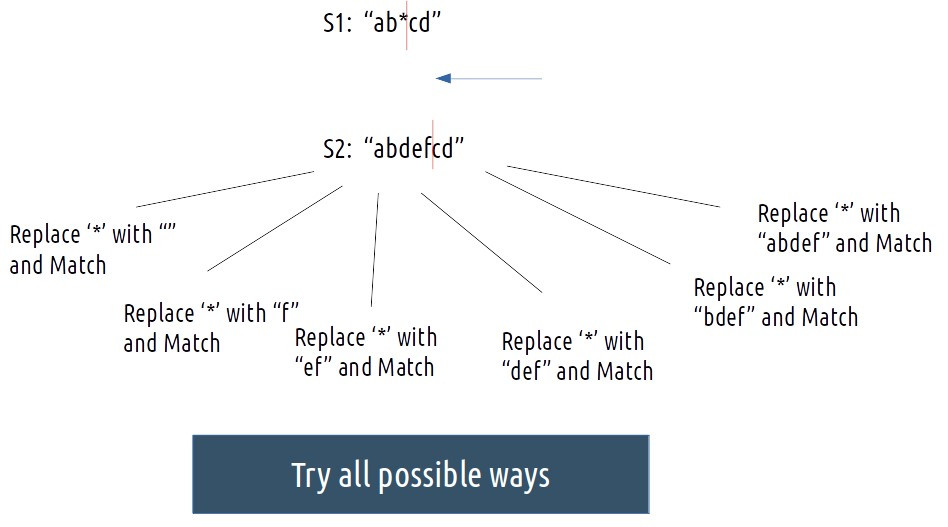
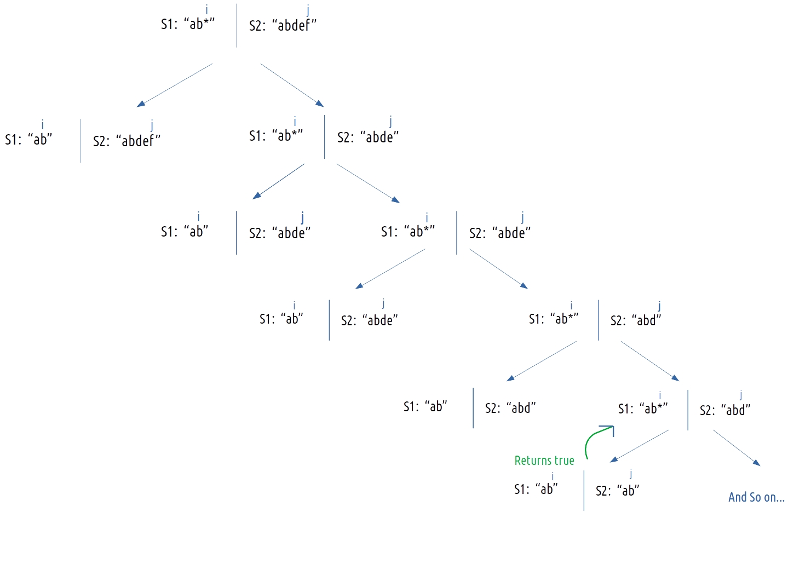
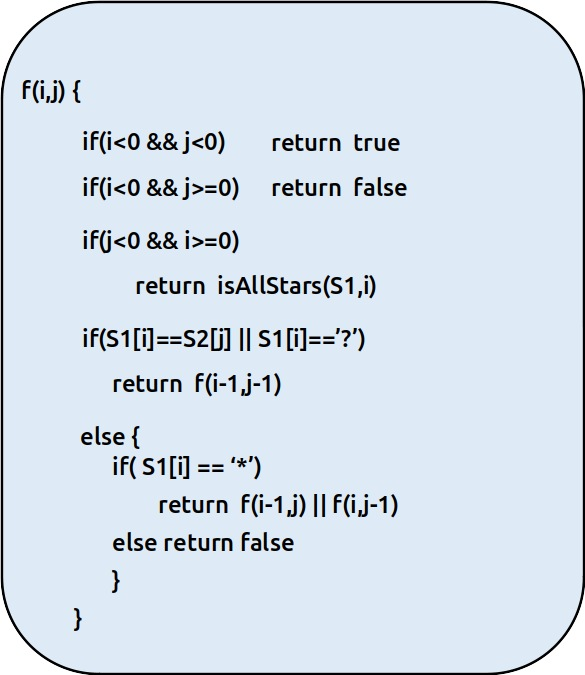

## Problem Statement

Given an input string (s) and a pattern (p), implement wildcard pattern matching with support for '?' and '\*' where:

- '?' Matches any single character.
- '\*' Matches any sequence of characters (including the empty sequence).

The matching should cover the entire input string (not partial).

Example 1:

    Input: s = "aa", p = "a"
    Output: false
    Explanation: "a" does not match the entire string "aa".

Example 2:

    Input: s = "aa", p = "*"
    Output: true
    Explanation: '*' matches any sequence.

Example 3:

    Input: s = "cb", p = "?a"
    Output: false
    Explanation: '?' matches 'c', but the second letter is 'a', which does not match 'b'.

Constraints:

    - `0 <= s.length, p.length <= 2000`
    - `s contains only lowercase English letters.`
    - `p contains only lowercase English letters, '?' or '*'.`

## Solutions

Intuition:
For every index of string S1, we have different options to match that index with string S2. Therefore, we can think in terms of string matching path as we have done already in previous questions.

        - Either the characters match already.
        - Or, if there is a ‘?’, we can explicitly match a single character.
        - For a ‘*’, the following figure explains the scenario.

        

As there is no uniformity in data, there is no other way to find out than to try out all possible ways. To do so we will need to use recursion.

Steps to form the recursive solution:

We will first form the recursive solution by the three points mentioned in the Dynamic Programming Introduction.

**Step 1**: Express the problem in terms of indexes.

We are given two strings. We can represent them with the help of two indexes i and j. Initially, i=n-1 and j=m-1, where n and m are lengths of strings S1 and S2. Initially, we will call f(n-1,m-1), which means whether string S1[0…n-1] matches with string S2[0…m-1].

We can generalize this as follows:



**Step 2**: Try out all possible choices at a given index.

Now, i and j represent two characters from strings S1 and S2 respectively. There are only two options that make sense: either the characters represented by i and j match or they don’t.

(i) When the characters match

     if(S1[i]==S2[j]),

If this is true, the characters at i and j match, we can simply move to the next characters of both the strings. So we will just decrement both i and j by 1 and recursively find the answer for the remaining string portions. We return f(i-1,j-1). The following figure makes it clear.



(ii) When the characters don’t match

If the characters don’t match, there are three possible scenarios:

            - S1[i] == ‘?’
            - S1[i] == ‘*’
            - S1[i] is some other character

Let us discuss them one by one:

(i) If S1[i] == ‘?’

In this case, we can explicitly match ‘?’ at index i of S1 with the corresponding character at index j of S2. And then recursively call f(i-1,j-1) to check for the remaining string.

(ii) If S1[i] == ‘\*’

This is an interesting case as now ‘\*’ can be replaced with any sequence of characters( of length 0 or more) from S2.

We will revisit this example:



If any of these cases return true, we can say that the characters do match. The next question is how to try all possible ways?

We are using two pointers i and j to represent characters of strings S1 and S2. We can surely write a for loop to compare characters from 0 to j of S2 for the above scenario. Can we do it more smartly? Yes, we can. Please understand the approach explained below.

We are using a recursive function f(i,j). If we do only the following two recursive calls:

- Call f(i-1,j). i.e replace ‘\*’ with nothing and act as if it was not present.
- Call f(i,j-1). i.e replace _ with a single character at index j and make the i pointer to still point at index i. In this, we matched it with a single character (one of the many options that need to be tried) and in the next recursive call, as i still point to ‘_’, we get the exact two recursive calls again.

The following recursive tree will help us to understand the recursion better.



So we see how we can tackle all the required cases associated with ‘\*’ by using recursion.

(iii) If S1[i] is neither ‘?’ nor ‘\*’, then we can say as the characters at i and j don’t match then the strings don’t match, so we return false.

To summarise:
`cpp
        If S1[i] == ‘?’, return f(i-1,j)
        Else if S1[i] == ‘*’, return f(i-1,j) || f(i,j-1)
        Else return false
      `

Step 3: Return logical OR (||) of all the choices

If any of the cases return true, we can say that strings do match. We can use OR operator (||) with the recursive calls.

Base Cases:

We are reducing i and j in our recursive relation, there can be two possibilities, either i becomes -1 or j becomes -1., i,e we exhaust either S1 or S2 respectively.

(i) When S1 is exhausted:

When S1 is exhausted `(i<0)`, we know that in order for the strings to match, String S2 should also exhaust simultaneously. If it does, we return true, else we return false.

We can say:

        - if `(i<0 && j<0)`, return true.
        - if `(i<0 && j>=0)`, return false.

(ii) When S2 is exhausted:

When S2 is exhausted `(j<0)` and S1 has not, there is only one pattern that can account for true(matching of strings). It is if S1 is like this “\*”,”\***_”,”_**”, i.e: S1 contains only stars. Then we can replace every star with a sequence of length `0` and say that the string match.

If S1 is all-stars, we return true, else return false.

The final pseudocode after steps 1, 2, and 3:



Steps to memoize a recursive solution:

If we draw the recursion tree, we will see that there are overlapping subproblems. In order to convert a recursive solution the following steps will be taken:

       - Create a dp array of size [n][m]. The size of S1 and S2 are n and m respectively, so the variable i will always lie between ‘0’ and ‘n-1’ and the variable j between ‘0’ and ‘m-1’.

       - We initialize the dp array to -1.

       - Whenever we want to find the answer to particular parameters (say f(i,j)), we first check whether the answer is already calculated using the dp array(i.e dp[i][j]!= -1 ). If yes, simply return the value from the dp array.

       - If not, then we are finding the answer for the given value for the first time, we will use the recursive relation as usual but before returning from the function, we will set dp[i][j] to the solution we get.

## code

<Tabs>
    <TabItem value="cpp" label="C++" default>
      <SolutionAuthor name="@Ajay-Dhangar"/>
      ```cpp
      #include <iostream>
      #include <vector>
      #include <string>

      using namespace std;

      class Solution {
      public:
          bool solve(int i, int j, string &s, string &p, vector<vector<int>> &dp) {
              if (i == 0 && j == 0) {
                  return true;
              }

              if (i == 0 && j > 0) {
                  return false;
              }

              if (j == 0 && i > 0) {
                  for (int k = 1; k <= i; k++) {
                      if (p[k - 1] != '*') {
                          return false;
                      }
                  }
                  return true;
              }

              if (dp[i][j] != -1)
                  return dp[i][j];

              if (s[i - 1] == p[j - 1] || p[j - 1] == '?') {
                  return dp[i][j] = solve(i - 1, j - 1, s, p, dp);
              }

              if (p[j - 1] == '*') {
                  return dp[i][j] = solve(i - 1, j, s, p, dp) || solve(i, j - 1, s, p, dp);
              }
              return dp[i][j] = false;
          }

          bool isMatch(string s, string p) {
              int n = p.size();
              int m = s.size();

              vector<vector<bool>> dp(n + 1, vector<bool>(m + 1, false));
              dp[0][0] = true;
              for (int j = 1; j <= m; j++) {
                  dp[0][j] = false;
              }

              for (int i = 1; i <= n; i++) {
                  bool flag = true;
                  for (int k = 1; k <= i; k++) {
                      if (p[i - 1] != '*') {
                          flag = false;
                          break;
                      }
                  }
                  dp[i][0] = flag;
              }

              for (int i = 1; i <= n; i++) {
                  for (int j = 1; j <= m; j++) {
                      if (p[i - 1] == s[j - 1] || p[i - 1] == '?') {
                          dp[i][j] = dp[i - 1][j - 1];
                      } else if (p[i - 1] == '*') {
                          dp[i][j] = dp[i - 1][j] || dp[i][j - 1];
                      } else {
                          dp[i][j] = false;
                      }
                  }
              }
              return dp[n][m];
          }
      };

      // Driver code
      int main() {
          Solution sol;
          string s = "aa";
          string p = "*";
          cout << sol.isMatch(s, p) << endl;  // Output: 1 (true)
          return 0;
      }
      ```
    </TabItem>
    <TabItem value="java" label="Java">
      <SolutionAuthor name="@Ajay-Dhangar"/>
      ```java
      import java.util.Arrays;

      public class Solution {
          public boolean solve(int i, int j, String s, String p, int[][] dp) {
              if (i == 0 && j == 0) {
                  return true;
              }

              if (i == 0 && j > 0) {
                  return false;
              }

              if (j == 0 && i > 0) {
                  for (int k = 1; k <= i; k++) {
                      if (p.charAt(k - 1) != '*') {
                          return false;
                      }
                  }
                  return true;
              }

              if (dp[i][j] != -1)
                  return dp[i][j] == 1;

              if (s.charAt(i - 1) == p.charAt(j - 1) || p.charAt(j - 1) == '?') {
                  return dp[i][j] = solve(i - 1, j - 1, s, p, dp) ? 1 : 0;
              }

              if (p.charAt(j - 1) == '*') {
                  return dp[i][j] = (solve(i - 1, j, s, p, dp) || solve(i, j - 1, s, p, dp)) ? 1 : 0;
              }
              return dp[i][j] = 0;
          }

          public boolean isMatch(String s, String p) {
              int n = p.length();
              int m = s.length();

              boolean[][] dp = new boolean[n + 1][m + 1];
              dp[0][0] = true;
              for (int j = 1; j <= m; j++) {
                  dp[0][j] = false;
              }

              for (int i = 1; i <= n; i++) {
                  boolean flag = true;
                  for (int k = 1; k <= i; k++) {
                      if (p.charAt(i - 1) != '*') {
                          flag = false;
                          break;
                      }
                  }
                  dp[i][0] = flag;
              }

              for (int i = 1; i <= n; i++) {
                  for (int j = 1; j <= m; j++) {
                      if (p.charAt(i - 1) == s.charAt(j - 1) || p.charAt(i - 1) == '?') {
                          dp[i][j] = dp[i - 1][j - 1];
                      } else if (p.charAt(i - 1) == '*') {
                          dp[i][j] = dp[i - 1][j] || dp[i][j - 1];
                      } else {
                          dp[i][j] = false;
                      }
                  }
              }
              return dp[n][m];
          }

          // Driver code
          public static void main(String[] args) {
              Solution sol = new Solution();
              String s = "aa";
              String p = "*";
              System.out.println(sol.isMatch(s, p));  // Output: true
          }
      }
      ```
    </TabItem>
    <TabItem value="python" label="Python">
      <SolutionAuthor name="@Ajay-Dhangar"/>
      ```python
      class Solution:
          def solve(self, i, j, s, p, dp):
              if i == 0 and j == 0:
                  return True
              if i == 0 and j > 0:
                  return False
              if j == 0 and i > 0:
                  return all(p[k - 1] == '*' for k in range(1, i + 1))
              if dp[i][j] != -1:
                  return dp[i][j] == 1
              if s[i - 1] == p[j - 1] or p[j - 1] == '?':
                  dp[i][j] = 1 if self.solve(i - 1, j - 1, s, p, dp) else 0
                  return dp[i][j] == 1
              if p[j - 1] == '*':
                  dp[i][j] = 1 if self.solve(i - 1, j, s, p, dp) or self.solve(i, j - 1, s, p, dp) else 0
                  return dp[i][j] == 1
              dp[i][j] = 0
              return False

          def isMatch(self, s, p):
              n = len(p)
              m = len(s)
              dp = [[-1] * (m + 1) for _ in range(n + 1)]
              dp[0][0] = 1
              for j in range(1, m + 1):
                  dp[0][j] = 0
              for i in range(1, n + 1):
                  dp[i][0] = 1 if all(p[k - 1] == '*' for k in range(1, i + 1)) else 0
              for i in range(1, n + 1):
                  for j in range(1, m + 1):
                      if p[i - 1] == s[j - 1] or p[i - 1] == '?':
                          dp[i][j] = dp[i - 1][j - 1]
                      elif p[i - 1] == '*':
                          dp[i][j] = dp[i - 1][j] or dp[i][j - 1]
                      else:
                          dp[i][j] = 0
              return dp[n][m] == 1

      # Driver code
      if __name__ == "__main__":
          sol = Solution()
          s = "aa"
          p = "*"
          print(sol.isMatch(s, p))  # Output: True
      ```
    </TabItem>
    <TabItem value="c" label="C">
      <SolutionAuthor name="@Ajay-Dhangar"/>
      ```c
      #include <stdio.h>
      #include <stdbool.h>
      #include <string.h>

      bool solve(int i, int j, char *s, char *p, int dp[2001][2001]) {
          if (i == 0 && j == 0) {
              return true;
          }

          if (i == 0 && j > 0) {
              return false;
          }

          if (j == 0 && i > 0) {
              for (int k = 1; k <= i; k++) {
                  if (p[k - 1] != '*') {
                      return false;
                  }
              }
              return true;
          }

          if (dp[i][j] != -1) {
              return dp[i][j];
          }

          if (s[i - 1] == p[j - 1] || p[j - 1] == '?') {
              return dp[i][j] = solve(i - 1, j - 1, s, p, dp);
          }

          if (p[j - 1] == '*') {
              return dp[i][j] = solve(i - 1, j, s, p, dp) || solve(i, j - 1, s, p, dp);
          }
          return dp[i][j] = false;
      }

      bool isMatch(char *s, char *p) {
          int n = strlen(p);
          int m = strlen(s);

          bool dp[2001][2001];
          memset(dp, false, sizeof(dp));
          dp[0][0] = true;
          for (int j = 1; j <= m; j++) {
              dp[0][j] = false;
          }

          for (int i = 1; i <= n; i++) {
              bool flag = true;
              for (int k = 1; k <= i; k++) {
                  if (p[i - 1] != '*') {
                      flag = false;
                      break;
                  }
              }
              dp[i][0] = flag;
          }

          for (int i = 1; i <= n; i++) {
              for (int j = 1; j <= m; j++) {
                  if (p[i - 1] == s[j - 1] || p[i - 1] == '?') {
                      dp[i][j] = dp[i - 1][j - 1];
                  } else if (p[i - 1] == '*') {
                      dp[i][j] = dp[i - 1][j] || dp[i][j - 1];
                  } else {
                      dp[i][j] = false;
                  }
              }
          }
          return dp[n][m];
      }

      // Driver code
      int main() {
          char s[] = "aa";
          char p[] = "*";
          printf("%d\n", isMatch(s, p));  // Output: 1 (true)
          return 0;
      }
      ```
    </TabItem>

</Tabs>

## Complexity Analysis

Time Complexity: $O(N*M)$

Reason: There are `N*M` states therefore at max `N*M` new problems will be solved.

Space Complexity: $O(N*M)$ + $O(N+M)$

Reason: We are using a recursion stack space($O(N+M)$) and a 2D array ( $O(N*M)$).
