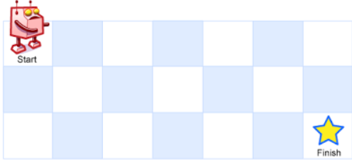

## Problem Description
There is a robot on an `m x n` grid. The robot is initially located at the **top-left corner** (i.e., `grid[0][0]`). The robot tries to move to the **bottom-right corner** (i.e., `grid[m - 1][n - 1]`). The robot can only move either down or right at any point in time.

Given the two integers `m` and `n`, return *the number of possible unique paths that the robot can take to reach the bottom-right corner*.

The test cases are generated so that the answer will be less than or equal to `2 * 109`.

### Examples

**Example 1:**



```
Input: m = 3, n = 7
Output: 28
```

**Example 2:**
```
Input: m = 3, n = 2
Output: 3
Explanation:
From the top-left corner, there are a total of 3 ways to reach the bottom-right corner:
1. Right -> Down -> Down
2. Down -> Down -> Right
3. Down -> Right -> Down

```


### Constraints
- `1 <= m, n <= 100`


## Solution for Unique Paths
### Approach 
#### Brute Force 
- The brute force approach uses recursion to explore all possible paths from the top-left to the bottom-right corner of the grid. At each cell, the robot has two choices: move right or move down.

**Recursive function:**
```cpp
int uniquePathsBruteForce(int m, int n) {
    if (m == 1 || n == 1) {
        return 1;
    }
    return uniquePathsBruteForce(m - 1, n) + uniquePathsBruteForce(m, n - 1);
}

```

**Complexity:**
- Time Complexity: `O(2^(m+n))` - Each recursive call generates two more recursive calls, leading to an exponential number of calls.
- Space Complexity: `O(m+n)` - The recursion stack can go as deep as the sum of `m` and `n`.

**Corner Cases:**
- If `m` or `n` is 1, there's only one path straight to the destination.
- The function assumes valid input where `m` and `n` are positive integers.

#### Optimized Approach 
- The optimized approach uses dynamic programming to avoid redundant calculations. We create a 2D array `dp` where `dp[i][j]` represents the number of unique paths to reach cell `(i, j)`.

**Dynamic Programming Solution:**

```cpp
int uniquePaths(int m, int n) {
    vector<vector<int>> dp(m, vector<int>(n, 1));
    
    for (int i = 1; i < m; i++) {
        for (int j = 1; j < n; j++) {
            dp[i][j] = dp[i-1][j] + dp[i][j-1];
        }
    }
    
    return dp[m-1][n-1];
}
```

**Complexity:**
- Time Complexity: `O(m*n)` because We fill in each cell of the `m x n` matrix exactly once.
- Space Complexity: `O(m*n)` We use a 2D array to store the number of paths for each cell.


**Further Optimization**
We can further optimize the space complexity to `O(n)` by using a single array to keep track of the current row's path counts.
```cpp
int uniquePaths(int m, int n) {
    vector<int> dp(n, 1);
    
    for (int i = 1; i < m; i++) {
        for (int j = 1; j < n; j++) {
            dp[j] += dp[j-1];
        }
    }
    
    return dp[n-1];
}
```
**Complexity of Optimized Approach:**
- Time Complexity: `O(m*n)` - Still filling in each cell exactly once.
- Space Complexity: `O(n)` - Using a single array of size `n`.

**Corner Cases:**
- If either `m` or `n` is 1, the function should return 1 since there's only one path straight to the destination.
- TThe function handles cases where `m` or `n` is very large efficiently within the constraints


<Tabs>
  <TabItem value="Solution" label="Solution">

#### Implementation

    ```jsx live
    function Solution(a,b) {
      var uniquePaths = function(m, n) {
        if (m === 0 || n === 0) return 0;

        let dp = new Array(n).fill(1);

        for (let i = 1; i < m; i++) {
            for (let j = 1; j < n; j++) {
                dp[j] += dp[j - 1];
            }
        }

        return dp[n - 1];
      };

      const m = 3;
      const n = 7;
      const output = uniquePaths(m, n);
      return (
        <div>
          <p>
            <b>Input: </b>
            {m,' ',n}
          </p>
          <p>
            <b>Output:</b> {output.toString()}
          </p>
        </div>
      );
    }
    ```

#### Complexity Analysis

 - Time Complexity: $O(m*n)$ 
 - Space Complexity: $O(n)$ 

  ## Code in Different Languages

   <Tabs>

  <TabItem value="JavaScript" label="JavaScript">
  <SolutionAuthor name="@vansh-codes" />

   ```javascript
        var uniquePaths = function(m, n) {
            if (m === 0 || n === 0) return 0;

            let dp = new Array(n).fill(1);

            for (let i = 1; i < m; i++) {
                for (let j = 1; j < n; j++) {
                    dp[j] += dp[j - 1];
                }
            }
            return dp[n - 1];
        };
    ```

  </TabItem>

  <TabItem value="TypeScript" label="TypeScript">
  <SolutionAuthor name="@vansh-codes" /> 

   ```typescript
        function uniquePaths(m: number, n: number): number {
            if (m === 0 || n === 0) return 0;

            let dp: number[] = new Array(n).fill(1);

            for (let i = 1; i < m; i++) {
                for (let j = 1; j < n; j++) {
                    dp[j] += dp[j - 1];
                }
            }

            return dp[n - 1];
        };
    ```

  </TabItem>

  <TabItem value="Python" label="Python">
  <SolutionAuthor name="@vansh-codes" />

   ```python
    class Solution(object):
        def uniquePaths(self, m, n):
            if m == 0 or n == 0:
                return 0
            
            dp = [1] * n
            
            for i in range(1, m):
                for j in range(1, n):
                    dp[j] += dp[j - 1]
            
            return dp[-1]
    ```

  </TabItem>

  <TabItem value="Java" label="Java">
  <SolutionAuthor name="@vansh-codes" />

   ```java
    class Solution {
        public int uniquePaths(int m, int n) {
            if (m == 0 || n == 0) return 0;

            int[] dp = new int[n];
            Arrays.fill(dp, 1);

            for (int i = 1; i < m; i++) {
                for (int j = 1; j < n; j++) {
                    dp[j] += dp[j - 1];
                }
            }

            return dp[n - 1];
        }
    }
    ```

  </TabItem>

  <TabItem value="C++" label="C++">
  <SolutionAuthor name="@vansh-codes" />

   ```cpp
   class Solution {
    public:
        int uniquePaths(int m, int n) {
            if (m == 0 || n == 0) return 0;

            vector<int> dp(n, 1);

            for (int i = 1; i < m; i++) {
                for (int j = 1; j < n; j++) {
                    dp[j] += dp[j - 1];
                }
            }

            return dp[n - 1];
        }
    };
    ```

</TabItem>
</Tabs>

</TabItem>
</Tabs>

## References

- **LeetCode Problem**: [Unique Paths](https://leetcode.com/problems/unique-paths/description/)

- **Solution Link**: [LeetCode Solution](https://leetcode.com/problems/unique-paths/solutions/)