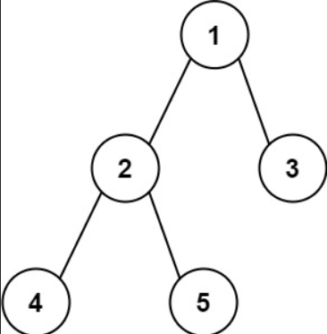

## Problem Description
Given the `root` of a binary tree, return *the length of the diameter of the tree*.
The **diameter** of a binary tree is the **length** of the longest path between any two nodes in a tree. This path may or may not pass through the `root`.
The **length** of a path between two nodes is represented by the number of edges between them.
### Examples

**Example 1:** 


```
Input: root = [1,2,3,4,5]
Output: 3
Explanataion: 3 is the length of the path [4,2,1,3] or [5,2,1,3].
```

**Example 2:**

```
Input: root = [1,2]
Output: 1
```


### Constraints
- The number of nodes in the tree is in the range `[1, 10^4]`.
- `-100 <= Node.val <= 100`


## Solution for Diameter of Binary tree
### Approach 
#### Brute Force 
- **Define a Helper Function**: 
    - Create a function to calculate the height of a tree.
- **Calculate Diameter**: 
    - For each node, calculate the diameter passing through that node.
    - The diameter passing through a node is the sum of the heights of its left and right subtrees.
    - Compare this diameter with the global maximum diameter.
- **Traverse Tree**: 
    - Perform a traversal of the tree (e.g., in-order, pre-order) to compute the diameter for each node.

**Implementation:**
```cpp
#include <bits/stdc++.h>
using namespace std;

struct TreeNode {
    int val;
    TreeNode *left;
    TreeNode *right;
    TreeNode(int x) : val(x), left(NULL), right(NULL) {}
};

int height(TreeNode* node) {
    if (node == NULL) {
        return 0;
    }
    return 1 + max(height(node->left), height(node->right));
}

int diameterOfBinaryTree(TreeNode* root) {
    if (root == NULL) {
        return 0;
    }

    // Get the height of left and right sub-trees
    int left_height = height(root->left);
    int right_height = height(root->right);

    // Get the diameter of left and right sub-trees
    int left_diameter = diameterOfBinaryTree(root->left);
    int right_diameter = diameterOfBinaryTree(root->right);

    // Calculate diameter passing through the root
    return max(left_height + right_height, max(left_diameter, right_diameter));
}

int main() {
    TreeNode* root = new TreeNode(1);
    root->left = new TreeNode(2);
    root->right = new TreeNode(3);
    root->left->left = new TreeNode(4);
    root->left->right = new TreeNode(5);

    cout << "Diameter of the binary tree is: " << diameterOfBinaryTree(root) << endl;

    return 0;
}
```

**Complexity:**
- Time Complexity: `O(n^2)` because for each node, we are calculating the height which takes O(n) time.
- Space Complexity: `O(n)` due to the recursion stack.

**Corner Cases:**
- Empty tree: Should return `0`.
- Single node tree: Should return `0` as there are no edges.

#### Optimized Approach 
- **Define a Helper Function:**: 
    - Create a function to calculate both the height and the diameter of the tree simultaneously.
- **Single Traversal**: 
    - Traverse the tree once, calculating the height and updating the maximum diameter at each node.

**Implementation:**

```cpp
#include <bits/stdc++.h>
using namespace std;

struct TreeNode {
    int val;
    TreeNode *left;
    TreeNode *right;
    TreeNode(int x) : val(x), left(NULL), right(NULL) {}
};

class Solution {
public:
    int diameter;

    int height(TreeNode* node) {
        if (node == NULL) {
            return 0;
        }

        int left_height = height(node->left);
        int right_height = height(node->right);

        // Update the diameter if left_height + right_height is larger
        diameter = max(diameter, left_height + right_height);

        // Height of the current node is max of heights of left and right subtrees plus 1
        return 1 + max(left_height, right_height);
    }

    int diameterOfBinaryTree(TreeNode* root) {
        diameter = 0;
        height(root);
        return diameter;
    }
};

int main() {
    TreeNode* root = new TreeNode(1);
    root->left = new TreeNode(2);
    root->right = new TreeNode(3);
    root->left->left = new TreeNode(4);
    root->left->right = new TreeNode(5);

    Solution solution;
    cout << "Diameter of the binary tree is: " << solution.diameterOfBinaryTree(root) << endl;

    return 0;
}
```

**Complexity:**
- Time Complexity: `O(n)`since we are traversing each node only once.
- Space Complexity: `O(n)`due to the recursion stack.

**Corner Cases:**
- Empty tree: Should return `0`.
- Single node tree: Should return `0` as there are no edges.


  ## Code in Different Languages

 <Tabs>

  <TabItem value="JavaScript" label="JavaScript">
  <SolutionAuthor name="@vansh-codes" />

   ```javascript
    var diameterOfBinaryTree = function(root) {
         let diameter = 0;

        function height(node) {
            if (node === null) return 0;
            let leftHeight = height(node.left);
            let rightHeight = height(node.right);

            // Update the diameter
            diameter = Math.max(diameter, leftHeight + rightHeight);

            return 1 + Math.max(leftHeight, rightHeight);
        }

        height(root);
        return diameter;
    };
    ```

  </TabItem>

  <TabItem value="TypeScript" label="TypeScript">
  <SolutionAuthor name="@vansh-codes" /> 

   ```typescript
    function diameterOfBinaryTree(root: TreeNode | null): number {
        let diameter = 0;

        function height(node: TreeNode | null): number {
            if (node === null) return 0;
            let leftHeight = height(node.left);
            let rightHeight = height(node.right);

            // Update the diameter
            diameter = Math.max(diameter, leftHeight + rightHeight);

            return 1 + Math.max(leftHeight, rightHeight);
        }

        height(root);
        return diameter;
    }
    ```

  </TabItem>

  <TabItem value="Python" label="Python">
  <SolutionAuthor name="@vansh-codes" />

   ```python
    class Solution(object):
    def diameterOfBinaryTree(self, root: Optional[TreeNode]) -> int:
        self.diameter = 0

        def height(node: TreeNode) -> int:
            if not node:
                return 0
            left_height = height(node.left)
            right_height = height(node.right)

            # Update the diameter
            self.diameter = max(self.diameter, left_height + right_height)

            return 1 + max(left_height, right_height)

        height(root)
        return self.diameter
    ```

  </TabItem>

  <TabItem value="Java" label="Java">
  <SolutionAuthor name="@vansh-codes" />

   ```java
   import java.util.Arrays;

    class Solution {
        private int diameter;
        public int diameterOfBinaryTree(TreeNode root) {
            diameter = 0;

            height(root);
            return diameter;
        }

        private int height(TreeNode node) {
            if (node == null) {
                return 0;
            }

            int leftHeight = height(node.left);
            int rightHeight = height(node.right);

            // Update the diameter
            diameter = Math.max(diameter, leftHeight + rightHeight);

            return 1 + Math.max(leftHeight, rightHeight);
        }
    };
    ```

  </TabItem>

 <TabItem value="C++" label="C++">
 <SolutionAuthor name="@vansh-codes" />

   ```cpp
   class Solution {
    public:
        int diameter;

        int diameterOfBinaryTree(TreeNode* root) {
            diameter = 0;
            height(root);
            return diameter;
        }
    private:
        int height(TreeNode* node) {
            if (node == nullptr) {
                return 0;
            }

            int leftHeight = height(node->left);
            int rightHeight = height(node->right);

            // Update the diameter
            diameter = max(diameter, leftHeight + rightHeight);

            return 1 + max(leftHeight, rightHeight);
        }
    };
    ```

 </TabItem>
 </Tabs>

## References

- **LeetCode Problem**: [Diameter of Binary tree](https://leetcode.com/problems/diameter-of-binary-tree/description/)

- **Solution Link**: [LeetCode Solution](https://leetcode.com/problems/diameter-of-binary-tree/solutions/)  