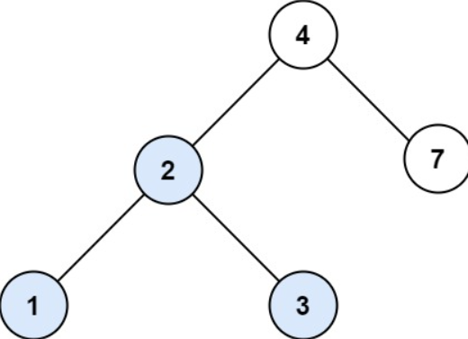
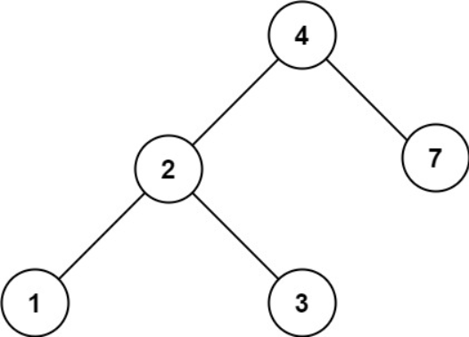

## Problem Description
You are given the `root` of a binary search tree (BST) and an integer `val`.
Find the node in the BST that the node's value equals `val` and return the subtree rooted with that node. If such a node does not exist, return `null`.
### Examples

**Example 1:** 


```
Input: root = [4,2,7,1,3], val = 2
Output: [2,1,3]
```

**Example 2:**


```
Input: root = [4,2,7,1,3], val = 5
Output: []

```


### Constraints
- The number of nodes in the tree is in the range `[1, 5000]`.
- `1 <= Node.val <= 10^7`
- `root` is a binary search tree.
- `1 <= val <= 10^7`


## Solution for Search in a Binary Search Tree
### Approach 
#### Brute Force 
- **Traverse the Tree**: Perform a level-order or in-order traversal of the tree.
- **Compare Values**: At each node, compare its value with the given value `val`.
- **Return Subtree**: If the node’s value equals `val`, return the subtree rooted at that node.
- **Return Null**: If the traversal completes without finding the node, return `null`.

**Implementation:**
```python
class TreeNode:
    def __init__(self, val=0, left=None, right=None):
        self.val = val
        self.left = left
        self.right = right

def findNode(root, val):
    if root is None:
        return None

    queue = [root]
    while queue:
        node = queue.pop(0)
        if node.val == val:
            return node
        if node.left:
            queue.append(node.left)
        if node.right:
            queue.append(node.right)

    return None

# Example usage
root = TreeNode(4, TreeNode(2, TreeNode(1), TreeNode(3)), TreeNode(7))
val = 2
subtree = findNode(root, val)
print(subtree.val if subtree else "Node not found")
```

**Complexity:**
- Time Complexity: `O(n)` - We might have to visit every node in the tree.
- Space Complexity: `O(n)` - In the worst case, the queue can hold all nodes in the tree (for level-order traversal).

**Corner Cases:**
- Empty tree: Should return `null`.
- Value not found: Should return `null`.

#### Optimized Approach 
- **Leverage BST Properties**: Use the properties of the BST (left subtree contains nodes with values less than the root, and the right subtree contains nodes with values greater than the root).
- **Binary Search**: Traverse the tree using a binary search-like approach:
    - If `val` is less than the current node’s value, move to the left child.
    - If `val` is greater than the current node’s value, move to the right child.
    - If `val` equals the current node’s value, return the current node.
- **Return Null**: If a leaf node is reached without finding the value, return `null`.

**Implementation:**

```python
class TreeNode:
    def __init__(self, val=0, left=None, right=None):
        self.val = val
        self.left = left
        self.right = right

def findNode(root, val):
    current = root
    while current:
        if current.val == val:
            return current
        elif val < current.val:
            current = current.left
        else:
            current = current.right
    return None

# Example usage
root = TreeNode(4, TreeNode(2, TreeNode(1), TreeNode(3)), TreeNode(7))
val = 2
subtree = findNode(root, val)
print(subtree.val if subtree else "Node not found")
```

**Complexity:**
- Time Complexity: `O(h)`- `h` is the height of the tree. In the worst case, it can be O(n) for a skewed tree, but in a balanced tree, it is O(log n).
- Space Complexity: `O(1)`- We are not using any extra space except for the input and output.

**Corner Cases:**
- Empty tree: Should return `null`.
- Value not found: Should return `null`.
- Single node tree: If the single node does not match `val`, should return `null`.


  ## Code in Different Languages

 <Tabs>

  <TabItem value="JavaScript" label="JavaScript">
  <SolutionAuthor name="@vansh-codes" />

   ```javascript
    var searchBST = function(root, val) {
        if (root === null) {
            return null;
        } else {
            if (root.val === val) {
                return root;
            } else if (root.val < val) {
                return searchBST(root.right, val);
            } else {
                return searchBST(root.left, val);
            }
        }
    };
    ```

  </TabItem>

  <TabItem value="TypeScript" label="TypeScript">
  <SolutionAuthor name="@vansh-codes" /> 

   ```typescript
    function searchBST(root: TreeNode | null, val: number): TreeNode | null {
        if (root === null) {
            return null;
        } else {
            if (root.val === val) {
                return root;
            } else if (root.val < val) {
                return searchBST(root.right, val);
            } else {
                return searchBST(root.left, val);
            }
        }
    }
    ```

  </TabItem>

  <TabItem value="Python" label="Python">
  <SolutionAuthor name="@vansh-codes" />

   ```python

    class Solution(object):
    def searchBST(self, root, val):
        if root is None:
            return None
        else:
            if root.val == val:
                return root
            elif root.val < val:
                return self.searchBST(root.right, val)
            else:
                return self.searchBST(root.left, val)
    ```

  </TabItem>

  <TabItem value="Java" label="Java">
  <SolutionAuthor name="@vansh-codes" />

   ```java
   import java.util.Arrays;

    class Solution {
        public TreeNode searchBST(TreeNode root, int val) {
            if (root == null) {
                return null;
            } else {
                if (root.val == val) {
                    return root;
                } else if (root.val < val) {
                    return searchBST(root.right, val);
                } else {
                    return searchBST(root.left, val);
                }
            }
        }
    }
    ```

  </TabItem>

 <TabItem value="C++" label="C++">
 <SolutionAuthor name="@vansh-codes" />

   ```cpp
   class Solution {
    public:
        TreeNode* searchBST(TreeNode* root, int val) {
            if(root==NULL){
                return NULL;
            }
            else{
                if(root->val == val){
                        return root;
                }else if(root->val < val){
                        return searchBST(root->right,val);
                }else{
                        return searchBST(root->left,val);
                }
                return NULL;
            }
            return NULL;
        }
    };
    ```

 </TabItem>
 </Tabs>

## References

- **LeetCode Problem**: [Search in a Binary Search Tree](https://leetcode.com/problems/search-in-a-binary-search-tree/description)

- **Solution Link**: [LeetCode Solution](https://leetcode.com/problems/search-in-a-binary-search-tree/solutions)  