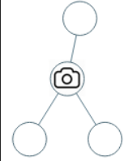

## Problem Description
You are given the `root` of a binary tree. We install cameras on the tree nodes where each camera at a node can monitor its parent, itself, and its immediate children.
Return *the minimum number of cameras needed to monitor all nodes of the tree.*

### Examples

**Example 1:**



```
Input: root = [0,0,null,0,0]
Output: 1
Explanation: One camera is enough to monitor all nodes if placed as shown.
```

**Example 2:**


```
Input: root = [0,0,null,0,null,0,null,null,0]
Output: 2
Explanation: At least two cameras are needed to monitor all nodes of the tree. The above image shows one of the valid configurations of camera placement.
```


### Constraints
- The number of nodes in the tree is in the range `[1, 1000]`.
- `Node.val == 0`


## Solution for Binary Tree Cameras
### Approach 1
#### Brute Force 
The brute force approach involves exploring all possible ways to place cameras and selecting the minimum configuration. This is impractical due to the exponential number of configurations.


**Steps:**:
- For each node, consider placing a camera at that node.
- Recursively determine the number of cameras needed for the left and right subtrees.
- Calculate the total number of cameras for each configuration and choose the minimum.


**Complexity:**
- Time Complexity: `O(2^n)` where `n` is the number of nodes in the tree. This is because each node has two possibilities: placing a camera or not.
- Space Complexity: `O(n)` due to the recursion stack.

**Corner Cases:**
- An empty tree (should return 0).
- A single node tree (should return 1).
- A skewed tree where all nodes are in a single line (worst-case scenario for brute force).

### Approach 2
#### Optimized Approach 
The optimized approach uses dynamic programming with a Depth-First Search (DFS) traversal. The idea is to use three states for each node:
- State 0: The node has no camera and is not monitored.
- State 1: The node is monitored but does not have a camera.
- State 2: The node has a camera.

We then use these states to determine the minimum number of cameras needed.

**Steps:**
- Define a recursive function `dfs(node)` that returns a tuple of three values representing the minimum cameras needed for states 0, 1, and 2.
- For each node, compute:
    - State 0: The sum of the minimum cameras needed for state 1 of the left and right children.
    - State 1: The minimum of state 2 (placing a camera) for either left or right child plus the minimum of states 0 or 1 for the other child.
    - State 2: 1 (camera at this node) plus the minimum of states 0, 1, or 2 for both left and right children.
- The result for the root is the minimum of state 1 and state 2.

**Implementation:**

```python
class TreeNode:
    def __init__(self, val=0, left=None, right=None):
        self.val = val
        self.left = left
        self.right = right

def minCameraCover(root: TreeNode) -> int:
    def dfs(node):
        if not node:
            return (0, 0, float('inf'))
        
        L = dfs(node.left)
        R = dfs(node.right)
        
        d0 = L[1] + R[1]
        d1 = min(L[2] + min(R[1], R[2]), R[2] + min(L[1], L[2]))
        d2 = 1 + min(L) + min(R)
        
        return (d0, d1, d2)
    
    res = dfs(root)
    return min(res[1], res[2])
```

**Explanation:**
- **dfs(node)**: Returns a tuple (d0, d1, d2) for the given node.
    - `d0`: Minimum cameras needed if the node is not monitored.
    - `d1`: Minimum cameras needed if the node is monitored but has no camera.
    - `d2`: Minimum cameras needed if the node has a camera.
- **Res**: For the root node, we return the minimum of `d1` and `d2`, ensuring all nodes are monitored.

**Complexity:**
- Time Complexity: `O(n)` where `n` is the number of nodes. Each node is visited once
- Space Complexity: `O(h)` where `h` is the height of the tree due to the recursion stack.

**Corner Cases:**
- An empty tree (should return 0).
- A single node tree (should return 1).
- A skewed tree where all nodes are in a single line.


<!-- START FROM HERE -->

  ## Code in Different Languages

   <Tabs>

  <TabItem value="JavaScript" label="JavaScript">
  <SolutionAuthor name="@vansh-codes" />

   ```javascript
    var minCameraCover = function(root) {
        const NOT_NEEDED = 0;
        const HAS_CAMERA = 1;
        const NEEDS_CAMERA = 2;

        let cameras = 0;

        function dfs(node) {
            if (!node) return NOT_NEEDED;

            const left = dfs(node.left);
            const right = dfs(node.right);

            if (left === NEEDS_CAMERA || right === NEEDS_CAMERA) {
                cameras++;
                return HAS_CAMERA;
            }
            if (left === HAS_CAMERA || right === HAS_CAMERA) {
                return NOT_NEEDED;
            }
            return NEEDS_CAMERA;
        }

        return dfs(root) === NEEDS_CAMERA ? cameras + 1 : cameras;
    };
    ```

  </TabItem>

  <TabItem value="TypeScript" label="TypeScript">
  <SolutionAuthor name="@vansh-codes" /> 

   ```typescript
    function minCameraCover(root: TreeNode | null): number {
        const NOT_NEEDED = 0;
        const HAS_CAMERA = 1;
        const NEEDS_CAMERA = 2;

        let cameras = 0;

        function dfs(node: TreeNode | null): number {
            if (!node) return NOT_NEEDED;

            const left = dfs(node.left);
            const right = dfs(node.right);

            if (left === NEEDS_CAMERA || right === NEEDS_CAMERA) {
                cameras++;
                return HAS_CAMERA;
            }
            if (left === HAS_CAMERA || right === HAS_CAMERA) {
                return NOT_NEEDED;
            }
            return NEEDS_CAMERA;
        }

        return dfs(root) === NEEDS_CAMERA ? cameras + 1 : cameras;
    };
    ```

  </TabItem>

  <TabItem value="Python" label="Python">
  <SolutionAuthor name="@vansh-codes" />

   ```python
    class Solution:
        def minCameraCover(self, root: Optional[TreeNode]) -> int:
            NOT_NEEDED = 0
            HAS_CAMERA = 1
            NEEDS_CAMERA = 2

            cameras = 0

            def dfs(node):
                nonlocal cameras
                if not node:
                    return NOT_NEEDED
                
                left = dfs(node.left)
                right = dfs(node.right)

                if left == NEEDS_CAMERA or right == NEEDS_CAMERA:
                    cameras += 1
                    return HAS_CAMERA
                if left == HAS_CAMERA or right == HAS_CAMERA:
                    return NOT_NEEDED
                return NEEDS_CAMERA

            return cameras + 1 if dfs(root) == NEEDS_CAMERA else cameras
    ```

  </TabItem>

  <TabItem value="Java" label="Java">
  <SolutionAuthor name="@vansh-codes" />

   ```java
    class Solution {
        private static final int NOT_NEEDED = 0;
        private static final int HAS_CAMERA = 1;
        private static final int NEEDS_CAMERA = 2;

        private int cameras = 0;

        public int minCameraCover(TreeNode root) {
            return (dfs(root) == NEEDS_CAMERA ? 1 : 0) + cameras;
        }

        private int dfs(TreeNode node) {
            if (node == null) return NOT_NEEDED;

            int left = dfs(node.left);
            int right = dfs(node.right);

            if (left == NEEDS_CAMERA || right == NEEDS_CAMERA) {
                cameras++;
                return HAS_CAMERA;
            }
            if (left == HAS_CAMERA || right == HAS_CAMERA) {
                return NOT_NEEDED;
            }
            return NEEDS_CAMERA;
        }
    }
    ```

  </TabItem>

  <TabItem value="C++" label="C++">
  <SolutionAuthor name="@vansh-codes" />

   ```cpp
    class Solution {
        static const int NOT_NEEDED = 0;
        static const int HAS_CAMERA = 1;
        static const int NEEDS_CAMERA = 2;

        int cameras = 0;

        int dfs(TreeNode* node) {
            if (!node) return NOT_NEEDED;

            int left = dfs(node->left);
            int right = dfs(node->right);

            if (left == NEEDS_CAMERA || right == NEEDS_CAMERA) {
                cameras++;
                return HAS_CAMERA;
            }
            if (left == HAS_CAMERA || right == HAS_CAMERA) {
                return NOT_NEEDED;
            }
            return NEEDS_CAMERA;
        }

        public:
            int minCameraCover(TreeNode* root) {
                return (dfs(root) == NEEDS_CAMERA ? 1 : 0) + cameras;
            }
    };
    ```

</TabItem>
</Tabs>


## References

- **LeetCode Problem**: [Binary Tree Cameras](https://leetcode.com/problems/binary-tree-cameras/)

- **Solution Link**: [LeetCode Solution](https://leetcode.com/problems/binary-tree-cameras/solutions/)