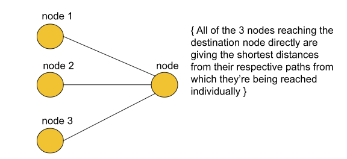

## Problem Description

You are in a city that consists of n intersections numbered from 0 to n - 1 with bi-directional roads between some intersections. The inputs are generated such that you can reach any intersection from any other intersection and that there is at most one road between any two intersections.

You are given an integer n and a 2D integer array roads where roads[i] = [ui, vi, timei] means that there is a road between intersections ui and vi that takes timei minutes to travel. You want to know in how many ways you can travel from intersection 0 to intersection n - 1 in the shortest amount of time.

Return the number of ways you can arrive at your destination in the shortest amount of time. Since the answer may be large, return it modulo `10^9 + 7`.

 ### Examples
**Example 1:**
```
Input: n = 7, roads = [[0,6,7],[0,1,2],[1,2,3],[1,3,3],[6,3,3],[3,5,1],[6,5,1],[2,5,1],[0,4,5],[4,6,2]]

Output: 4

Explanation:

The shortest amount of time it takes to go from intersection 0 to intersection 6 is 7 minutes.
The four ways to get there in 7 minutes are:
- 0 ➝ 6
- 0 ➝ 4 ➝ 6
- 0 ➝ 1 ➝ 2 ➝ 5 ➝ 6
- 0 ➝ 1 ➝ 3 ➝ 5 ➝ 6
```

**Example 2:**
```
Input: n = 2, roads = [[1,0,10]]

Output: 1

Explanation:

There is only one way to go from intersection 0 to intersection 1, and it takes 10 minutes.
```

### Constraints
- `1 <= n <= 200`
- `n - 1 <= roads.length <= n * (n - 1) / 2`
- `roads[i].length == 3`
- `0 <= ui, vi <= n - 1`
- `1 <= timei <= 109`
- `ui != vi`
- There is at most one road connecting any two intersections.
- You can reach any intersection from any other intersection.

## Solution for 1976. Number of Ways to Arrive at Destination

Since there can be many paths to reach a destination node from the given source node, in this problem, we have to find all those paths that are the shortest in order to reach our destination. For an easier understanding of this particular problem, we can say that we can divide the problem into partitions such as illustrated below :


From the above picture, we may assume that there will be 3 shortest paths to the destination node. But that may not be the case every time. Let us understand how - We assume the total number of ways in which the destination node is reachable by the shortest possible distance be ways[node] where ‘node’ depicts the destination node and node1, node2 and node3 are the three nodes which act as intermediate nodes that provide shortest paths to the destination. We can say :
`ways[node] = ways[node1] + ways[node2] + ways[node3]`

Where, ways[node1], ways[node2], and ways[node3] are the number of shortest paths possible to node1, node2, and node3 respectively from the source node, the sum of which is the total possible shortest paths and that can be hence greater than 3.

## Approach

Initial configuration:

- **Priority Queue**: Define a Priority Queue which would contain pairs of the type {dist, node }, where ‘dist’ indicates the currently updated value of the shortest dist taken to reach from source to the current ‘node’.
- **Distance Array**: Define a distance array that would contain the minimum distance from the start node to the current node. If a cell is marked as ‘infinity’ then it is treated as unreachable/ unvisited.
- **Source Node**: Define the start node from where we have to calculate the total number of shortest paths.
- **Ways Array**: Define a ways array which would contain the number of possible shortest ways/paths for each node. 

Eventually, we would want to return ways[n-1] where n= Number of nodes.
The Algorithm consists of the following steps :

1. Start by creating an adjacency list, a priority queue that stores the dist-node pairs in the form {dist, node} and a dist array with each node initialized with a very large number ( to indicate that the nodes have not been visited initially). 
2. In addition to the standard configuration of Dijkstra’s algorithm, we have one more array in this problem by the name ‘ways’ which is initialized to ‘0’ for every node when they’re unvisited (so the number of ways is 0).
3. Now, we push the start node to the queue along with its distance marked as ‘0’ and ways marked as ‘1’ initially because we’ve just started the algorithm.
4. Pop the element from the front of the queue and look out for its adjacent nodes.
5. If the current dist value for a number is better than the previous distance indicated by the distance array, we update the distance in the array and push it to the queue. Now, here side by side we also keep the number of ways to the ‘node’ the same as before.
6. If the current dist value is the same as the previously stored dist value at the same index, increment the number of ways by 1 at that index.
7. We repeat the above steps until the queue becomes empty or till we reach the destination.
8. Return the ways[n-1] modulo 10^9+7 when the queue becomes empty.

### Code in Different Languages

<Tabs>
<TabItem value="C++" label="C++" default>
<SolutionAuthor name="@nagalakshmi08"/>

```cpp
class Solution
{
public:
    int countPaths(int n, vector<vector<int>> &roads)
    {
        // Creating an adjacency list for the given graph.
        vector<pair<int, int>> adj[n];
        for (auto it : roads)
        {
            adj[it[0]].push_back({it[1], it[2]});
            adj[it[1]].push_back({it[0], it[2]});
        }

        // Defining a priority queue (min heap). 
        priority_queue<pair<int, int>,
                       vector<pair<int, int>>, greater<pair<int, int>>> pq;

        // Initializing the dist array and the ways array
        // along with their first indices.
        vector<int> dist(n, INT_MAX), ways(n, 0);
        dist[0] = 0;
        ways[0] = 1;
        pq.push({0, 0});

        // Define modulo value
        int mod = (int)(1e9 + 7);

        // Iterate through the graph with the help of priority queue
        // just as we do in Dijkstra's Algorithm.
        while (!pq.empty())
        {
            int dis = pq.top().first;
            int node = pq.top().second;
            pq.pop();

            for (auto it : adj[node])
            {
                int adjNode = it.first;
                int edW = it.second;

                // This ‘if’ condition signifies that this is the first
                // time we’re coming with this short distance, so we push
                // in PQ and keep the no. of ways the same.
                if (dis + edW < dist[adjNode])
                {
                    dist[adjNode] = dis + edW;
                    pq.push({dis + edW, adjNode});
                    ways[adjNode] = ways[node];
                }

                // If we again encounter a node with the same short distance
                // as before, we simply increment the no. of ways.
                else if (dis + edW == dist[adjNode])
                {
                    ways[adjNode] = (ways[adjNode] + ways[node]) % mod;
                }
            }
        }
        // Finally, we return the no. of ways to reach
        // (n-1)th node modulo 10^9+7.
        return ways[n - 1] % mod;
    }
};
```
</TabItem>
<TabItem value="Java" label="Java">
<SolutionAuthor name="@nagalakshmi08"/>
```java
import java.util.*;

class Solution {
    public int countPaths(int n, int[][] roads) {
        // Creating an adjacency list for the given graph.
        List<List<int[]>> adj = new ArrayList<>();
        for (int i = 0; i < n; i++) {
            adj.add(new ArrayList<>());
        }
        for (int[] road : roads) {
            adj.get(road[0]).add(new int[]{road[1], road[2]});
            adj.get(road[1]).add(new int[]{road[0], road[2]});
        }

        // Defining a priority queue (min heap).
        PriorityQueue<int[]> pq = new PriorityQueue<>(Comparator.comparingInt(a -> a[0]));
        pq.add(new int[]{0, 0}); // (distance, node)

        // Initializing the dist array and the ways array
        int[] dist = new int[n];
        int[] ways = new int[n];
        Arrays.fill(dist, Integer.MAX_VALUE);
        dist[0] = 0;
        ways[0] = 1;

        // Define modulo value
        int mod = (int) (1e9 + 7);

        // Iterate through the graph with the help of priority queue
        while (!pq.isEmpty()) {
            int[] top = pq.poll();
            int dis = top[0];
            int node = top[1];

            for (int[] edge : adj.get(node)) {
                int adjNode = edge[0];
                int edW = edge[1];

                // This condition signifies that this is the first
                // time we’re coming with this short distance.
                if (dis + edW < dist[adjNode]) {
                    dist[adjNode] = dis + edW;
                    pq.add(new int[]{dis + edW, adjNode});
                    ways[adjNode] = ways[node];
                }

                // If we again encounter a node with the same short distance
                // as before, we simply increment the number of ways.
                else if (dis + edW == dist[adjNode]) {
                    ways[adjNode] = (ways[adjNode] + ways[node]) % mod;
                }
            }
        }

        // Finally, we return the number of ways to reach
        // the (n-1)th node modulo 10^9+7.
        return ways[n - 1] % mod;
    }
}
```

</TabItem>

<TabItem value="Python" label="Python">
<SolutionAuthor name="@nagalakshmi08"/>

```python
import heapq
import sys

class Solution:
    def countPaths(self, n: int, roads: list[list[int]]) -> int:
        # Creating an adjacency list for the given graph.
        adj = [[] for _ in range(n)]
        for u, v, time in roads:
            adj[u].append((v, time))
            adj[v].append((u, time))

        # Defining a priority queue (min heap).
        pq = [(0, 0)]  # (distance, node)

        # Initializing the dist array and the ways array
        dist = [sys.maxsize] * n
        ways = [0] * n
        dist[0] = 0
        ways[0] = 1

        # Define modulo value
        mod = int(1e9 + 7)

        # Iterate through the graph with the help of priority queue
        while pq:
            dis, node = heapq.heappop(pq)

            for adjNode, edW in adj[node]:
                # This condition signifies that this is the first
                # time we’re coming with this short distance.
                if dis + edW < dist[adjNode]:
                    dist[adjNode] = dis + edW
                    heapq.heappush(pq, (dis + edW, adjNode))
                    ways[adjNode] = ways[node]
                
                # If we again encounter a node with the same short distance
                # as before, we simply increment the number of ways.
                elif dis + edW == dist[adjNode]:
                    ways[adjNode] = (ways[adjNode] + ways[node]) % mod

        # Finally, we return the number of ways to reach
        # the (n-1)th node modulo 10^9+7.
        return ways[n - 1] % mod
```
</TabItem>
</Tabs>

#### Complexity Analysis

- **Time Complexity**:  $O(E \times log(V))$ { As we are using simple Dijkstra's algorithm here, the time complexity will be or the order E*log(V)}
Where E = Number of edges and V = No. of vertices.
- **Space Complexity**: $O(N)$ { for dist array + ways array + approximate complexity for priority queue }
Where, N = Number of nodes.

---

<h2>Authors:</h2>

<div style={{display: 'flex', flexWrap: 'wrap', justifyContent: 'space-between', gap: '10px'}}>
{['nagalakshmi08'].map(username => (
 <Author key={username} username={username} />
))}
</div>
