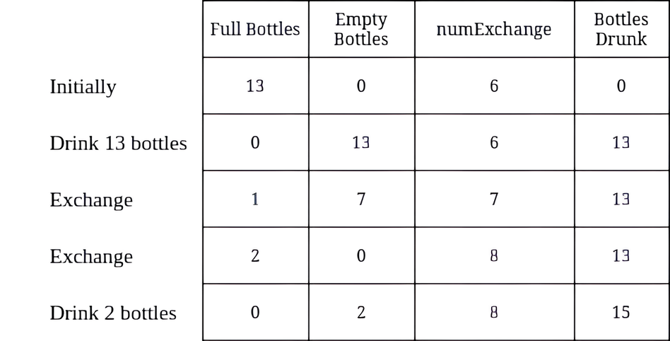
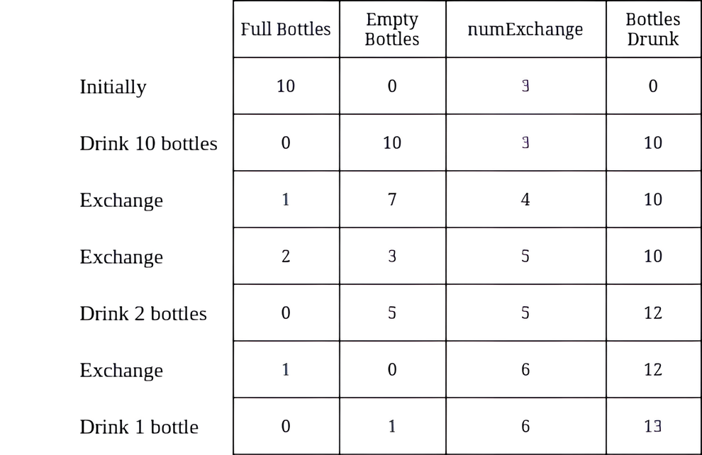

## Problem statement:

You are given two integers numBottles and numExchange.

numBottles represents the number of full water bottles that you initially have. In one operation, you can perform one of the following operations:

    1. Drink any number of full water bottles turning them into empty bottles.
    2. Exchange numExchange empty bottles with one full water bottle. Then, increase numExchange by one.

Note that you cannot exchange multiple batches of empty bottles for the same value of numExchange. For example, if numBottles == 3 and numExchange == 1, you cannot exchange 3 empty water bottles for 3 full bottles.

Return the maximum number of water bottles you can drink.

Example 1:

        

Input: numBottles = 13, numExchange = 6
Output: 15
Explanation: The table above shows the number of full water bottles, empty water bottles, the value of numExchange, and the number of bottles drunk.

Example 2:

         

Input: numBottles = 10, numExchange = 3
Output: 13
Explanation: The table above shows the number of full water bottles, empty water bottles, the value of numExchange, and the number of bottles drunk.

Constraints:

        `1 <= numBottles <= 100`
        `1 <= numExchange <= 100`

## Solutions:

### Intuition

The key to maximizing the number of water bottles drunk is to strategically utilize the exchange mechanic. We can think of this problem in terms of maximizing the total number of "drinking opportunities."

### Approach

      1. **Greedy Strategy:**

         We want to prioritize drinking full bottles whenever possible. Since drinking a full bottle directly translates to an extra opportunity to exchange empty bottles, it's the most efficient use of a full bottle.

      2. **Iterative Exchange:**

         As long as we have enough empty bottles (at least numExchange), we can perform an exchange. Each exchange grants one new full bottle and increases the exchange cost (numExchange) by one.

      3. **Stopping Condition:**

          The exchange process becomes inefficient once we don't have enough empty bottles (less than numExchange) to trigger an exchange. At this point, we simply drink any remaining full bottles.

### Implementation

          The provided code effectively implements the greedy approach with an iterative loop. Here's a breakdown:

         - int maxBottlesDrunk(int numBottles, int numExchange): This function takes the initial number of bottles (numBottles) and the exchange cost (numExchange) as input.

         - int ans = numBottles: Initializes two variables:

         - ans: Tracks the current number of full bottles we can potentially drink (including potential gains from exchange).

         - ans2 (not shown explicitly in the provided code snippet): Stores the final maximum number of bottles drunk.

         - while(ans>=numExchange): A loop that continues as long as we have enough empty bottles (represented by ans) to trigger an exchange.

         - ans-=numExchange: Subtract the exchange cost from the current full bottles (ans). This simulates performing the exchange and using numExchange empty bottles.

         - ans++: Since the exchange grants one new full bottle, we increment ans to represent this gain.

         - ans2++: Increment ans2 to track the total number of bottles drunk so far (including the newly gained bottle).

         - numExchange++: Increase the exchange cost by one, reflecting the updated requirement for future exchanges.

         - return ans2: After the loop exits (when we don't have enough empty bottles to exchange), ans2 holds the maximum number of bottles drunk, which is returned.

## Code:

<Tabs>
    <TabItem value="cpp" label="C++" default>
      <SolutionAuthor name="@Ajay-Dhangar"/>
      ```cpp
      #include <iostream>

      class Solution {
      public:
          int maxBottlesDrunk(int numBottles, int numExchange) {
              int totalDrunk = numBottles;
              int emptyBottles = numBottles;

              while (emptyBottles >= numExchange) {
                  int newBottles = emptyBottles / numExchange;
                  totalDrunk += newBottles;
                  emptyBottles = emptyBottles % numExchange + newBottles;
              }

              return totalDrunk;
          }
      };

      // Driver code
      int main() {
          Solution sol;
          int numBottles = 9;
          int numExchange = 3;
          std::cout << sol.maxBottlesDrunk(numBottles, numExchange) << std::endl;  // Output: 13
          return 0;
      }
      ```
    </TabItem>
    <TabItem value="java" label="Java">
      <SolutionAuthor name="@Ajay-Dhangar"/>
      ```java
      public class Solution {
          public int maxBottlesDrunk(int numBottles, int numExchange) {
              int totalDrunk = numBottles;
              int emptyBottles = numBottles;

              while (emptyBottles >= numExchange) {
                  int newBottles = emptyBottles / numExchange;
                  totalDrunk += newBottles;
                  emptyBottles = emptyBottles % numExchange + newBottles;
              }

              return totalDrunk;
          }

          // Driver code
          public static void main(String[] args) {
              Solution sol = new Solution();
              int numBottles = 9;
              int numExchange = 3;
              System.out.println(sol.maxBottlesDrunk(numBottles, numExchange));  // Output: 13
          }
      }
      ```
    </TabItem>
    <TabItem value="python" label="Python">
      <SolutionAuthor name="@Ajay-Dhangar"/>
      ```python
      class Solution:
          def maxBottlesDrunk(self, numBottles: int, numExchange: int) -> int:
              total_drunk = numBottles
              empty_bottles = numBottles

              while empty_bottles >= numExchange:
                  new_bottles = empty_bottles // numExchange
                  total_drunk += new_bottles
                  empty_bottles = empty_bottles % numExchange + new_bottles

              return total_drunk

      # Driver code
      if __name__ == "__main__":
          sol = Solution()
          numBottles = 9
          numExchange = 3
          print(sol.maxBottlesDrunk(numBottles, numExchange))  # Output: 13
      ```
    </TabItem>
    <TabItem value="c" label="C">
      <SolutionAuthor name="@Ajay-Dhangar"/>
      ```c
      #include <stdio.h>

      int maxBottlesDrunk(int numBottles, int numExchange) {
          int totalDrunk = numBottles;
          int emptyBottles = numBottles;

          while (emptyBottles >= numExchange) {
              int newBottles = emptyBottles / numExchange;
              totalDrunk += newBottles;
              emptyBottles = emptyBottles % numExchange + newBottles;
          }

          return totalDrunk;
      }

      // Driver code
      int main() {
          int numBottles = 9;
          int numExchange = 3;
          printf("%d\n", maxBottlesDrunk(numBottles, numExchange));  // Output: 13
          return 0;
      }
      ```
    </TabItem>

</Tabs>

## Complexity

**Time complexity:** $O(numBottles)$

In the worst case, we might need to perform an exchange for every initial bottle (numBottles) if the exchange cost (numExchange) is low. The loop iterates proportionally to the number of bottles.

**Space complexity:** $O(1)$

The code uses a constant amount of extra space for variables like ans and ans2, which doesn't depend on the input size (numBottles or numExchange).
