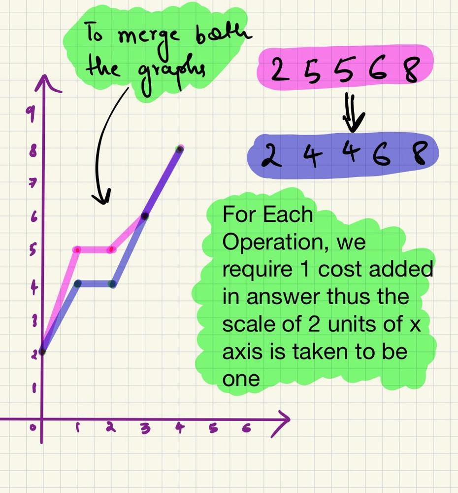

## Problem statement:

You are given an integer array nums and a non-negative integer k. In one operation, you can increase or decrease any element by 1.

Return the minimum number of operations needed to make the median of nums equal to k.

The median of an array is defined as the middle element of the array when it is sorted in non-decreasing order. If there are two choices for a median, the larger of the two values is taken.

**Example 1:**

Input: nums = [2,5,6,8,5], k = 4
Output: 2

Explanation:
We can subtract one from nums[1] and nums[4] to obtain [2, 4, 6, 8, 4]. The median of the resulting array is equal to k.

**Example 2:**

Input: nums = [2,5,6,8,5], k = 7
Output: 3

Explanation:
We can add one to nums[1] twice and add one to nums[2] once to obtain [2, 7, 7, 8, 5].

**Example 3:**

Input: nums = [1,2,3,4,5,6], k = 4
Output: 0

Explanation:
The median of the array is already equal to k.

Constraints:

`1 <= nums.length <= 2 * 105`
`1 <= nums[i] <= 109`
`1 <= k <= 109`

## Solutions:

### Intuition

-> Plot the intial points and the expected points of the given array on a graph.
-> To find the expected median 'k' the expected graph should coincide with the inital graph.
-> Find minimum number of steps to coincide them.

### Approach

consider: nums = [2,5,6,8,5], k = 4

       

1.  till the n/2th element-> all elements to the left of expected graph should be merged with the expected graph and those on the right wouldn't affect the median so no need to add in answer.

2.  for n/2th element it should be same for both graphs, so take difference and add.

3.  for elements after n/2-> the element to the left of expected graph wouldn't affect the median however those on the right will, so shift them so that they coincide and add the cost of shifting as well.

### Observation:

To make both the graphs coincide:

1. For elements less than the median (i < n / 2): calculate the difference between the current element nums[i] and the target value k. If this difference is positive (i.e., nums[i] is greater than k), add this difference to ans. Otherwise, add 0(already conincided).

2. For the median element itself (i == n / 2): calculate the absolute difference between the current element nums[i] and k and add it to ans. This ensures that regardless of whether k is greater or smaller than the median, its distance is considered.

3. For elements greater than the median (i > n / 2): calculate the difference between k and the current element nums[i]. If this difference is positive (i.e., nums[i] is less than k), add this difference to ans. Otherwise, add 0(already coincided).

## code:

<Tabs>
    <TabItem value="cpp" label="C++" default>
      <SolutionAuthor name="@Ajay-Dhangar"/>
      ```cpp
      #include <vector>
      #include <algorithm>
      using namespace std;

      class Solution {
      public:
          long long minOperationsToMakeMedianK(vector<int>& nums, int k) {
              int n = nums.size();
              sort(nums.begin(), nums.end());
              long long ans = 0;
              for (int i = 0; i < n; i++) {
                  if (i < n / 2)
                      ans += max(0, nums[i] - k); // 1st case
                  else if (i == n / 2)
                      ans += abs(nums[i] - k); // 2nd case
                  else
                      ans += max(0, k - nums[i]); // 3rd case
              }
              return ans;
          }
      };
      ```
    </TabItem>
    <TabItem value="java" label="Java">
      <SolutionAuthor name="@Ajay-Dhangar"/>
      ```java
      import java.util.*;

      public class Solution {
          public long minOperationsToMakeMedianK(List<Integer> nums, int k) {
              int n = nums.size();
              Collections.sort(nums);
              long ans = 0;
              for (int i = 0; i < n; i++) {
                  if (i < n / 2)
                      ans += Math.max(0, nums.get(i) - k); // 1st case
                  else if (i == n / 2)
                      ans += Math.abs(nums.get(i) - k); // 2nd case
                  else
                      ans += Math.max(0, k - nums.get(i)); // 3rd case
              }
              return ans;
          }
      }
      ```
    </TabItem>
    <TabItem value="python" label="Python">
      <SolutionAuthor name="@Ajay-Dhangar"/>
      ```python
      from typing import List

      class Solution:
          def minOperationsToMakeMedianK(self, nums: List[int], k: int) -> int:
              n = len(nums)
              nums.sort()
              ans = 0
              for i in range(n):
                  if i < n // 2:
                      ans += max(0, nums[i] - k)  # 1st case
                  elif i == n // 2:
                      ans += abs(nums[i] - k)  # 2nd case
                  else:
                      ans += max(0, k - nums[i])  # 3rd case
              return ans
      ```
    </TabItem>
    <TabItem value="c" label="C">
      <SolutionAuthor name="@Ajay-Dhangar"/>
      ```c
      #include <stdio.h>
      #include <stdlib.h>
      #include <limits.h>

      int cmp(const void* a, const void* b) {
          return (*(int*)a - *(int*)b);
      }

      long long minOperationsToMakeMedianK(int* nums, int numsSize, int k) {
          qsort(nums, numsSize, sizeof(int), cmp);
          long long ans = 0;
          for (int i = 0; i < numsSize; i++) {
              if (i < numsSize / 2)
                  ans += nums[i] > k ? nums[i] - k : 0;  // 1st case
              else if (i == numsSize / 2)
                  ans += abs(nums[i] - k);  // 2nd case
              else
                  ans += nums[i] < k ? k - nums[i] : 0;  // 3rd case
          }
          return ans;
      }

      int main() {
          int nums[] = {1, 3, 2, 5, 4};
          int numsSize = sizeof(nums) / sizeof(nums[0]);
          int k = 3;
          printf("%lld\n", minOperationsToMakeMedianK(nums, numsSize, k));
          return 0;
      }
      ```
    </TabItem>

</Tabs>

## Complexity

Time complexity: $O(nlogn)$

Space complexity: $O(1)$
