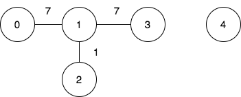
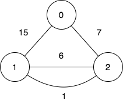
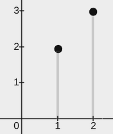

## Problem statement:

You are given a 2D integer array points, where `points[i] = [xi, yi]`. You are also given an integer w. Your task is to cover all the given points with rectangles.

Each rectangle has its lower end at some point `(x1, 0)` and its upper end at some point `(x2, y2)`, where `x1 <= x2`, `y2 >= 0`, and the condition `x2 - x1 <= w` must be satisfied for each rectangle.

A point is considered covered by a rectangle if it lies within or on the boundary of the rectangle.

Return an integer denoting the minimum number of rectangles needed so that each point is covered by at least one rectangle.

Note: A point may be covered by more than one rectangle.

**Example 1:**


Input: points = [[2,1],[1,0],[1,4],[1,8],[3,5],[4,6]], w = 1
Output: 2

Explanation:
The image above shows one possible placement of rectangles to cover the points:

`A rectangle with a lower end at (1, 0) and its upper end at (2, 8)`
`A rectangle with a lower end at (3, 0) and its upper end at (4, 8)`

**Example 2:**


Input: points = [[0,0],[1,1],[2,2],[3,3],[4,4],[5,5],[6,6]], w = 2
Output: 3

Explanation:
The image above shows one possible placement of rectangles to cover the points:

`A rectangle with a lower end at (0, 0) and its upper end at (2, 2)`
`A rectangle with a lower end at (3, 0) and its upper end at (5, 5)`
`A rectangle with a lower end at (6, 0) and its upper end at (6, 6)`

**Example 3:**


Input: points = [[2,3],[1,2]], w = 0
Output: 2

Explanation:
The image above shows one possible placement of rectangles to cover the points:

`A rectangle with a lower end at (1, 0) and its upper end at (1, 2)`
`A rectangle with a lower end at (2, 0) and its upper end at (2, 3)`

**Constraints:**

        -`1 <= points.length <= 105`
        -`points[i].length == 2`
        -`0 <= xi == points[i][0] <= 109`
        -`0 <= yi == points[i][1] <= 109`
        -`0 <= w <= 109`
        -`All pairs (xi, yi) are distinct.`

## Solutions:

### Binary search Approch:

**Intuition**
Consider only the x-coordinates. Sorting them, then use binary search to find the index which is the beginning for the next cover

**Approach** 1. Set array x 2. Sort x 3. Use while loop to proceed the binary searching (C++ upper_bound) for the beginning index for the next cover

```cpp
    class Solution {
    public:
    int minRectanglesToCoverPoints(vector<vector<int>>& points, int w) {
        int n=points.size();
        vector<int> x(n,-1);
        for(int i=0; i<n; i++) x[i]=points[i][0];
        sort(x.begin(), x.end());
        int ans=0, k=0;
        while(k<n){
            k=upper_bound(x.begin()+k, x.end(), x[k]+w)-x.begin();
            ans++;
        }
        return ans;
    }
};
```

## Complexity

**Time complexity:** $O(nlog⁡n)$

**Space complexity:** $O(n)$

## Greedy Approch:

**Intuition**

- Simple Greedy Approach.
- Height has no constraints, so just worry about the distance constraint in the x-axis.

## Similar to Line Sweep Approach.

**Approach** - initialize an ORDERED Map to store the x-values in order - Then Simply iterate through the map, as soon as the distance between the previous and the current x-value - goes beyond the given constraint, the count of rectangle increases.

## code:

```cpp
class Solution {
public:
    int minRectanglesToCoverPoints(vector<vector<int>>& points, int w) {


        map<int,int> mp;

        for(auto point : points) {
            mp[point[0]]++;
        }

        auto it = mp.begin();
        int prev = it->first;

        int count = 0;

        for(auto it : mp) {
            if(it.first - prev > w) {
                count++;
                prev = it.first;
            }
        }

        return count+1;


    }
};
```

**Complexity**

Time complexity: $O(nlogn)$
