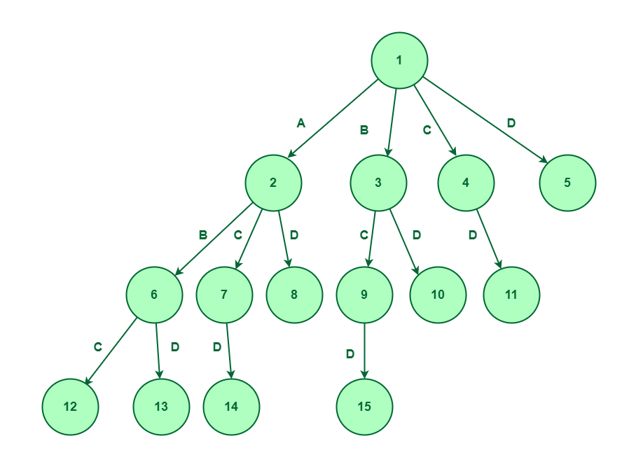
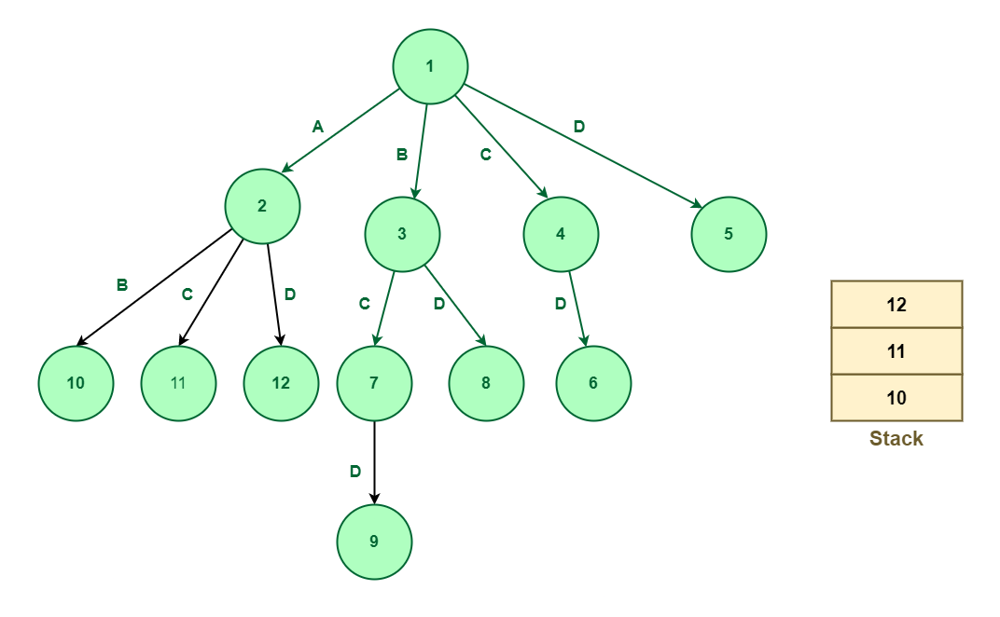
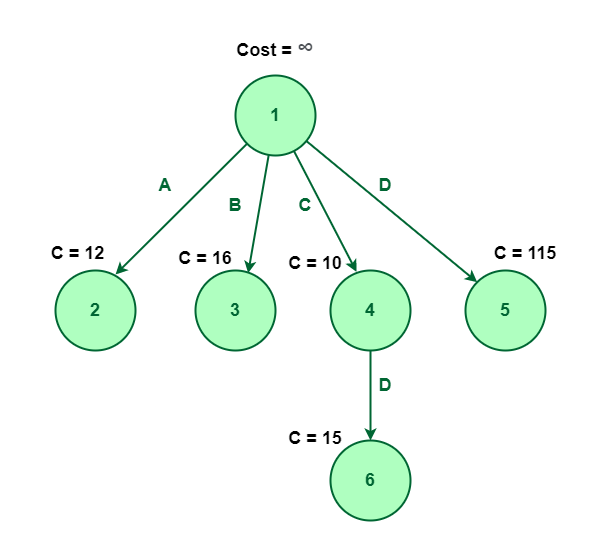

## Branch and Bound

The Branch and Bound Algorithm is a method used in combinatorial optimization problems to systematically search for the best solution. It works by dividing the problem into smaller subproblems, or branches, and then eliminating certain branches based on bounds on the optimal solution. This process continues until the best solution is found or all branches have been explored. 

## How it works:

Branch and bound is an algorithmic technique used in computer science to solve optimization problems. Branch and bound is a systematic way of exploring all possible solutions to a problem by dividing the problem space into smaller sub-problems and then applying bounds or constraints to eliminate certain subproblems from consideration.

## Characteristics of Branch and Bound:

- Optimal solution: The algorithm is designed to find the optimal solution to an optimization problem by searching the solution space in a systematic way.
- Upper and lower bounds: The algorithm uses upper and lower bounds to reduce the size of the search space and eliminate subproblems that cannot contain the optimal solution.
- Pruning: The algorithm prunes the search tree by eliminating subproblems that cannot contain the optimal solution or are not worth exploring further.
- Backtracking: The algorithm uses backtracking to return to a previous node in the search tree when a dead end is reached or when a better solution is found.

## Different search techniques in branch and bound:

The Branch  algorithms incorporate different search techniques to traverse a state space tree. Different search techniques used in B&B are listed below:

- LC search
- BFS
- DFS

1. LC search (Least Cost Search):
It uses a heuristic cost function to compute the bound values at each node. Nodes are added to the list of live nodes as soon as they get generated.
The node with the least value of a cost function selected as a next E-node.

2. BFS(Breadth First Search):
It is also known as a FIFO search.
It maintains the list of live nodes in first-in-first-out order i.e, in a queue, The live nodes are searched in the FIFO order to make them next E-nodes.

3. DFS (Depth First Search):
It is also known as a LIFO search.
It maintains the list of live nodes in last-in-first-out order i.e. in a stack.
The live nodes are searched in the LIFO order to make them next E-nodes.

## When to apply Branch and Bound Algorithm?

Branch and bound is an effective solution to some problems, which we have already discussed. We’ll discuss all such cases where branching and binding are appropriate in this section.

It is appropriate to use a branch and bound approach if the given problem is discrete optimization. Discrete optimization refers to problems in which the variables belong to the discrete set. Examples of such problems include 0-1 Integer Programming and Network Flow problems.

When it comes to combinatory optimization problems, branch and bound work well. An optimization problem is optimized by combinatory optimization by finding its maximum or minimum based on its objective function. The combinatory optimization problems include Boolean Satisfiability and Integer Linear Programming.

## Types of Branch and Bound Solutions:

The solution of the Branch and the bound problem can be represented in two ways:

Variable size solution: Using this solution, we can find the subset of the given set that gives the optimized solution to the given problem. For example, if we have to select a combination of elements from A, B, C, D that optimizes the given problem, and it is found that A and B together give the best solution, then the solution will be A, B.

Fixed-size solution: There are 0s and 1s in this solution, with the digit at the ith position indicating whether the ith element should be included, for the above example, the solution will be given by 1, 1, 0, 0, here 1 represent that we have select the element which at ith position and 0 represent we don’t select the element at ith position.

## Classification of Branch and Bound Problems:
The Branch and Bound method can be classified into three types based on the order in which the state space tree is searched. 

FIFO Branch and Bound
LIFO Branch and Bound
Least Cost-Branch and Bound

1. FIFO Branch and Bound
First-In-First-Out is an approach to the branch and bound problem that uses the queue approach to create a state-space tree. In this case, the breadth-first search is performed, that is, the elements at a certain level are all searched, and then the elements at the next level are searched, starting with the first child of the first node at the previous level.

For a given set A, B, C, D, the state space tree will be constructed as follows :

2. LIFO Branch and Bound
The Last-In-First-Out approach for this problem uses stack in creating the state space tree. When nodes are added to a state space tree, they are added to a stack. After all nodes of a level have been added, we pop the topmost element from the stack and explore it.

For a given set A, B, C, D, the state space tree will be constructed as follows :

3. Least Cost-Branch and Bound
To explore the state space tree, this method uses the cost function. The previous two methods also calculate the cost function at each node but the cost is not been used for further exploration.

## Applications of Branch and Bound:

- Traveling salesman problem: Branch and bound is used to solve the traveling salesman problem, which involves finding the shortest possible path that visits a set of cities and returns from where it started to visit the set of cities.
- Knapsack problem: Branch and bound is used to solve the knapsack problem, which involves finding the optimized combination of items to pack into a knapsack of limited capacity.
- Resource allocation: Branch and bound is used to solve resource allocation problems, like scheduling work on machines or assigning work to workers.
- Network optimization: Branch and bound is used to solve network optimization problems, it helps in finding the optimized path or flow through a network.
- Game playing: Branch and bound is used in some of the game-playing algorithms, like chess or tic-tac or 16 puzzle problem, to explore the various possible moves and find the optimized strategies.

## Advantages of Branch and Bound:

- Optimal solution: Branch and bound algorithm is created to find the best answer to an optimization issue by methodically searching the solution space.
- Reduces search space: The algorithm uses lower and upper bounds to cut down on the size of the search area and get rid of sub-problems that can not have the best answer.
- Proven performance: The branch and bound approach has been used extensively in numerous applications and has been shown to be successful in locating the best solutions to challenging optimization problems.
- Incremental improvement: The algorithm starts with an initial lower bound and iterations improve it until an optimized solution is found.

## Disadvantages of Branch and Bound:

- Exponential time complexity: The branch and bound algorithm’s worst-case time complexity is exponential in the size of the input, making it unsuitable for handling complex optimization issues.
- Memory-intensive: To store the search tree and the current best answer, the method needs a lot of memory. When dealing with numerous instances of the issue, this may become a problem.
- Sensitivity to problem-specific parameters: The quality of the problem-specific constraints utilized determines how well the method performs, and sometimes it might be challenging to discover good bounds.
- Limited scalability: Due to the size of the search tree which expands exponentially with the size of the problem, the Branch and Bound technique may not scale effectively for problems with huge search spaces.