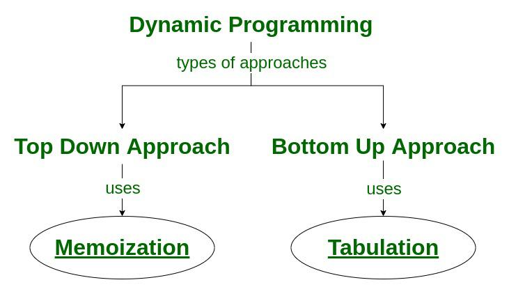
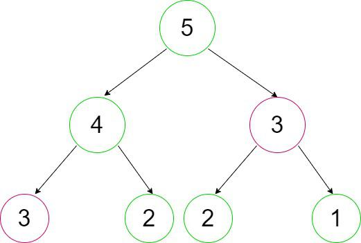

# Dynamic Programming in DSA

Dynamic Programming is mainly an optimization over plain recursion. Wherever we see a recursive solution that has repeated calls for the same inputs, we can optimize it using Dynamic Programming. The idea is to simply store the results of subproblems so that we do not have to re-compute them when needed later. This simple optimization reduces time complexities from exponential to polynomial.

## Characteristics of Dynamic Programming Algorithm:

1.  In general, dynamic programming (DP) is one of the most powerful techniques for solving a certain class of problems.

2.  There is an elegant way to formulate the approach and a very simple thinking process, and the coding part is very easy.

3.  Essentially, it is a simple idea, after solving a problem with a given input, save the result as a reference for future use, so you won’t have to re-solve it.. briefly ‘Remember your Past’.

4.  It is a big hint for DP if the given problem can be broken up into smaller sub-problems, and these smaller subproblems can be divided into still smaller ones, and in this process, you see some overlapping subproblems.

5.  Additionally, the optimal solutions to the subproblems contribute to the optimal solution of the given problem (referred to as the Optimal Substructure Property).

6.  The solutions to the subproblems are stored in a table or array (memoization) or in a bottom-up manner (tabulation) to avoid redundant computation.

7.  The solution to the problem can be constructed from the solutions to the subproblems.

8.  Dynamic programming can be implemented using a recursive algorithm, where the solutions to subproblems are found recursively, or using an iterative algorithm, where the solutions are found by working through the subproblems in a specific order.

## Dynamic programming works on following principles:

1.  Characterize structure of optimal solution, i.e. build a mathematical model of the solution.
2.  Recursively define the value of the optimal solution.
3.  Using bottom-up approach, compute the value of the optimal solution for each possible subproblems.
4.  Construct optimal solution for the original problem using information computed in the previous step.

## Applications:

Dynamic programming is used to solve optimization problems. It is used to solve many real-life problems such as,

(i) Make a change problem

(ii) Knapsack problem

(iii) Optimal binary search tree

## What is the difference between a Dynamic programming algorithm and recursion?

1. In dynamic programming, problems are solved by breaking them down into smaller ones to solve the larger ones, while recursion is when a function is called and executed by itself. While dynamic programming can function without making use of recursion techniques, since the purpose of dynamic programming is to optimize and accelerate the process, programmers usually make use of recursion techniques to accelerate and turn the process efficiently.

2. When a function can execute a specific task by calling itself, receive the name of the recursive function. In order to perform and accomplish the work, this function calls itself when it has to be executed.

3. Using dynamic programming, you can break a problem into smaller parts, called subproblems, to solve it. Dynamic programming involves solving the problem for the first time, then using memoization to store the solutions.

4. Therefore, the main difference between the two techniques is their intended use; recursion is used to automate a function, whereas dynamic programming is an optimization technique used to solve problems.

5. Recursive functions recognize when they are needed, execute themselves, then stop working. When the function identifies the moment it is needed, it calls itself and is executed; this is called a recursive case. As a result, the function must stop once the task is completed, known as the base case.

6. By establishing states, dynamic programming recognizes the problem and divides it into sub-problems in order to solve the whole scene. After solving these sub-problems, or variables, the programmer must establish a mathematical relationship between them. Last but not least, these solutions and results are stored as algorithms, so they can be accessed in the future without having to solve the whole problem again.

## Techniques to solve Dynamic Programming Problems:

1.  Top-Down(Memoization):
    Break down the given problem in order to begin solving it. If you see that the problem has already been solved, return the saved answer. If it hasn’t been solved, solve it and save it. This is usually easy to think of and very intuitive, This is referred to as Memoization.

2.  Bottom-Up(Tabulation):
    Analyze the problem and see in what order the subproblems are solved, and work your way up from the trivial subproblem to the given problem. This process ensures that the subproblems are solved before the main problem. This is referred to as Dynamic Programming.

        

## Tabulation vs Memoization:

There are two different ways to store the values so that the values of a sub-problem can be reused. Here, will discuss two patterns of solving dynamic programming (DP) problems:

1. Tabulation: Bottom Up
2. Memoization: Top Down

Before getting to the definitions of the above two terms consider the following statements:

(i) Version 1: I will study the theory of DP from GeeksforGeeks, then I will practice some problems on classic DP and hence I will master DP.

(ii) Version 2: To Master DP, I would have to practice Dynamic problems and practice problems – Firstly, I would have to study some theories of DP from GeeksforGeeks

Both versions say the same thing, the difference simply lies in the way of conveying the message and that’s exactly what Bottom-Up and Top-Down DP do. Version 1 can be related to Bottom-Up DP and Version-2 can be related to Top-Down DP.

|                        | Tabulation                                                                                                                                                        | Memoization                                                                                                                                                                   | Memoization                                                                                                                                                                   |
| ---------------------- | ----------------------------------------------------------------------------------------------------------------------------------------------------------------- | ----------------------------------------------------------------------------------------------------------------------------------------------------------------------------- | ----------------------------------------------------------------------------------------------------------------------------------------------------------------------------- |
| **State**              | State transition relation is difficult to think                                                                                                                   | State transition relation is easy to think                                                                                                                                    | State transition relation is easy to think                                                                                                                                    |
| **Code**               | Code gets complicated when a lot of conditions are required                                                                                                       | Code is easy and less complicated                                                                                                                                             | Code is easy and less complicated                                                                                                                                             |
| **Speed**              | Fast, as we directly access previous states from the table                                                                                                        | Slow due to a lot of recursive calls and return statements                                                                                                                    | Slow due to a lot of recursive calls and return statements                                                                                                                    |
| **Subproblem solving** | If all subproblems must be solved at least once, a bottom-up dynamic programming algorithm usually outperforms a top-down memoized algorithm by a constant factor | If some subproblems in the subproblem space need not be solved at all, the memoized solution has the advantage of solving only those subproblems that are definitely required | If some subproblems in the subproblem space need not be solved at all, the memoized solution has the advantage of solving only those subproblems that are definitely required |
| **Table entries**      | In the Tabulated version, starting from the first entry, all entries are filled one by one                                                                        | Unlike the Tabulated version, all entries of the lookup table are not necessarily filled in Memoized version. The table is filled on demand.                                  | Unlike the Tabulated version, all entries of the lookup table are not necessarily filled in Memoized version. The table is filled on demand.                                  |
| **Approach**           | Generally, tabulation (dynamic programming) is an iterative approach                                                                                              | On the other hand, memoization is a recursive approach.                                                                                                                       | On the other hand, memoization is a recursive approach.                                                                                                                       |

## How to solve a Dynamic Programming Problem?

To dynamically solve a problem, we need to check two necessary conditions:

1. Overlapping Subproblems: When the solutions to the same subproblems are needed repetitively for solving the actual problem. The problem is said to have overlapping subproblems property.

2. Optimal Substructure Property: If the optimal solution of the given problem can be obtained by using optimal solutions of its subproblems then the problem is said to have Optimal Substructure Property.

### Steps to solve a Dynamic programming problem:

1. Identify if it is a Dynamic programming problem.
2. Decide a state expression with the Least parameters.
3. Formulate state and transition relationships.
4. Do tabulation (or memorization).

#### 1. How to classify a problem as a Dynamic Programming algorithm Problem?

Typically, all the problems that require maximizing or minimizing certain quantities or counting problems that say to count the arrangements under certain conditions or certain probability problems can be solved by using Dynamic Programming.
All dynamic programming problems satisfy the overlapping subproblems property and most of the classic Dynamic programming problems also satisfy the optimal substructure property. Once we observe these properties in a given problem be sure that it can be solved using Dynamic Programming.

#### 2. Deciding the state:

Problems with dynamic programming are mostly concerned with the state and its transition. The most fundamental phase must be carried out with extreme care because the state transition depends on the state definition you select.

State:

A state is a collection of characteristics that can be used to specifically describe a given position or standing in a given challenge. To minimise state space, this set of parameters has to be as compact as feasible.

#### 3 Formulating a relation among the states:

The hardest part of a Dynamic Programming challenge is this step, which calls for a lot of intuition, observation, and training.

Example:

Given 3 numbers {1, 3, 5}, the task is to tell the total number of ways we can form a number N using the sum of the given three numbers. (allowing repetitions and different arrangements).

The total number of ways to form 6 is: 8

```
1+1+1+1+1+1
1+1+1+3
1+1+3+1
1+3+1+1
3+1+1+1
3+3
1+5
5+1
```

### Following are the steps to solve the problem:

1.  We choose a state for the given problem.
2.  N will be used as the determining factor for the state because it can be used to identify any subproblem.
3.  The DP state will resemble state(N), where the state(N) is the total number of arrangements required to create N using the elements 1, 3, and 5. Identify the relationship of the transition between any two states.
4.  We must now calculate the state (N).

#### 3.1 How to Compute the state?

As we can only use 1, 3, or 5 to form a given number N. Let us assume that we know the result for N = 1, 2, 3, 4, 5, 6

Let us say we know the result for:
state (n = 1), state (n = 2), state (n = 3) ……… state (n = 6)
Now, we wish to know the result of the state (n = 7). See, we can only add 1, 3, and 5. Now we can get a sum total of 7 in the following 3 ways:

1. Adding 1 to all possible combinations of state (n = 6)
   Eg: [ (1+1+1+1+1+1) + 1]

```
[ (1+1+1+3) + 1]
[ (1+1+3+1) + 1]
[ (1+3+1+1) + 1]
[ (3+1+1+1) + 1]
[ (3+3) + 1]
[ (1+5) + 1]
[ (5+1) + 1]
```

2. Adding 3 to all possible combinations of state (n = 4);

```
[(1+1+1+1) + 3]
[(1+3) + 3]
[(3+1) + 3]
```

3. Adding 5 to all possible combinations of state(n = 2)

```
[ (1+1) + 5]
```

(Note how it sufficient to add only on the right-side – all the add-from-left-side cases are covered, either in the same state, or another, e.g. [ 1+(1+1+1+3)] is not needed in state (n=6) because it’s covered by state (n = 4) [(1+1+1+1) + 3])

Now, think carefully and satisfy yourself that the above three cases are covering all possible ways to form a sum total of 7;
Therefore, we can say that result for

```
state(7) = state (6) + state (4) + state (2)
OR
state(7) = state (7-1) + state (7-3) + state (7-5)
In general,
state(n) = state(n-1) + state(n-3) + state(n-5)
```

Below is the implementation for the above approach:

<Tabs>
    <TabItem value="js" label="JavaScript" default>
      <SolutionAuthor name="@Ajay-Dhangar"/>
      ```js
      function solve(n) {
        // base case
        if (n < 0) {
          return 0;
        }
        if (n === 0) {
          return 1;
        }
        return solve(n - 1) + solve(n - 3) + solve(n - 5);
      }
      ```
    </TabItem>
    <TabItem value="java" label="Java">
      <SolutionAuthor name="@Ajay-Dhangar"/>
      ```java
      public class RecursionExample {
          public static int solve(int n) {
              // base case
              if (n < 0) {
                  return 0;
              }
              if (n == 0) {
                  return 1;
              }
              return solve(n - 1) + solve(n - 3) + solve(n - 5);
          }
      }
      ```
    </TabItem>
    <TabItem value="python" label="Python">
      <SolutionAuthor name="@Ajay-Dhangar"/>
      ```python
      def solve(n):
          # base case
          if n < 0:
              return 0
          if n == 0:
              return 1
          return solve(n - 1) + solve(n - 3) + solve(n - 5)
      ```
    </TabItem>
    <TabItem value="c" label="C">
      <SolutionAuthor name="@Ajay-Dhangar"/>
      ```c
      int solve(int n) {
          // base case
          if (n < 0) {
              return 0;
          }
          if (n == 0) {
              return 1;
          }
          return solve(n - 1) + solve(n - 3) + solve(n - 5);
      }
      ```
    </TabItem>
    <TabItem value="cpp" label="C++">
      <SolutionAuthor name="@Ajay-Dhangar"/>
      ```cpp
      int solve(int n) {
          // base case
          if (n < 0) {
              return 0;
          }
          if (n == 0) {
              return 1;
          }
          return solve(n - 1) + solve(n - 3) + solve(n - 5);
      }
      ```
    </TabItem>
    <TabItem value="ts" label="TypeScript">
      <SolutionAuthor name="@Ajay-Dhangar"/>
      ```ts
      function solve(n: number): number {
        // base case
        if (n < 0) {
          return 0;
        }
        if (n === 0) {
          return 1;
        }
        return solve(n - 1) + solve(n - 3) + solve(n - 5);
      }
      ```
    </TabItem>
</Tabs>

Time Complexity: O(3n), As at every stage we need to take three decisions and the height of the tree will be of the order of n.
Auxiliary Space: O(n), The extra space is used due to the recursion call stack.

The above code seems exponential as it is calculating the same state again and again. So, we just need to add memoization.

4. Adding memoization or tabulation for the state
   The simplest portion of a solution based on dynamic programming is this. Simply storing the state solution will allow us to access it from memory the next time that state is needed.

Adding memoization to the above code:

// Number of Arrangements with Memoization

// Number of Arrangements with Memoization

<Tabs>
    <TabItem value="js" label="JavaScript" default>
      <SolutionAuthor name="@Ajay-Dhangar"/>
      ```js
      const MAXN = 1000; // or any appropriate maximum value
      const dp = new Array(MAXN).fill(-1);

      function solve(n) {
        // base case
        if (n < 0) {
          return 0;
        }
        if (n === 0) {
          return 1;
        }

        // Checking if already calculated
        if (dp[n] !== -1) {
          return dp[n];
        }

        // Storing the result and returning
        return dp[n] = solve(n - 1) + solve(n - 3) + solve(n - 5);
      }
      ```
    </TabItem>
    <TabItem value="java" label="Java">
      <SolutionAuthor name="@Ajay-Dhangar"/>
      ```java
      public class RecursionExample {
          static final int MAXN = 1000; // or any appropriate maximum value
          static int[] dp = new int[MAXN];

          static {
              for (int i = 0; i < MAXN; i++) {
                  dp[i] = -1;
              }
          }

          public static int solve(int n) {
              // base case
              if (n < 0) {
                  return 0;
              }
              if (n == 0) {
                  return 1;
              }

              // Checking if already calculated
              if (dp[n] != -1) {
                  return dp[n];
              }

              // Storing the result and returning
              return dp[n] = solve(n - 1) + solve(n - 3) + solve(n - 5);
          }
      }
      ```
    </TabItem>
    <TabItem value="python" label="Python">
      <SolutionAuthor name="@Ajay-Dhangar"/>
      ```python
      MAXN = 1000  # or any appropriate maximum value
      dp = [-1] * MAXN

      def solve(n):
          # base case
          if n < 0:
              return 0
          if n == 0:
              return 1

          # Checking if already calculated
          if dp[n] != -1:
              return dp[n]

          # Storing the result and returning
          dp[n] = solve(n - 1) + solve(n - 3) + solve(n - 5)
          return dp[n]
      ```
    </TabItem>
    <TabItem value="c" label="C">
      <SolutionAuthor name="@Ajay-Dhangar"/>
      ```c
      #define MAXN 1000 // or any appropriate maximum value

      int dp[MAXN];

      // Initialize dp array
      void initialize_dp() {
          for (int i = 0; i < MAXN; i++) {
              dp[i] = -1;
          }
      }

      int solve(int n) {
          // base case
          if (n < 0) {
              return 0;
          }
          if (n == 0) {
              return 1;
          }

          // Checking if already calculated
          if (dp[n] != -1) {
              return dp[n];
          }

          // Storing the result and returning
          return dp[n] = solve(n - 1) + solve(n - 3) + solve(n - 5);
      }
      ```
    </TabItem>
    <TabItem value="cpp" label="C++">
      <SolutionAuthor name="@Ajay-Dhangar"/>
      ```cpp
      #define MAXN 1000 // or any appropriate maximum value

      int dp[MAXN];

      // Initialize dp array
      void initialize_dp() {
          for (int i = 0; i < MAXN; i++) {
              dp[i] = -1;
          }
      }

      int solve(int n) {
          // base case
          if (n < 0) {
              return 0;
          }
          if (n == 0) {
              return 1;
          }

          // Checking if already calculated
          if (dp[n] != -1) {
              return dp[n];
          }

          // Storing the result and returning
          return dp[n] = solve(n - 1) + solve(n - 3) + solve(n - 5);
      }
      ```
    </TabItem>
    <TabItem value="ts" label="TypeScript">
      <SolutionAuthor name="@Ajay-Dhangar"/>
      ```ts
      const MAXN = 1000; // or any appropriate maximum value
      const dp: number[] = new Array(MAXN).fill(-1);

      function solve(n: number): number {
        // base case
        if (n < 0) {
          return 0;
        }
        if (n === 0) {
          return 1;
        }

        // Checking if already calculated
        if (dp[n] !== -1) {
          return dp[n];
        }

        // Storing the result and returning
        return dp[n] = solve(n - 1) + solve(n - 3) + solve(n - 5);
      }
      ```
    </TabItem>

</Tabs>

Time Complexity: O(n), As we just need to make 3n function calls and there will be no repetitive calculations as we are returning previously calculated results.
Auxiliary Space: O(n), The extra space is used due to the recursion call stack.

### How to solve Dynamic Programming problems through Example?

Problem: Let’s find the Fibonacci sequence up to the nth term. A Fibonacci series is the sequence of numbers in which each number is the sum of the two preceding ones. For example, 0, 1, 1, 2, 3, and so on. Here, each number is the sum of the two preceding numbers.

Naive Approach: The basic way to find the nth Fibonacci number is to use recursion.

Below is the implementation for the above approach:

// Fibonacci Number

<Tabs>
    <TabItem value="cpp" label="C++" default>
      <SolutionAuthor name="@Ajay-Dhangar"/>
      ```cpp
      #include <iostream> 
      using namespace std;

      // Function to find nth fibonacci number
      int fib(int n)
      {
          if (n <= 1) {
              return n;
          }
          int x = fib(n - 1);
          int y = fib(n - 2);

          return x + y;
      }

      // Drivers code
      int main()
      {
          int n = 5;

          // Function Call
          cout << fib(n);
          return 0;
      }
      ```
    </TabItem>
    <TabItem value="java" label="Java">
      <SolutionAuthor name="@Ajay-Dhangar"/>
      ```java
      public class FibonacciExample {
          // Function to find nth fibonacci number
          public static int fib(int n) {
              if (n <= 1) {
                  return n;
              }
              int x = fib(n - 1);
              int y = fib(n - 2);
              return x + y;
          }

          // Drivers code
          public static void main(String[] args) {
              int n = 5;
              // Function Call
              System.out.println(fib(n));
          }
      }
      ```
    </TabItem>
    <TabItem value="python" label="Python">
      <SolutionAuthor name="@Ajay-Dhangar"/>
      ```python
      # Function to find nth fibonacci number
      def fib(n):
          if n <= 1:
              return n
          x = fib(n - 1)
          y = fib(n - 2)
          return x + y

      # Drivers code
      if __name__ == "__main__":
          n = 5
          # Function Call
          print(fib(n))
      ```
    </TabItem>
    <TabItem value="c" label="C">
      <SolutionAuthor name="@Ajay-Dhangar"/>
      ```c
      #include <stdio.h>

      // Function to find nth fibonacci number
      int fib(int n)
      {
          if (n <= 1) {
              return n;
          }
          int x = fib(n - 1);
          int y = fib(n - 2);

          return x + y;
      }

      // Drivers code
      int main()
      {
          int n = 5;

          // Function Call
          printf("%d\n", fib(n));
          return 0;
      }
      ```
    </TabItem>
    <TabItem value="js" label="JavaScript">
      <SolutionAuthor name="@Ajay-Dhangar"/>
      ```js
      // Function to find nth fibonacci number
      function fib(n) {
          if (n <= 1) {
              return n;
          }
          let x = fib(n - 1);
          let y = fib(n - 2);
          return x + y;
      }

      // Drivers code
      let n = 5;
      // Function Call
      console.log(fib(n));
      ```
    </TabItem>
    <TabItem value="ts" label="TypeScript">
      <SolutionAuthor name="@Ajay-Dhangar"/>
      ```ts
      // Function to find nth fibonacci number
      function fib(n: number): number {
          if (n <= 1) {
              return n;
          }
          let x = fib(n - 1);
          let y = fib(n - 2);
          return x + y;
      }

      // Drivers code
      let n: number = 5;
      // Function Call
      console.log(fib(n));
      ```
    </TabItem>

</Tabs>

Complexity Analysis:

Time Complexity: O(2n)

1.  Here, for every n, we are required to make a recursive call to fib(n – 1) and fib(n – 2). For fib(n – 1), we will again make the recursive call to fib(n – 2) and fib(n – 3). Similarly, for fib(n – 2), recursive calls are made on fib(n – 3) and fib(n – 4) until we reach the base case.

2.  During each recursive call, we perform constant work(k) (adding previous outputs to obtain the current output). We perform 2nK work at every level (where n = 0, 1, 2, …). Since n is the number of calls needed to reach 1, we are performing 2n-1k at the final level. Total work can be calculated as:

3.  If we draw the recursion tree of the Fibonacci recursion then we found the maximum height of the tree will be n and hence the space complexity of the Fibonacci recursion will be O(n).

4.  Efficient approach: As it is a very terrible complexity(Exponential), thus we need to optimize it with an efficient method. (Memoization)

Let’s look at the example below for finding the 5th Fibonacci number.



### Observations:

```
1.  The entire program repeats recursive calls. As in the above figure, for calculating fib(4), we need the value of fib(3) (first recursive call over fib(3)), and for calculating fib(5), we again need the value of fib(3)(second similar recursive call over fib(3)).

2.  Both of these recursive calls are shown above in the outlining circle.

3.  Similarly, there are many others for which we are repeating the recursive calls.

4.  Recursion generally involves repeated recursive calls, which increases the program’s time complexity.

5.  By storing the output of previously encountered values (preferably in arrays, as these can be traversed and extracted most efficiently), we can overcome this problem. The next time we make a recursive call over these values, we will use their already stored outputs instead of calculating them all over again.

6.  In this way, we can improve the performance of our code. Memoization is the process of storing each recursive call’s output for later use, preventing the code from calculating it again.

7.  Way to memoize: To achieve this in our example we will simply take an answer array initialized to -1. As we make a recursive call, we will first check if the value stored in the answer array corresponding to that position is -1. The value -1 indicates that we haven’t calculated it yet and have to recursively compute it. The output must be stored in the answer array so that, next time, if the same value is encountered, it can be directly used from the answer array.

Now in this process of memoization, considering the above Fibonacci numbers example, it can be observed that the total number of unique calls will be at most (n + 1) only.

```

Below is the implementation for the above approach:

## Fibonacci Number with Memoization

<Tabs>
    <TabItem value="cpp" label="C++" default>
      <SolutionAuthor name="@Ajay-Dhangar"/>
      ```cpp
      #include <iostream>
      using namespace std;

      // Helper Function
      int fibo_helper(int n, int* ans)
      {
          // Base case
          if (n <= 1) {
              return n;
          }

          // To check if output already exists
          if (ans[n] != -1) {
              return ans[n];
          }

          // Calculate output
          int x = fibo_helper(n - 1, ans);
          int y = fibo_helper(n - 2, ans);

          // Saving the output for future use
          ans[n] = x + y;

          // Returning the final output
          return ans[n];
      }

      int fibo(int n)
      {
          int* ans = new int[n + 1];

          // Initializing with -1
          for (int i = 0; i <= n; i++) {
              ans[i] = -1;
          }

          // Calling helper function
          return fibo_helper(n, ans);
      }

      // Drivers code
      int main()
      {
          int n = 5;

          // Function Call
          cout << fibo(n) << endl;
          return 0;
      }
      ```
    </TabItem>
    <TabItem value="java" label="Java">
      <SolutionAuthor name="@Ajay-Dhangar"/>
      ```java
      public class FibonacciMemoization {
          // Helper Function
          static int fibo_helper(int n, int[] ans) {
              // Base case
              if (n <= 1) {
                  return n;
              }

              // To check if output already exists
              if (ans[n] != -1) {
                  return ans[n];
              }

              // Calculate output
              int x = fibo_helper(n - 1, ans);
              int y = fibo_helper(n - 2, ans);

              // Saving the output for future use
              ans[n] = x + y;

              // Returning the final output
              return ans[n];
          }

          // Function to find nth fibonacci number with memoization
          static int fibo(int n) {
              int[] ans = new int[n + 1];

              // Initializing with -1
              for (int i = 0; i <= n; i++) {
                  ans[i] = -1;
              }

              // Calling helper function
              return fibo_helper(n, ans);
          }

          // Drivers code
          public static void main(String[] args) {
              int n = 5;

              // Function Call
              System.out.println(fibo(n));
          }
      }
      ```
    </TabItem>
    <TabItem value="python" label="Python">
      <SolutionAuthor name="@Ajay-Dhangar"/>
      ```python
      # Function to find nth fibonacci number with memoization
      def fibo(n):
          # Helper Function
          def fibo_helper(n, ans):
              # Base case
              if n <= 1:
                  return n

              # To check if output already exists
              if ans[n] != -1:
                  return ans[n]

              # Calculate output
              x = fibo_helper(n - 1, ans)
              y = fibo_helper(n - 2, ans)

              # Saving the output for future use
              ans[n] = x + y

              # Returning the final output
              return ans[n]

          # Initialize ans array with -1
          ans = [-1] * (n + 1)

          # Calling helper function
          return fibo_helper(n, ans)

      # Drivers code
      if __name__ == "__main__":
          n = 5

          # Function Call
          print(fibo(n))
      ```
    </TabItem>
    <TabItem value="c" label="C">
      <SolutionAuthor name="@Ajay-Dhangar"/>
      ```c
      #include <stdio.h>
      #include <stdlib.h>

      // Helper Function
      int fibo_helper(int n, int* ans)
      {
          // Base case
          if (n <= 1) {
              return n;
          }

          // To check if output already exists
          if (ans[n] != -1) {
              return ans[n];
          }

          // Calculate output
          int x = fibo_helper(n - 1, ans);
          int y = fibo_helper(n - 2, ans);

          // Saving the output for future use
          ans[n] = x + y;

          // Returning the final output
          return ans[n];
      }

      // Function to find nth fibonacci number with memoization
      int fibo(int n)
      {
          int* ans = (int*)malloc((n + 1) * sizeof(int));

          // Initializing with -1
          for (int i = 0; i <= n; i++) {
              ans[i] = -1;
          }

          // Calling helper function
          int result = fibo_helper(n, ans);

          // Free memory allocated to ans
          free(ans);

          return result;
      }

      // Drivers code
      int main()
      {
          int n = 5;

          // Function Call
          printf("%d\n", fibo(n));
          return 0;
      }
      ```
    </TabItem>
    <TabItem value="js" label="JavaScript">
      <SolutionAuthor name="@Ajay-Dhangar"/>
      ```js
      // Function to find nth fibonacci number with memoization
      function fibo(n) {
          // Helper Function
          function fibo_helper(n, ans) {
              // Base case
              if (n <= 1) {
                  return n;
              }

              // To check if output already exists
              if (ans[n] !== -1) {
                  return ans[n];
              }

              // Calculate output
              let x = fibo_helper(n - 1, ans);
              let y = fibo_helper(n - 2, ans);

              // Saving the output for future use
              ans[n] = x + y;

              // Returning the final output
              return ans[n];
          }

          // Initialize ans array with -1
          let ans = new Array(n + 1).fill(-1);

          // Calling helper function
          return fibo_helper(n, ans);
      }

      // Drivers code
      let n = 5;

      // Function Call
      console.log(fibo(n));
      ```
    </TabItem>
    <TabItem value="ts" label="TypeScript">
      <SolutionAuthor name="@Ajay-Dhangar"/>
      ```ts
      // Function to find nth fibonacci number with memoization
      function fibo(n: number): number {
          // Helper Function
          function fibo_helper(n: number, ans: number[]): number {
              // Base case
              if (n <= 1) {
                  return n;
              }

              // To check if output already exists
              if (ans[n] !== -1) {
                  return ans[n];
              }

              // Calculate output
              let x = fibo_helper(n - 1, ans);
              let y = fibo_helper(n - 2, ans);

              // Saving the output for future use
              ans[n] = x + y;

              // Returning the final output
              return ans[n];
          }

          // Initialize ans array with -1
          let ans: number[] = new Array(n + 1).fill(-1);

          // Calling helper function
          return fibo_helper(n, ans);
      }

      // Drivers code
      let n: number = 5;

      // Function Call
      console.log(fibo(n));
      ```
    </TabItem>

</Tabs>

Complexity analysis:

    Time complexity: O(n)
    Auxiliary Space: O(n)

## Optimized approach:

Following a bottom-up approach to reach the desired index. This approach of converting recursion into iteration is known as Dynamic programming(DP).

### Observation:

```
1. Finally, what we do is recursively call each response index field and calculate its value using previously saved outputs.

2. Recursive calls terminate via the base case, which means we are already aware of the answers which should be stored in the base case indexes.

3. In the case of Fibonacci numbers, these indices are 0 and 1 as f(ib0) = 0 and f(ib1) = 1. So we can directly assign these two values ​​into our answer array and then use them to calculate f(ib2), which is f(ib1) + f(ib0), and so on for each subsequent index.

4. This can easily be done iteratively by running a loop from i = (2 to n). Finally, we get our answer at the 5th index of the array because we already know that the ith index contains the answer to the ith value.

5. Simply, we first try to find out the dependence of the current value on previous values ​​and then use them to calculate our new value. Now, we are looking for those values which do not depend on other values, which means they are independent(base case values, since these, are the smallest problems
which we are already aware of).
```

// Fibonacci Number (Bottom-up Dynamic Programming)

<Tabs>
    <TabItem value="cpp" label="C++" default>
      <SolutionAuthor name="@Ajay-Dhangar"/>
      ```cpp
      #include <iostream>
      using namespace std;

      // Function for calculating the nth Fibonacci number
      int fibo(int n)
      {
          int* ans = new int[n + 1];

          // Storing the independent values in the answer array
          ans[0] = 0;
          ans[1] = 1;

          // Using the bottom-up approach
          for (int i = 2; i <= n; i++) {
              ans[i] = ans[i - 1] + ans[i - 2];
          }

          // Returning the final index
          return ans[n];
      }

      // Drivers code
      int main()
      {
          int n = 5;

          // Function Call
          cout << fibo(n) << endl;
          return 0;
      }
      ```
    </TabItem>
    <TabItem value="java" label="Java">
      <SolutionAuthor name="@Ajay-Dhangar"/>
      ```java
      public class FibonacciBottomUp {
          // Function for calculating the nth Fibonacci number
          static int fibo(int n) {
              int[] ans = new int[n + 1];

              // Storing the independent values in the answer array
              ans[0] = 0;
              ans[1] = 1;

              // Using the bottom-up approach
              for (int i = 2; i <= n; i++) {
                  ans[i] = ans[i - 1] + ans[i - 2];
              }

              // Returning the final index
              return ans[n];
          }

          // Drivers code
          public static void main(String[] args) {
              int n = 5;

              // Function Call
              System.out.println(fibo(n));
          }
      }
      ```
    </TabItem>
    <TabItem value="python" label="Python">
      <SolutionAuthor name="@Ajay-Dhangar"/>
      ```python
      # Function for calculating the nth Fibonacci number
      def fibo(n):
          ans = [0] * (n + 1)

          # Storing the independent values in the answer array
          ans[0] = 0
          ans[1] = 1

          # Using the bottom-up approach
          for i in range(2, n + 1):
              ans[i] = ans[i - 1] + ans[i - 2]

          # Returning the final index
          return ans[n]

      # Drivers code
      if __name__ == "__main__":
          n = 5

          # Function Call
          print(fibo(n))
      ```
    </TabItem>
    <TabItem value="c" label="C">
      <SolutionAuthor name="@Ajay-Dhangar"/>
      ```c
      #include <stdio.h>
      #include <stdlib.h>

      // Function for calculating the nth Fibonacci number
      int fibo(int n)
      {
          int* ans = (int*)malloc((n + 1) * sizeof(int));

          // Storing the independent values in the answer array
          ans[0] = 0;
          ans[1] = 1;

          // Using the bottom-up approach
          for (int i = 2; i <= n; i++) {
              ans[i] = ans[i - 1] + ans[i - 2];
          }

          // Returning the final index
          return ans[n];
      }

      // Drivers code
      int main()
      {
          int n = 5;

          // Function Call
          printf("%d\n", fibo(n));
          return 0;
      }
      ```
    </TabItem>
    <TabItem value="js" label="JavaScript">
      <SolutionAuthor name="@Ajay-Dhangar"/>
      ```js
      // Function for calculating the nth Fibonacci number
      function fibo(n) {
          let ans = new Array(n + 1);

          // Storing the independent values in the answer array
          ans[0] = 0;
          ans[1] = 1;

          // Using the bottom-up approach
          for (let i = 2; i <= n; i++) {
              ans[i] = ans[i - 1] + ans[i - 2];
          }

          // Returning the final index
          return ans[n];
      }

      // Drivers code
      let n = 5;

      // Function Call
      console.log(fibo(n));
      ```
    </TabItem>
    <TabItem value="ts" label="TypeScript">
      <SolutionAuthor name="@Ajay-Dhangar"/>
      ```ts
      // Function for calculating the nth Fibonacci number
      function fibo(n: number): number {
          let ans: number[] = new Array(n + 1);

          // Storing the independent values in the answer array
          ans[0] = 0;
          ans[1] = 1;

          // Using the bottom-up approach
          for (let i = 2; i <= n; i++) {
              ans[i] = ans[i - 1] + ans[i - 2];
          }

          // Returning the final index
          return ans[n];
      }

      // Drivers code
      let n: number = 5;

      // Function Call
      console.log(fibo(n));
      ```
    </TabItem>

</Tabs>

Complexity analysis:

    Time complexity: O(n)
    Auxiliary Space: O(n)

### Optimization of above method (Space Optimization Approch)

```
1. in above code we can see that the current state of any fibonacci number depend only on prev two number

2. so using this observation we can conclude that we did not need to store the whole table of size n but instead of that we can only store the prev two values

3. so this way we can optimize the space complexity in the above code O(n) to O(1)
```

// Fibonacci Number (Bottom-up Approach with Optimized Space)

<Tabs>
    <TabItem value="cpp" label="C++" default>
      <SolutionAuthor name="@Ajay-Dhangar"/>
      ```cpp
      #include <iostream>
      using namespace std;

      // Function for calculating the nth Fibonacci number
      int fibo(int n)
      {
          int prevPrev = 0, prev = 1, curr = 1;

          // Using the bottom-up approach
          for (int i = 2; i <= n; i++) {
              curr = prev + prevPrev;
              prevPrev = prev;
              prev = curr;
          }

          // Returning the final answer
          return curr;
      }

      // Drivers code
      int main()
      {
          int n = 5;

          // Function Call
          cout << fibo(n) << endl;
          return 0;
      }
      ```
    </TabItem>
    <TabItem value="java" label="Java">
      <SolutionAuthor name="@Ajay-Dhangar"/>
      ```java
      public class FibonacciBottomUpOptimized {
          // Function for calculating the nth Fibonacci number
          static int fibo(int n) {
              int prevPrev = 0, prev = 1, curr = 1;

              // Using the bottom-up approach
              for (int i = 2; i <= n; i++) {
                  curr = prev + prevPrev;
                  prevPrev = prev;
                  prev = curr;
              }

              // Returning the final answer
              return curr;
          }

          // Drivers code
          public static void main(String[] args) {
              int n = 5;

              // Function Call
              System.out.println(fibo(n));
          }
      }
      ```
    </TabItem>
    <TabItem value="python" label="Python">
      <SolutionAuthor name="@Ajay-Dhangar"/>
      ```python
      # Function for calculating the nth Fibonacci number
      def fibo(n):
          prevPrev, prev, curr = 0, 1, 1

          # Using the bottom-up approach
          for i in range(2, n + 1):
              curr = prev + prevPrev
              prevPrev = prev
              prev = curr

          # Returning the final answer
          return curr

      # Drivers code
      if __name__ == "__main__":
          n = 5

          # Function Call
          print(fibo(n))
      ```
    </TabItem>
    <TabItem value="c" label="C">
      <SolutionAuthor name="@Ajay-Dhangar"/>
      ```c
      #include <stdio.h>

      // Function for calculating the nth Fibonacci number
      int fibo(int n)
      {
          int prevPrev = 0, prev = 1, curr = 1;

          // Using the bottom-up approach
          for (int i = 2; i <= n; i++) {
              curr = prev + prevPrev;
              prevPrev = prev;
              prev = curr;
          }

          // Returning the final answer
          return curr;
      }

      // Drivers code
      int main()
      {
          int n = 5;

          // Function Call
          printf("%d\n", fibo(n));
          return 0;
      }
      ```
    </TabItem>
    <TabItem value="js" label="JavaScript">
      <SolutionAuthor name="@Ajay-Dhangar"/>
      ```js
      // Function for calculating the nth Fibonacci number
      function fibo(n) {
          let prevPrev = 0, prev = 1, curr = 1;

          // Using the bottom-up approach
          for (let i = 2; i <= n; i++) {
              curr = prev + prevPrev;
              prevPrev = prev;
              prev = curr;
          }

          // Returning the final answer
          return curr;
      }

      // Drivers code
      let n = 5;

      // Function Call
      console.log(fibo(n));
      ```
    </TabItem>
    <TabItem value="ts" label="TypeScript">
      <SolutionAuthor name="@Ajay-Dhangar"/>
      ```ts
      // Function for calculating the nth Fibonacci number
      function fibo(n: number): number {
          let prevPrev: number = 0, prev: number = 1, curr: number = 1;

          // Using the bottom-up approach
          for (let i: number = 2; i <= n; i++) {
              curr = prev + prevPrev;
              prevPrev = prev;
              prev = curr;
          }

          // Returning the final answer
          return curr;
      }

      // Drivers code
      let n: number = 5;

      // Function Call
      console.log(fibo(n));
      ```
    </TabItem>

</Tabs>

## Conclusion:

In conclusion, dynamic programming is a powerful problem-solving technique that is used for optimization problems. Dynamic programming is a superior form of recursion that overcomes its limitations. It involves breaking down a problem into smaller subproblems, solving each subproblem independently, and using the solutions to these subproblems to construct the overall solution. The key characteristics of a dynamic programming algorithm include overlapping subproblems, optimal substructure, memoization or tabulation, and the use of either iterative or recursive methods.

Dynamic programming has several advantages over other problem-solving techniques, including efficiency, simplicity, flexibility, optimality, clarity, and code reusability. It is not just recursion, although it can be implemented using a recursive algorithm. Dynamic programming is different from greedy algorithms in that it breaks down the problem into smaller subproblems, solves each subproblem independently, and uses the solutions to the subproblems to construct the overall solution.

The basics of dynamic programming include breaking down a problem into smaller subproblems, solving each subproblem independently, storing the solutions to subproblems to avoid redundant computation, using the solutions to the subproblems to construct the overall solution and using the principle of optimality to ensure that the solution is optimal. However, DP can occasionally be challenging to comprehend, making it a well-liked option for coding interviews. Understanding how DP functions work can be useful to everyone, whether they are a professional or a student getting ready for the placements.

Overall, dynamic programming is a valuable tool for solving complex optimization problems and can lead to more efficient and effective solutions.
