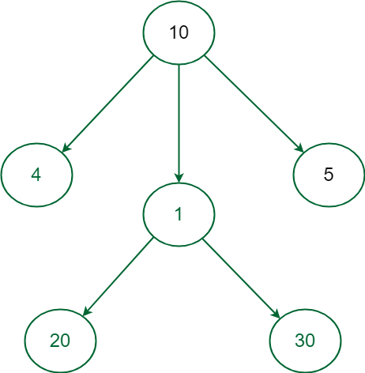
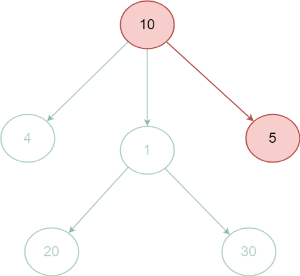
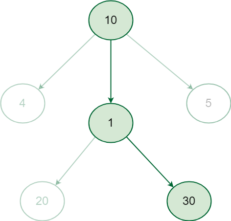

Greedy Algorithm is defined as a method for solving optimization problems by taking decisions that result in the most evident and immediate benefit irrespective of the final outcome. It works for cases where minimization or maximization leads to the required solution.

## What is Greedy Algorithm?

A greedy algorithm is a problem-solving technique that makes the best local choice at each step in the hope of finding the global optimum solution. It prioritizes immediate benefits over long-term consequences, making decisions based on the current situation without considering future implications. While this approach can be efficient and straightforward, it doesn’t guarantee the best overall outcome for all problems.

However, it’s important to note that not all problems are suitable for greedy algorithms. They work best when the problem exhibits the following properties:

1. Greedy Choice Property: The optimal solution can be constructed by making the best local choice at each step.
2. Optimal Substructure: The optimal solution to the problem contains the optimal solutions to its subproblems.

## Characteristics of Greedy Algorithm

Here are the characteristics of a greedy algorithm:

1. Greedy algorithms are simple and easy to implement.

2. They are efficient in terms of time complexity, often providing quick solutions.

3. Greedy algorithms are used for optimization problems where a locally optimal choice leads to a globally optimal solution.

4. These algorithms do not reconsider previous choices, as they make decisions based on current information without looking ahead.

5. Greedy algorithms are suitable for problems for optimal substructure.

These characteristics help to define the nature and usage of greedy algorithms in problem-solving.

## Examples of Greedy Algorithm

Several well-known algorithms fall under the category of greedy algorithms. Here are a few examples:

    1. Dijkstra’s Algorithm: This algorithm finds the shortest path between two nodes in a graph. It works by repeatedly choosing the shortest edge available from the current node.

    2. Kruskal’s Algorithm: This algorithm finds the minimum spanning tree of a graph. It works by repeatedly choosing the edge with the minimum weight that does not create a cycle.

    3. Fractional Knapsack Problem: This problem involves selecting items with the highest value-to-weight ratio to fill a knapsack with a limited capacity. The greedy algorithm selects items in decreasing order of their value-to-weight ratio until the knapsack is full.

    4. Scheduling and Resource Allocation: The greedy algorithm can be used to schedule jobs or allocate resources in an efficient manner.

    5. Coin Change Problem: The greedy algorithm can be used to make change for a given amount with the minimum number of coins, by always choosing the coin with the highest value that is less than the remaining amount to be changed.

    6. Huffman Coding: The greedy algorithm can be used to generate a prefix-free code for data compression, by constructing a binary tree in a way that the frequency of each character is taken into consideration.

## Why to use Greedy Approach?

Here are some reasons why you might use the Greedy Approach:

1. Simple and easy to understand: The Greedy Approach is straightforward and easy to implement, making it a good choice for beginners.

2. Fast and efficient: It usually finds a solution quickly, making it suitable for problems where time is a constraint.

3. Provides a good enough solution: While not always optimal, the Greedy Approach often finds a solution that is close to the best possible solution.

4. Can be used as a building block for other algorithms: The Greedy Approach can be used as a starting point for developing more complex algorithms.

5. Useful for a variety of problems: The Greedy Approach can be applied to a wide range of optimization problems, including knapsack problems, scheduling problems, and routing problems.

However, it’s important to remember that the Greedy Approach doesn’t always find the optimal solution. There are cases where it can lead to suboptimal solutions. Therefore, it is necessary to carefully consider the problem and the potential drawbacks before using the Greedy Approach.

## How does the Greedy Algorithm works?

Greedy Algorithm solve optimization problems by making the best local choice at each step in the hope of finding the global optimum. It’s like taking the best option available at each moment, hoping it will lead to the best overall outcome.

Here’s how it works:

1.  Start with the initial state of the problem. This is the starting point from where you begin making choices.

2.  Evaluate all possible choices you can make from the current state. Consider all the options available at that specific moment.

3.  Choose the option that seems best at that moment, regardless of future consequences. This is the “greedy” part – you take the best option available now, even if it might not be the best in the long run.

4.  Move to the new state based on your chosen option. This becomes your new starting point for the next iteration.

5.  Repeat steps 2-4 until you reach the goal state or no further progress is possible. Keep making the best local choices until you reach the end of the problem or get stuck..

Example:

Let’s say you have a set of coins with values {1, 2, 5, 10, 20, 50, 100} and you need to give minimum number of coin to someone change for 36.

```
The greedy algorithm for making change would work as follows:

   1. Start with the largest coin value that is less than or equal to the amount to be changed. In this case, the largest coin less than 36 is 20.

   2. Subtract the largest coin value from the amount to be changed, and add the coin to the solution. In this case, subtracting 20 from 36 gives 16, and we add a 20 coin to the solution.

   3. Repeat steps 1 and 2 until the amount to be changed becomes 0.

 So, using the greedy algorithm, the solution for making change for 36 would be one 20 coins, one 10 coin, one 5 coins and one 1 coin needed.
```

Note: This is just one example, and other greedy choices could have been made at each step. However, in this case, the greedy approach leads to the optimal solution.

The greedy algorithm is not always the optimal solution for every optimization problem, as shown in the example below.

```
1. One such example where the Greedy Approach fails is to find the Maximum weighted path of nodes in the given graph.


               


2. In the above graph starting from the root node 10 if we greedily select the next node to obtain the most weighted path the next selected node will be 5 that will take the total sum to 15 and the path will end as there is no child of 5 but the path 10 -> 5 is not the maximum weight path.

              

3. In order to find the most weighted path all possible path sum must be computed and their path sum must be compared to get the desired result, it is visible that the most weighted path in the above graph is 10 -> 1 -> 30 that gives the path sum 41.

              

In such cases Greedy approach wouldn’t work instead complete paths from root to leaf node has to be considered to get the correct answer i.e. the most weighted path, This can be achieved by recursively checking all the paths and calculating their weight.

```

| Criteria                | Greedy Algorithm                                                              | Dynamic Programming                                                      |
| ----------------------- | ----------------------------------------------------------------------------- | ------------------------------------------------------------------------ |
| Basic Idea              | Makes the locally optimal choice at each stage                                | Solves subproblems and builds up to the optimal solution                 |
| Optimal Solution        | Not always guaranteed to provide the globally optimal solution                | Guarantees the globally optimal solution                                 |
| Time Complexity         | Typically faster; often linear or polynomial time                             | Usually slower due to solving overlapping subproblems                    |
| Space Complexity        | Requires less memory; often constant or linear space                          | Requires more memory due to storing intermediate results                 |
| Subproblems Overlapping | Does not handle overlapping subproblems                                       | Handles overlapping subproblems efficiently                              |
| Examples                | Finding minimum spanning tree, Huffman coding                                 | Matrix chain multiplication, shortest path problems                      |
| Applications            | Used when a greedy choice at each step leads to the globally optimal solution | Applied when the problem can be broken down into overlapping subproblems |

## Applications of Greedy Algorithms:

1. Dijkstra’s shortest path algorithm: Finds the shortest path between two nodes in a graph.

2. Kruskal’s minimum spanning tree algorithm: Finds the minimum spanning tree for a weighted graph.

3. Huffman coding: Creates an optimal prefix code for a set of symbols based on their frequencies.

4. Fractional knapsack problem: Determines the most valuable items to carry in a knapsack with a limited weight capacity.

5. Activity selection problem: Chooses the maximum number of non-overlapping activities from a set of activities.

## Advantages of Greedy Algorithms:

        1. Simple and easy to understand: Greedy algorithms are often straightforward to implement and reason about.

        2. Efficient for certain problems: They can provide optimal solutions for specific problems, like finding the shortest path in a graph with non-negative edge weights.

        3. Fast execution time: Greedy algorithms generally have lower time complexity compared to other algorithms for certain problems.

        4. Intuitive and easy to explain: The decision-making process in a greedy algorithm is often easy to understand and justify.

        5. Can be used as building blocks for more complex algorithms: Greedy algorithms can be combined with other techniques to design more sophisticated algorithms for challenging problems.

## Disadvantages of the Greedy Approach:

        1. Not always optimal: Greedy algorithms prioritize local optima over global optima, leading to suboptimal solutions in some cases.

        2. Difficult to prove optimality: Proving the optimality of a greedy algorithm can be challenging, requiring careful analysis.

        3. Sensitive to input order: The order of input data can affect the solution generated by a greedy algorithm.

        4. Limited applicability: Greedy algorithms are not suitable for all problems and may not be applicable to problems with complex constraints.
