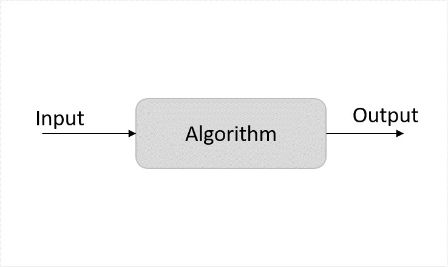
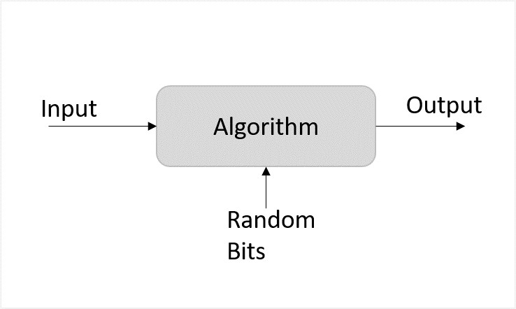
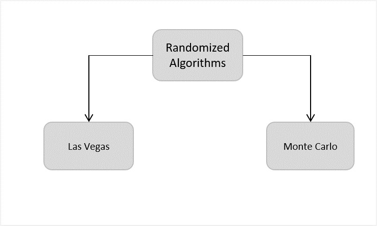

## Randomised Algorithm

Randomized algorithms in data structures and algorithms (DSA) are algorithms that use randomness in their computations to achieve a desired outcome. These algorithms introduce randomness to improve efficiency or simplify the algorithm design. By incorporating random choices into their processes, randomized algorithms can often provide faster solutions or better approximations compared to deterministic algorithms. 

They are particularly useful in situations where exact solutions are difficult to find or when a probabilistic approach is acceptable.

## Example

For example, in Randomized Quick Sort, we use a random number to pick the next pivot (or we randomly shuffle the array). Typically, this randomness is used to reduce time complexity or space complexity in other standard algorithms.

## Random variable

A random variable in statistics is a function that assigns a real value to an outcome in the sample space of a random experiment. For example: if you roll a die, you can assign a number to each possible outcome.

Random variables can have specific values or any value in a range.

There are two basic types of random variables,

- Discrete Random Variables
- Continuous Random Variables

## Understanding

Randomized algorithm is a different design approach taken by the standard algorithms where few random bits are added to a part of their logic. They are different from deterministic algorithms; deterministic algorithms follow a definite procedure to get the same output every time an input is passed where randomized algorithms produce a different output every time they’re executed. It is important to note that it is not the input that is randomized, but the logic of the standard algorithm


Deterministic Algorithm

Unlike deterministic algorithms, randomized algorithms consider randomized bits of the logic along with the input that in turn contribute towards obtaining the output.


 Randomized Algorithm

However, the probability of randomized algorithms providing incorrect output cannot be ruled out either. Hence, the process called amplification is performed to reduce the likelihood of these erroneous outputs. Amplification is also an algorithm that is applied to execute some parts of the randomized algorithms multiple times to increase the probability of correctness. However, too much amplification can also exceed the time constraints making the algorithm ineffective.

## Classification of Randomized Algorithms

Randomized algorithms are classified based on whether they have time constraints as the random variable or deterministic values. They are designed in their two common forms − Las Vegas and Monte Carlo.



```
- Las Vegas − The Las Vegas method of randomized algorithms never gives incorrect outputs, making the time constraint as the random variable. For example, in string matching algorithms, las vegas algorithms start from the beginning once they encounter an error. This increases the probability of correctness. Eg., Randomized Quick Sort Algorithm.

- Monte Carlo − The Monte Carlo method of randomized algorithms focuses on finishing the execution within the given time constraint. Therefore, the running time of this method is deterministic. For example, in string matching, if monte carlo encounters an error, it restarts the algorithm from the same point. Thus, saving time. Eg., Karger’s Minimum Cut Algorithm
```

## Need for Randomized Algorithms

This approach is usually adopted to reduce the time complexity and space complexity. But there might be some ambiguity about how adding randomness will decrease the runtime and memory stored, instead of increasing; we will understand that using the game theory.

## The Game Theory and Randomized Algorithms

The basic idea of game theory actually provides with few models that help understand how decision-makers in a game interact with each other. These game theoretical models use assumptions to figure out the decision-making structure of the players in a game. The popular assumptions made by these theoretical models are that the players are both rational and take into account what the opponent player would decide to do in a particular situation of a game. We will apply this theory on randomized algorithms.

## Zero-sum game

The zero-sum game is a mathematical representation of the game theory. It has two players where the result is a gain for one player while it is an equivalent loss to the other player. So, the net improvement is the sum of both players’ status which sums up to zero.

Randomized algorithms are based on the zero-sum game of designing an algorithm that gives lowest time complexity for all inputs. There are two players in the game; one designs the algorithm and the opponent provides with inputs for the algorithm. The player two needs to give the input in such a way that it will yield the worst time complexity for them to win the game. Whereas, the player one needs to design an algorithm that takes minimum time to execute any input given.

For example, consider the quick sort algorithm where the main algorithm starts from selecting the pivot element. But, if the player in zero-sum game chooses the sorted list as an input, the standard algorithm provides the worst case time complexity. Therefore, randomizing the pivot selection would execute the algorithm faster than the worst time complexity. However, even if the algorithm chose the first element as pivot randomly and obtains the worst time complexity, executing it another time with the same input will solve the problem since it chooses another pivot this time.

On the other hand, for algorithms like merge sort the time complexity does not depend on the input; even if the algorithm is randomized the time complexity will always remain the same. Hence, randomization is only applied on algorithms whose complexity depends on the input.

## Examples
Few popular examples of the Randomized algorithms are −

Randomized Quick Sort Algorithm

Karger’s Minimum Cut Algorithm

Fisher-Yates Shuffle Algorithm

The Subset Sum Problem