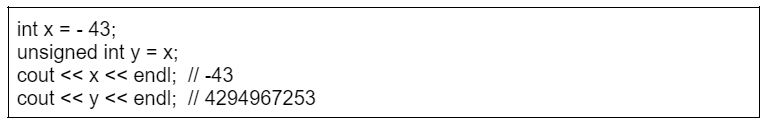
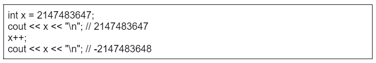

# Introduction to Bit Manipulation

Bit Manipulation is a technique used in a variety of problems to get the solution in an optimized way. This technique is very effective from a Competitive Programming point of view. It is all about Bitwise Operators which directly works upon binary numbers or bits of numbers that help the implementation fast. Below are the Bitwise Operators that are used:

      1. Bitwise AND (&)
      2. Bitwise OR (|)
      3. Bitwise XOR (^)
      4. Bitwise NOT (!)

All data in computer programs are internally stored as bits, i.e., as numbers 0 and 1.

## Bit representation

In programming, an n-bit integer is internally stored as a binary number that consists of n bits. For example, the C++ type int is a 32-bit type, which means that every int number consists of 32 bits.

The int number 43 = 00000000000000000000000000101011

The bits in the representation are indexed from right to left. To convert a bit representation bk ···b2 b1 b0 into a number, we can use the formula
bk2k +…+ b222 + b121 + b020.

E.g., 1·25+1·23 +1·21 +1·20 = 43.

The bit representation of a number is either signed or unsigned.
Usually, a signed representation is used, which means that both negative and positive numbers can be represented.
A signed variable of n bits can contain any integer between -2n-1 and 2n-1 – 1
The int type in C++ is a signed type, so an int variable can contain any integer between -231 and 231 – 1.

The first bit in a signed representation is the sign of the number, 0 for non-negative numbers and 1 for negative numbers and the remaining n−1 bits contain the magnitude of the number.

Two’s complement is used, which means that the opposite number of a number is calculated by first inverting all the bits in the number, and then increasing the number by one.
The bit representation of the int number −43 is 11111111111111111111111111010101
In an unsigned representation, only non-negative numbers can be used, but the upper bound for the values is larger.
An unsigned variable of n bits can contain any integer between 0 and 2n −1.

In C++, an unsigned int variable can contain any integer between 0 and 232 −1.
There is a connection between the representations:
A signed number −x equals an unsigned number 2n − x.
For example, the following pseudo-code snippet shows that the signed number
x = −43 equals the unsigned number y = 232 −43:

        

If a number is larger than the upper bound of the bit representation, the number will overflow. In a signed representation, the next number after 2n-1 – 1 is -2n-1, and in an unsigned representation, the next number after 2n -1 is 0. For example, consider the following pseudo-code snippet:

        

Initially, the value of x is 231 −1. This is the largest value that can be stored in an int variable, so the next number after 231 −1 is −231 .

## Bitwise Operations:

Below is the table to illustrate the result when the operation is performed using Bitwise Operators. Here 0s or 1s mean a sequence of 0 or 1 respectively.

| Operators | Operations | Result |
| --------- | ---------- | ------ | --- |
| XOR       | X **^** 0s | X      |
| XOR       | X **^** 1s | ~X     |
| XOR       | X **^** X  | 0      |
| AND       | X & 0s     | 0      |
| AND       | X & 1s     | X      |
| AND       | X & X      | X      |
| OR        | X          | 0s     | X   |
| OR        | X          | 1s     | 1s  |
| OR        | X          | X      | X   |

## Get Bit:

This method is used to find the bit at a particular position(say i) of the given number N. The idea is to find the Bitwise AND of the given number and 2i that can be represented as (1 `<<` i). If the value return is 1 then the bit at the ith position is set. Otherwise, it is unset.

Below is the pseudo-code for the same:

<Tabs>
    <TabItem value="cpp" label="C++" default>
      <SolutionAuthor name="@Ajay-Dhangar"/>
      ```cpp
      // Function to get the bit at the
      // ith position
      bool getBit(int num, int i) {
          // Return true if the bit is
          // set. Otherwise return false
          return ((num & (1 << i)) != 0);
      }

      // Driver code
      #include <iostream>
      int main() {
          int num = 5; // Binary representation: 101
          int i = 1;   // Checking the 2nd bit (0-based index)
          std::cout << getBit(num, i) << std::endl;  // Output: 0 (false)

          i = 2;   // Checking the 3rd bit (0-based index)
          std::cout << getBit(num, i) << std::endl;  // Output: 1 (true)

          return 0;
      }
      ```
    </TabItem>
    <TabItem value="java" label="Java">
      <SolutionAuthor name="@Ajay-Dhangar"/>
      ```java
      public class Solution {
          // Function to get the bit at the ith position
          public static boolean getBit(int num, int i) {
              // Return true if the bit is set. Otherwise return false
              return ((num & (1 << i)) != 0);
          }

          // Driver code
          public static void main(String[] args) {
              int num = 5; // Binary representation: 101
              int i = 1;   // Checking the 2nd bit (0-based index)
              System.out.println(getBit(num, i));  // Output: false

              i = 2;   // Checking the 3rd bit (0-based index)
              System.out.println(getBit(num, i));  // Output: true
          }
      }
      ```
    </TabItem>
    <TabItem value="python" label="Python">
      <SolutionAuthor name="@Ajay-Dhangar"/>
      ```python
      # Function to get the bit at the ith position
      def getBit(num: int, i: int) -> bool:
          # Return true if the bit is set. Otherwise return false
          return (num & (1 << i)) != 0

      # Driver code
      if __name__ == "__main__":
          num = 5  # Binary representation: 101
          i = 1    # Checking the 2nd bit (0-based index)
          print(getBit(num, i))  # Output: False

          i = 2    # Checking the 3rd bit (0-based index)
          print(getBit(num, i))  # Output: True
      ```
    </TabItem>
    <TabItem value="c" label="C">
      <SolutionAuthor name="@Ajay-Dhangar"/>
      ```c
      #include <stdio.h>
      #include <stdbool.h>

      // Function to get the bit at the ith position
      bool getBit(int num, int i) {
          // Return true if the bit is set. Otherwise return false
          return ((num & (1 << i)) != 0);
      }

      // Driver code
      int main() {
          int num = 5;  // Binary representation: 101
          int i = 1;    // Checking the 2nd bit (0-based index)
          printf("%d\n", getBit(num, i));  // Output: 0 (false)

          i = 2;    // Checking the 3rd bit (0-based index)
          printf("%d\n", getBit(num, i));  // Output: 1 (true)

          return 0;
      }
      ```
    </TabItem>

</Tabs>

## Set Bit:

This method is used to set the bit at a particular position(say i) of the given number N. The idea is to update the value of the given number N to the Bitwise OR of the given number N and 2i that can be represented as (1 `<<` i). If the value return is 1 then the bit at the ith position is set. Otherwise, it is unset.

Below is the pseudo-code for the same:

<Tabs>
    <TabItem value="cpp" label="C++" default>
      <SolutionAuthor name="@Ajay-Dhangar"/>
      ```cpp
      // Function to set the bit at the
      // ith position
      int setBit(int num, int i) {
          // Sets the ith bit and return
          // the updated value
          return num | (1 << i);
      }

      // Driver code
      #include <iostream>
      int main() {
          int num = 5; // Binary representation: 101
          int i = 1;   // Setting the 2nd bit (0-based index)
          std::cout << setBit(num, i) << std::endl;  // Output: 7 (111)

          i = 0;   // Setting the 1st bit (0-based index)
          std::cout << setBit(num, i) << std::endl;  // Output: 5 (101, unchanged)

          return 0;
      }
      ```
    </TabItem>
    <TabItem value="java" label="Java">
      <SolutionAuthor name="@Ajay-Dhangar"/>
      ```java
      public class Solution {
          // Function to set the bit at the ith position
          public static int setBit(int num, int i) {
              // Sets the ith bit and return
              // the updated value
              return num | (1 << i);
          }

          // Driver code
          public static void main(String[] args) {
              int num = 5; // Binary representation: 101
              int i = 1;   // Setting the 2nd bit (0-based index)
              System.out.println(setBit(num, i));  // Output: 7 (111)

              i = 0;   // Setting the 1st bit (0-based index)
              System.out.println(setBit(num, i));  // Output: 5 (101, unchanged)
          }
      }
      ```
    </TabItem>
    <TabItem value="python" label="Python">
      <SolutionAuthor name="@Ajay-Dhangar"/>
      ```python
      # Function to set the bit at the ith position
      def setBit(num: int, i: int) -> int:
          # Sets the ith bit and return
          # the updated value
          return num | (1  << i)

      # Driver code
      if __name__ == "__main__":
          num = 5  # Binary representation: 101
          i = 1    # Setting the 2nd bit (0-based index)
          print(setBit(num, i))  # Output: 7 (111)

          i = 0    # Setting the 1st bit (0-based index)
          print(setBit(num, i))  # Output: 5 (101, unchanged)
      ```
    </TabItem>
    <TabItem value="c" label="C">
      <SolutionAuthor name="@Ajay-Dhangar"/>
      ```c
      #include <stdio.h>

      // Function to set the bit at the ith position
      int setBit(int num, int i) {
          // Sets the ith bit and return
          // the updated value
          return num | (1 << i);
      }

      // Driver code
      int main() {
          int num = 5;  // Binary representation: 101
          int i = 1;    // Setting the 2nd bit (0-based index)
          printf("%d\n", setBit(num, i));  // Output: 7 (111)

          i = 0;    // Setting the 1st bit (0-based index)
          printf("%d\n", setBit(num, i));  // Output: 5 (101, unchanged)

          return 0;
      }
      ```
    </TabItem>

</Tabs>

## Clear Bit:

This method is used to clear the bit at a particular position(say i) of the given number N. The idea is to update the value of the given number N to the Bitwise AND of the given number N and the compliment of 2i that can be represented as ~(1 `<<` i). If the value return is 1 then the bit at the ith position is set. Otherwise, it is unset.

Below is the pseudo-code for the same:

<Tabs>
    <TabItem value="cpp" label="C++" default>
      <SolutionAuthor name="@Ajay-Dhangar"/>
      ```cpp
      // Function to clear the bit at the
      // ith position
      int clearBit(int num, int i) {
          // Create the mask for the ith
          // bit unset
          int mask = ~(1 << i);

          // Return the updated value
          return num & mask;
      }

      // Driver code
      #include <iostream>
      int main() {
          int num = 5; // Binary representation: 101
          int i = 0;   // Clearing the 1st bit (0-based index)
          std::cout << clearBit(num, i) << std::endl;  // Output: 4 (100)

          i = 2;   // Clearing the 3rd bit (0-based index)
          std::cout << clearBit(num, i) << std::endl;  // Output: 1 (001)

          return 0;
      }
      ```
    </TabItem>
    <TabItem value="java" label="Java">
      <SolutionAuthor name="@Ajay-Dhangar"/>
      ```java
      public class Solution {
          // Function to clear the bit at the ith position
          public static int clearBit(int num, int i) {
              // Create the mask for the ith
              // bit unset
              int mask = ~(1 << i);

              // Return the updated value
              return num & mask;
          }

          // Driver code
          public static void main(String[] args) {
              int num = 5; // Binary representation: 101
              int i = 0;   // Clearing the 1st bit (0-based index)
              System.out.println(clearBit(num, i));  // Output: 4 (100)

              i = 2;   // Clearing the 3rd bit (0-based index)
              System.out.println(clearBit(num, i));  // Output: 1 (001)
          }
      }
      ```
    </TabItem>
    <TabItem value="python" label="Python">
      <SolutionAuthor name="@Ajay-Dhangar"/>
      ```python
      # Function to clear the bit at the ith position
      def clearBit(num: int, i: int) -> int:
          # Create the mask for the ith
          # bit unset
          mask = ~(1 << i)

          # Return the updated value
          return num & mask

      # Driver code
      if __name__ == "__main__":
          num = 5  # Binary representation: 101
          i = 0    # Clearing the 1st bit (0-based index)
          print(clearBit(num, i))  # Output: 4 (100)

          i = 2    # Clearing the 3rd bit (0-based index)
          print(clearBit(num, i))  # Output: 1 (001)
      ```
    </TabItem>
    <TabItem value="c" label="C">
      <SolutionAuthor name="@Ajay-Dhangar"/>
      ```c
      #include <stdio.h>

      // Function to clear the bit at the ith position
      int clearBit(int num, int i) {
          // Create the mask for the ith
          // bit unset
          int mask = ~(1 << i);

          // Return the updated value
          return num & mask;
      }

      // Driver code
      int main() {
          int num = 5;  // Binary representation: 101
          int i = 0;    // Clearing the 1st bit (0-based index)
          printf("%d\n", clearBit(num, i));  // Output: 4 (100)

          i = 2;    // Clearing the 3rd bit (0-based index)
          printf("%d\n", clearBit(num, i));  // Output: 1 (001)

          return 0;
      }
      ```
    </TabItem>

</Tabs>

Below is the program that implements the above functionalities:

// C++ program to implement all the
// above functionalities

```
#include <bits/stdc++.h>
using namespace std;

// Function to get the bit at the
// ith position
bool getBit(int num, int i)
{
// Return true if the ith bit is
// set. Otherwise return false
return ((num & (1 << i)) != 0);
}

// Function to set the ith bit of the
// given number num
int setBit(int num, int i)
{
// Sets the ith bit and return
// the updated value
return num | (1 << i);
}

// Function to clear the ith bit of
// the given number num
int clearBit(int num, int i)
{

    // Create the mask for the ith
    // bit unset
    int mask = ~(1 << i);

    // Return the updated value
    return num & mask;

}

// Driver Code
int main()
{
// Given number N
int N = 70;

    cout << "The bit at the 3rd position from LSB is: "
    	<< (getBit(N, 3) ? '1' : '0')
    	<< endl;

    cout << "The value of the given number "
    	<< "after setting the bit at "
    	<< "LSB is: "
    	<< setBit(N, 0) << endl;

    cout << "The value of the given number "
    	<< "after clearing the bit at "
    	<< "LSB is: "
    	<< clearBit(N, 0) << endl;

    return 0;

}
```

### Output

```
    The bit at the 3rd position from LSB is: 0
    The value of the given number after setting the bit at LSB is: 71
    The value of the given number after clearing the bit at LSB is: 70
```

Time Complexity: $O(1)$
Auxiliary Space: $O(1)$

## Application of Bitwise Operator

1. Bitwise operations are prominent in embedded systems, control systems, etc where memory(data transmission/data points) is still an issue.

2. They are also useful in networking where it is important to reduce the amount of data, so booleans are packed together. Packing them together and taking them apart use bitwise operations and shift instructions.

3. Bitwise operations are also heavily used in the compression and encryption of data.

4. Useful in graphics programming, older GUIs are heavily dependent on bitwise operations like XOR(^) for selection highlighting and other overlays
