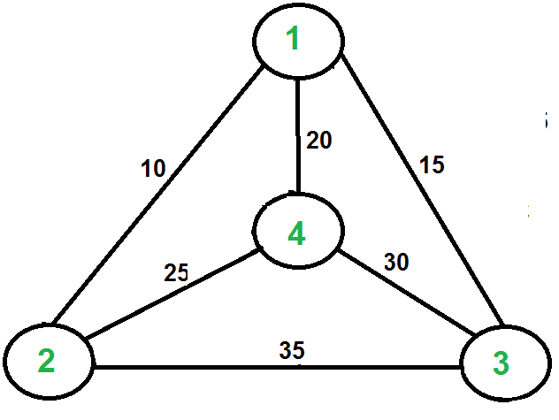

# Travelling Sales Person Algorithm

Given a set of cities and the distance between every pair of cities, the problem is to find the shortest possible route that visits every city exactly once and returns to the starting point. Note the difference between Hamiltonian Cycle and TSP. The Hamiltonian cycle problem is to find if there exists a tour that visits every city exactly once. Here we know that Hamiltonian Tour exists (because the graph is complete) and in fact, many such tours exist, the problem is to find a minimum weight Hamiltonian Cycle.

## Problem Statement

For example, consider the graph shown in the figure. A TSP tour in the graph is 1-2-4-3-1. The cost of the tour is 10+25+30+15 which is 80. The problem is a famous NP-hard problem. There is no polynomial-time know solution for this problem. The following are different solutions for the traveling salesman problem.



### Intuition

1) Consider city 1 as the starting and ending point.

2) Generate all (n-1)! Permutations of cities. 

3) Calculate the cost of every permutation and keep track of the minimum cost permutation. 

4) Return the permutation with minimum cost. 

Time Complexity: T(n!) 

## Dynamic Programming Approach

Let the given set of vertices be 1, 2, 3, 4,….n. Let us consider 1 as starting and ending point of output. For every other vertex I (other than 1), we find the minimum cost path with 1 as the starting point, I as the ending point, and all vertices appearing exactly once. Let the cost of this path cost (i), and the cost of the corresponding Cycle would cost (i) + dist(i, 1) where dist(i, 1) is the distance from I to 1. Finally, we return the minimum of all [cost(i) + dist(i, 1)] values. This looks simple so far. 

Now the question is how to get cost(i)? To calculate the cost(i) using Dynamic Programming, we need to have some recursive relation in terms of sub-problems. 

Let us define a term C(S, i) be the cost of the minimum cost path visiting each vertex in set S exactly once, starting at 1 and ending at i. We start with all subsets of size 2 and calculate C(S, i) for all subsets where S is the subset, then we calculate C(S, i) for all subsets S of size 3 and so on. Note that 1 must be present in every subset.
```
If size of S is 2, then S must be {1, i},
 C(S, i) = dist(1, i) 
Else if size of S is greater than 2.
 C(S, i) = min { C(S-{i}, j) + dis(j, i)} where j belongs to S, j != i and j != 1.
```

## Code for Travelling Sales Person Algorithm using DP


<Tabs>
  <TabItem value="Python" label="Python">
    ``` Python  showLineNumbers
n = 4 # there are four nodes in example graph (graph is 1-based)

# dist[i][j] represents shortest distance to go from i to j
# this matrix can be calculated for any given graph using 
# all-pair shortest path algorithms
dist = [[0, 0, 0, 0, 0], [0, 0, 10, 15, 20], [
	0, 10, 0, 25, 25], [0, 15, 25, 0, 30], [0, 20, 25, 30, 0]]

# memoization for top down recursion
memo = [[-1]*(1 << (n+1)) for _ in range(n+1)]


def fun(i, mask):
	# base case
	# if only ith bit and 1st bit is set in our mask,
	# it implies we have visited all other nodes already
	if mask == ((1 << i) | 3):
		return dist[1][i]

	# memoization
	if memo[i][mask] != -1:
		return memo[i][mask]

	res = 10**9 # result of this sub-problem

	# we have to travel all nodes j in mask and end the path at ith node
	# so for every node j in mask, recursively calculate cost of 
	# travelling all nodes in mask
	# except i and then travel back from node j to node i taking 
	# the shortest path take the minimum of all possible j nodes
	for j in range(1, n+1):
		if (mask & (1 << j)) != 0 and j != i and j != 1:
			res = min(res, fun(j, mask & (~(1 << i))) + dist[j][i])
	memo[i][mask] = res # storing the minimum value
	return res


# Driver program to test above logic
ans = 10**9
for i in range(1, n+1):
	# try to go from node 1 visiting all nodes in between to i
	# then return from i taking the shortest route to 1
	ans = min(ans, fun(i, (1 << (n+1))-1) + dist[i][1])

print("The cost of most efficient tour = " + str(ans))


```
</TabItem>

<TabItem value="Java" label="Java">

``` jsx showLineNumbers
import java.io.*;
import java.util.*;

public class TSE {
	// there are four nodes in example graph (graph is
	// 1-based)

	static int n = 4;
	// give appropriate maximum to avoid overflow

	static int MAX = 1000000;

	// dist[i][j] represents shortest distance to go from i
	// to j this matrix can be calculated for any given
	// graph using all-pair shortest path algorithms
	static int[][] dist = {
		{ 0, 0, 0, 0, 0 }, { 0, 0, 10, 15, 20 },
		{ 0, 10, 0, 25, 25 }, { 0, 15, 25, 0, 30 },
		{ 0, 20, 25, 30, 0 },
	};

	// memoization for top down recursion

	static int[][] memo = new int[n + 1][1 << (n + 1)];

	static int fun(int i, int mask)
	{
		// base case
		// if only ith bit and 1st bit is set in our mask,
		// it implies we have visited all other nodes
		// already
		if (mask == ((1 << i) | 3))
			return dist[1][i];
		// memoization
		if (memo[i][mask] != 0)
			return memo[i][mask];

		int res = MAX; // result of this sub-problem

		// we have to travel all nodes j in mask and end the
		// path at ith node so for every node j in mask,
		// recursively calculate cost of travelling all
		// nodes in mask
		// except i and then travel back from node j to node
		// i taking the shortest path take the minimum of
		// all possible j nodes

		for (int j = 1; j <= n; j++)
			if ((mask & (1 << j)) != 0 && j != i && j != 1)
				res = Math.min(res,
							fun(j, mask & (~(1 << i)))
								+ dist[j][i]);
		return memo[i][mask] = res;
	}

	// Driver program to test above logic
	public static void main(String[] args)
	{
		int ans = MAX;
		for (int i = 1; i <= n; i++)
			// try to go from node 1 visiting all nodes in
			// between to i then return from i taking the
			// shortest route to 1
			ans = Math.min(ans, fun(i, (1 << (n + 1)) - 1)
									+ dist[i][1]);

		System.out.println(
			"The cost of most efficient tour = " + ans);
	}
}


```
</TabItem>

<TabItem value="Cpp" label="Cpp">
```cpp showLineNumbers
#include <iostream>

using namespace std;

// there are four nodes in example graph (graph is 1-based)
const int n = 4;
// give appropriate maximum to avoid overflow
const int MAX = 1000000;

// dist[i][j] represents shortest distance to go from i to j
// this matrix can be calculated for any given graph using
// all-pair shortest path algorithms
int dist[n + 1][n + 1] = {
	{ 0, 0, 0, 0, 0 }, { 0, 0, 10, 15, 20 },
	{ 0, 10, 0, 25, 25 }, { 0, 15, 25, 0, 30 },
	{ 0, 20, 25, 30, 0 },
};

// memoization for top down recursion
int memo[n + 1][1 << (n + 1)];

int fun(int i, int mask)
{
	// base case
	// if only ith bit and 1st bit is set in our mask,
	// it implies we have visited all other nodes already
	if (mask == ((1 << i) | 3))
		return dist[1][i];
	// memoization
	if (memo[i][mask] != 0)
		return memo[i][mask];

	int res = MAX; // result of this sub-problem

	// we have to travel all nodes j in mask and end the
	// path at ith node so for every node j in mask,
	// recursively calculate cost of travelling all nodes in
	// mask except i and then travel back from node j to
	// node i taking the shortest path take the minimum of
	// all possible j nodes

	for (int j = 1; j <= n; j++)
		if ((mask & (1 << j)) && j != i && j != 1)
			res = std::min(res, fun(j, mask & (~(1 << i)))
									+ dist[j][i]);
	return memo[i][mask] = res;
}
// Driver program to test above logic
int main()
{
	int ans = MAX;
	for (int i = 1; i <= n; i++)
		// try to go from node 1 visiting all nodes in
		// between to i then return from i taking the
		// shortest route to 1
		ans = std::min(ans, fun(i, (1 << (n + 1)) - 1)
								+ dist[i][1]);

	printf("The cost of most efficient tour = %d", ans);

	return 0;
}


```
</TabItem>

<TabItem value="JavaScript" label="JavaScript">
```jsx showLineNumbers
// JavaScript code for the above approach

// there are four nodes in example graph (graph is 1-based)
let n = 4;
	
// give appropriate maximum to avoid overflow
let MAX = 1000000;

// dist[i][j] represents shortest distance to go from i to j
// this matrix can be calculated for any given graph using
// all-pair shortest path algorithms
let dist = [
	[0, 0, 0, 0, 0], [0, 0, 10, 15, 20],
	[0, 10, 0, 25, 25], [0, 15, 25, 0, 30],
	[0, 20, 25, 30, 0],
];

// memoization for top down recursion
let memo = new Array(n + 1);

for (let i = 0; i < memo.length; i++) {
	memo[i] = new Array(1 << (n + 1)).fill(0)
}

function fun(i, mask) 
{
	
	// base case
	// if only ith bit and 1st bit is set in our mask,
	// it implies we have visited all other nodes already
	if (mask == ((1 << i) | 3))
	return dist[1][i];
		
	// memoization
	if (memo[i][mask] != 0)
	return memo[i][mask];

	let res = MAX; // result of this sub-problem

	// we have to travel all nodes j in mask and end the
	// path at ith node so for every node j in mask,
	// recursively calculate cost of travelling all nodes in
	// mask except i and then travel back from node j to
	// node i taking the shortest path take the minimum of
	// all possible j nodes

	for (let j = 1; j <= n; j++)
	if ((mask & (1 << j)) && j != i && j != 1)
		res = Math.min(res, fun(j, mask & (~(1 << i)))
		+ dist[j][i]);
	return memo[i][mask] = res;
}
	
// Driver program to test above logic
let ans = MAX;
for (let i = 1; i <= n; i++)
	
	// try to go from node 1 visiting all nodes in
	// between to i then return from i taking the
	// shortest route to 1
	ans = Math.min(ans, fun(i, (1 << (n + 1)) - 1)
	+ dist[i][1]);

console.log("The cost of most efficient tour " + ans);

```
</TabItem>
</Tabs>


## Output

```
The cost of most efficient tour = 80
```

## Time Complexity : 

O(n2*2n) where O(n* 2n) are maximum number of unique subproblems/states and O(n) for transition (through for loop as in code) in every states.

## Auxiliary Space: 

O(n*2n), where n is number of Nodes/Cities here.

## Conclusion

For a set of size n, we consider n-2 subsets each of size n-1 such that all subsets don’t have nth in them. Using the above recurrence relation, we can write a dynamic programming-based solution. There are at most O(n*2n) subproblems, and each one takes linear time to solve. The total running time is therefore O(n2*2n). The time complexity is much less than O(n!) but still exponential. The space required is also exponential. So this approach is also infeasible even for a slightly higher number of vertices. We will soon be discussing approximate algorithms for the traveling salesman problem.